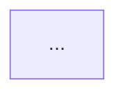

# CCNP/CCIE 콘텐츠 작성 가이드

## Mermaid 다이어그램 규칙

### 줄바꿈은 `<br/>` 사용 (절대 `\n` 금지)
```
❌ EDM["EDM\n평가·지시·모니터링"]
✅ EDM["EDM<br/>평가·지시·모니터링"]
```

### subgraph 라벨에 이모지 금지 (파싱 오류 발생)
```
❌ subgraph GOV["🏛️ 거버넌스 영역"]
✅ subgraph GOV["거버넌스 영역"]
```

### 모든 노드 라벨과 화살표 라벨을 `""` 로 감싸기
```
✅ A["한글 라벨"] -->|"화살표"| B["결과"]
```

### `&` 체인 화살표는 별도 줄로 분리
```
❌ OSPF --> R1 & R2 & R3
✅ OSPF --> R1
   OSPF --> R2
   OSPF --> R3
```

### 권장 컬러 팔레트
- 파랑: `#2563EB` (stroke: `#1D4ED8`)
- 보라: `#7C3AED` (stroke: `#6D28D9`)
- 주황: `#EA580C`
- 녹색: `#16A34A`
- 청록: `#0891B2`
- 네이비: `#1E3A5F`

### 예시 (네트워크 토폴로지)


---

## 볼드 텍스트 규칙

### 따옴표는 볼드 마커 밖에
```
❌ **"따옴표가 안에 있는 볼드"**
✅ "**따옴표가 밖에 있는 볼드**"
```

### 특수문자가 포함된 긴 문자열은 단어별 볼드
```
❌ **라우팅·스위칭·보안(CCNP)**
✅ **라우팅**·**스위칭**·**보안**(CCNP)
```

---

## 문서 구조 템플릿

```markdown
---
sidebar_position: 1
title: 문서 제목
---

# 문서 제목
**Full English Name**

## 개요

## 핵심 개념

## 동작 원리



## 설정 예시

```bash
! Cisco IOS 설정
...
```

## 트러블슈팅 팁

## 시험 포인트 (CCNP/CCIE)
```

---

## MDX 주석

MDX에서 주석은 반드시 `{/* */}` 형식 사용:
```
✅ {/* 이것은 주석입니다 */}
❌ <!-- 이것은 HTML 주석 — MDX에서 오류 발생 -->
```
