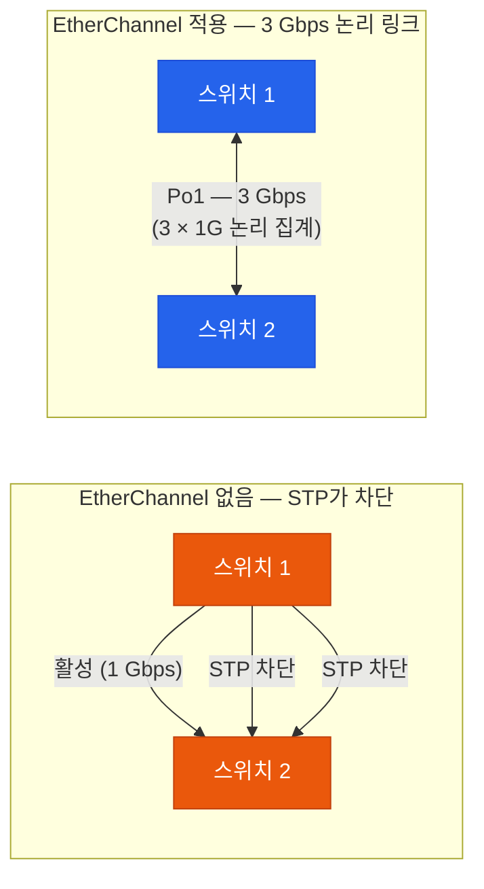
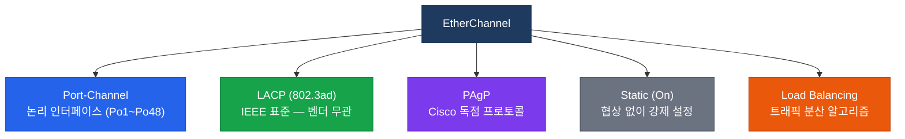
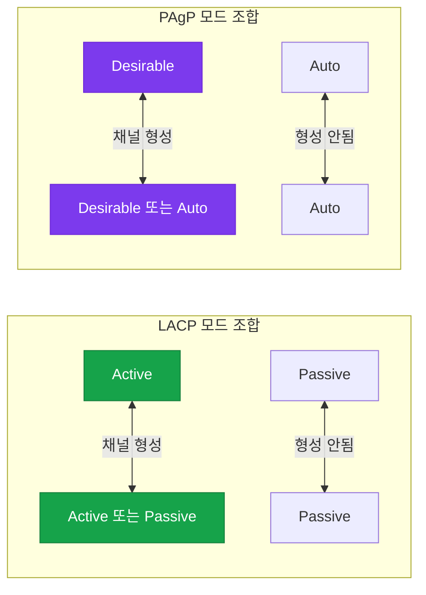
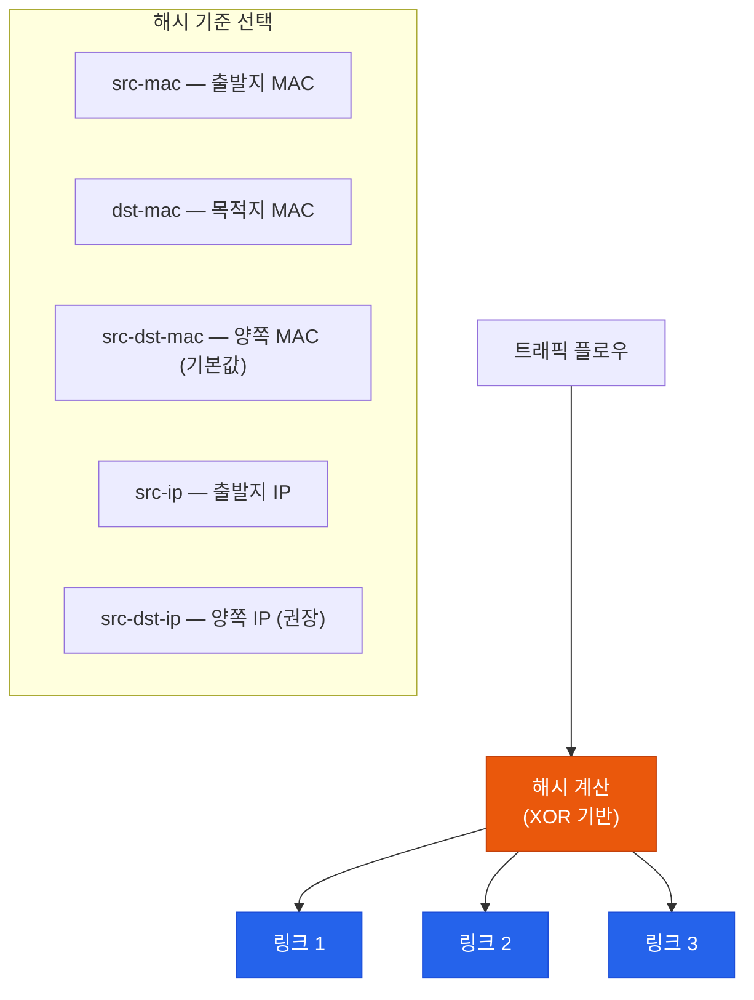
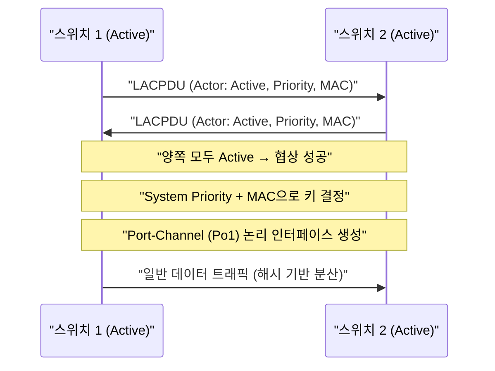
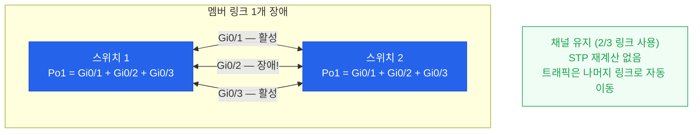
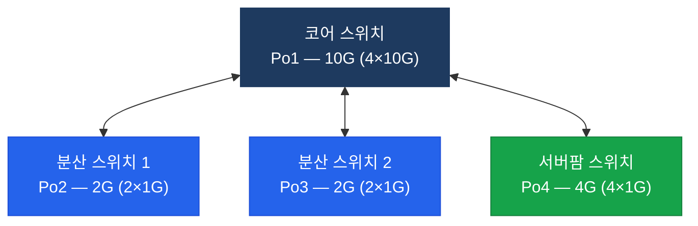

# 이더채널
**EtherChannel (LACP / PAgP)**

## 왜 필요한가?

두 스위치를 연결할 때 단일 링크의 대역폭이 부족하거나 장애에 취약하다. 여러 링크를 추가하면 STP가 루프를 막기 위해 하나만 남기고 나머지를 **차단(Blocking)** 해버린다.

**EtherChannel** 은 여러 물리 링크를 **하나의 논리 인터페이스**로 묶어서, STP 눈에는 단일 링크처럼 보이게 하면서 **대역폭 집계와 이중화**를 동시에 달성한다.



---

## 구성 요소



---

## LACP vs PAgP vs Static 비교

| 항목 | LACP (802.3ad) | PAgP | Static (On) |
|------|----------------|------|-------------|
| 표준 | IEEE 802.3ad | Cisco 독점 | - |
| 협상 방식 | Active / Passive | Desirable / Auto | On (협상 없음) |
| 최대 멤버 | 16개 (8개 활성) | 8개 | 제한 없음 |
| 권장 여부 | **권장** | Cisco 환경 | 주의 필요 |

### 모드 조합 — 채널이 형성되는 조건



---

## 로드 밸런싱 알고리즘

EtherChannel은 트래픽을 여러 멤버 링크에 분산한다. **해시 알고리즘**을 기반으로 동일 플로우는 항상 같은 링크를 사용한다.



```bash
! 로드 밸런싱 방식 변경 (글로벌 설정)
SW(config)# port-channel load-balance src-dst-ip

! 확인
SW# show etherchannel load-balance
```

---

## 동작 흐름 — LACP 협상



---

## 설정 — 완전한 예시

### LACP (권장)

```bash
! 스위치 1
SW1(config)# interface range GigabitEthernet0/1 - 3
SW1(config-if-range)# channel-group 1 mode active
SW1(config-if-range)# exit
SW1(config)# interface port-channel 1
SW1(config-if)# switchport trunk encapsulation dot1q
SW1(config-if)# switchport mode trunk
SW1(config-if)# switchport trunk allowed vlan 10,20,30

! 스위치 2
SW2(config)# interface range GigabitEthernet0/1 - 3
SW2(config-if-range)# channel-group 1 mode active
```

### PAgP

```bash
SW1(config)# interface range GigabitEthernet0/1 - 2
SW1(config-if-range)# channel-group 1 mode desirable
```

### Static (On) — 주의

```bash
! 양쪽 모두 On 설정 — 한쪽만 On이면 채널 안 만들어짐
SW1(config-if-range)# channel-group 1 mode on
```

---

## 검증 명령어

```bash
! 전체 채널 상태
SW# show etherchannel summary
! 출력 예시:
! Po1(SU)   LACP     Gi0/1(P) Gi0/2(P) Gi0/3(P)
! S=Layer2  U=in use  P=bundled

! 상세 정보
SW# show etherchannel 1 detail
SW# show etherchannel port-channel

! LACP 협상 상태
SW# show lacp neighbor
SW# show lacp 1 counters

! 포트채널 인터페이스 상태
SW# show interfaces port-channel 1
```

---

## EtherChannel 장애 시나리오



---

## 활용 시나리오



---

## CCNP/CCIE 시험 포인트

- EtherChannel 형성 실패 원인: 양단의 **속도·듀플렉스·VLAN·Trunk 설정 불일치**
- `show etherchannel summary`의 플래그: `P`=bundled, `D`=down, `I`=stand-alone
- LACP는 **16개 포트** 지원하지만 최대 **8개 활성** (나머지 8개는 Hot-Standby)
- PAgP의 **Desirable-Desirable** 또는 **Desirable-Auto** 조합만 채널 형성
- **Static(On)** 은 협상이 없으므로 한쪽만 설정되어도 오류 없이 올라와서 미스매치를 감지하기 어렵다
- L3 EtherChannel: `no switchport` 후 `ip address` 직접 할당 가능
