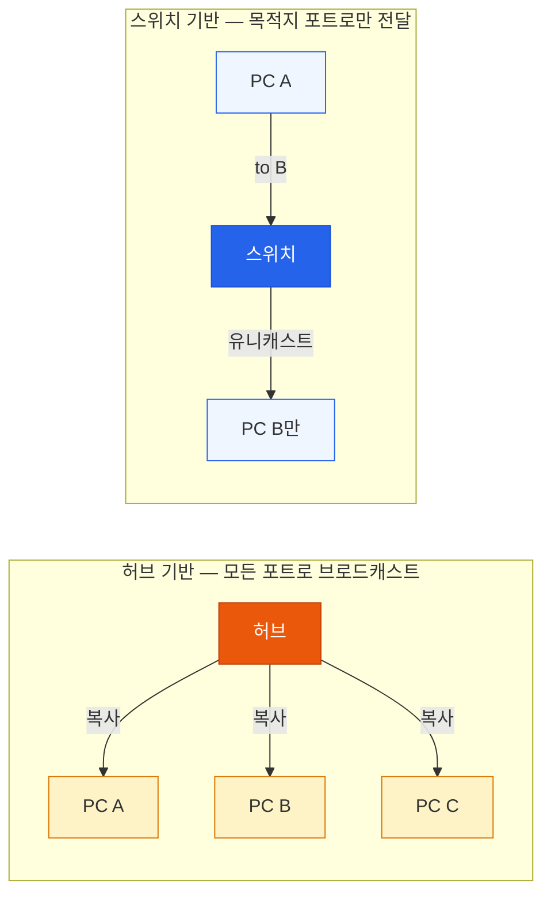
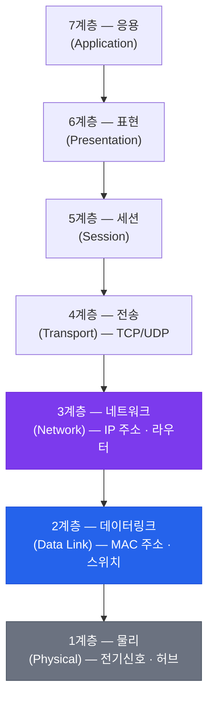
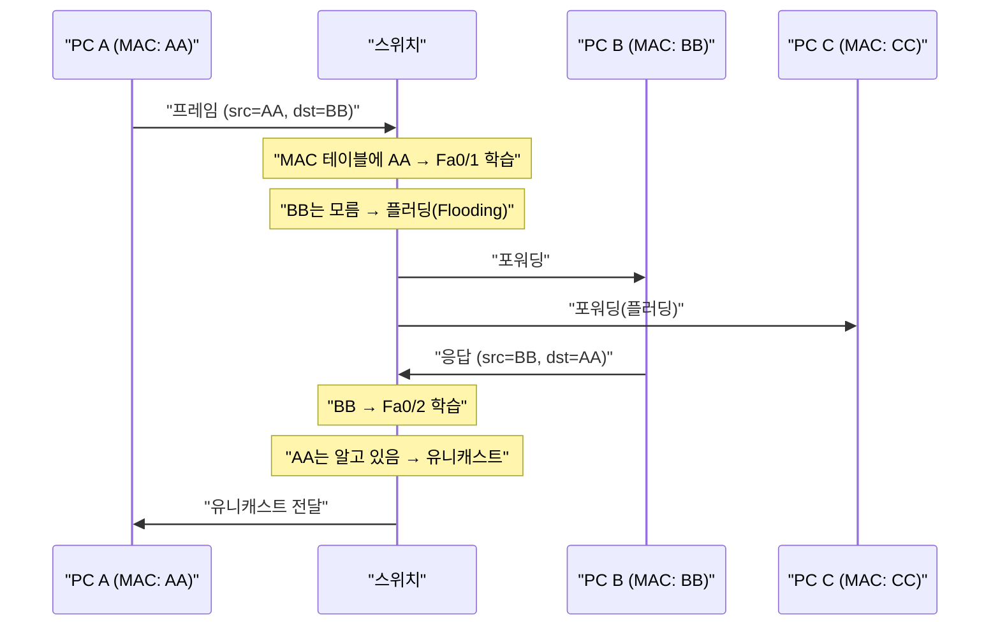
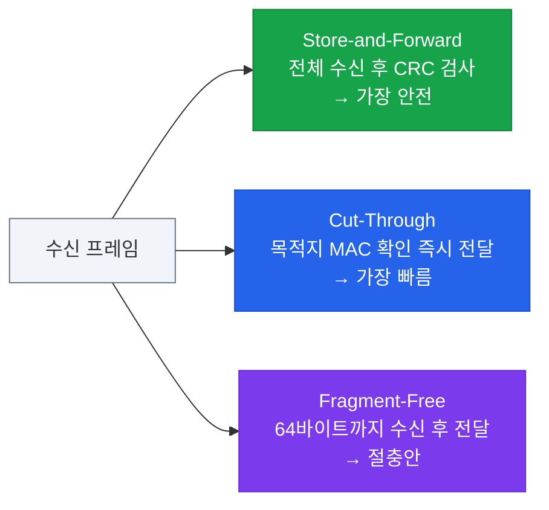
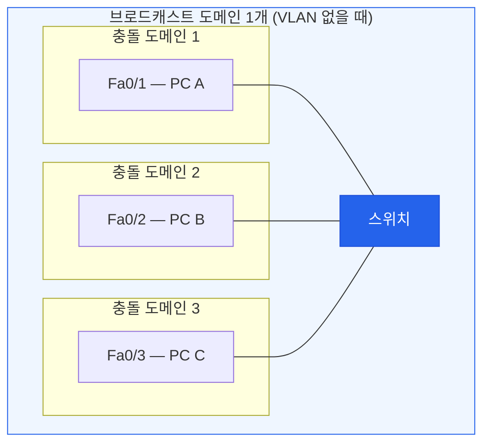
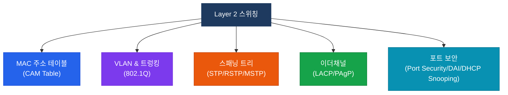

# Layer 2 스위칭 개요
**Layer 2 Switching Overview**

## 정의

OSI 2계층(데이터링크 계층)에서 **MAC 주소**를 기반으로 수신된 프레임을 목적지 포트로 선택적으로 전달하는 네트워크 스위칭 기술.

## 특징

- **(MAC 주소 기반 포워딩)** 목적지 MAC 주소가 일치하는 포트로만 프레임을 전달하여 불필요한 트래픽 제거
- **(충돌 도메인 분리)** 포트마다 독립적인 충돌 도메인을 형성하여 허브 대비 네트워크 효율 극대화
- **(ASIC 기반 와이어 스피드)** 하드웨어 칩이 라인 속도에서 직접 처리하여 수십만 pps 고속 포워딩 지원

## 왜 필요한가?

초기 네트워크는 **허브(Hub)** 기반이었다. 허브는 수신한 신호를 모든 포트로 그대로 복사해 전달하기 때문에, 장치가 늘어날수록 **충돌(Collision)** 이 폭발적으로 증가했다.

스위치는 이 문제를 해결하기 위해 등장했다. 목적지 MAC 주소를 학습해서 **해당 포트로만** 프레임을 전달하므로, 불필요한 트래픽을 제거하고 성능을 극적으로 향상시킨다.



---

## OSI 모델에서의 위치

Layer 2 스위치는 **데이터링크 계층**에서 동작하며, MAC 주소를 기반으로 프레임을 포워딩한다.



---

## MAC 주소 테이블 (CAM Table)

스위치의 핵심은 **MAC 주소 테이블**이다. 프레임이 들어오면 출발지 MAC 주소와 수신 포트를 테이블에 기록(학습)하고, 이후 동일 목적지가 오면 해당 포트로만 전달한다.

### 학습 → 포워딩 흐름



### MAC 주소 테이블 확인

```bash
SW# show mac address-table
          Mac Address Table
-------------------------------------------
Vlan    Mac Address       Type        Ports
----    -----------       --------    -----
   1    aabb.cc00.0100    DYNAMIC     Fa0/1
   1    aabb.cc00.0200    DYNAMIC     Fa0/2
  10    aabb.cc00.0300    STATIC      Fa0/3
```

---

## 스위칭 동작의 3가지 방식



| 방식 | 동작 | 지연 | 에러 감지 |
|------|------|------|-----------|
| **Store-and-Forward** | 전체 프레임 수신 후 CRC 검사 | 높음 | 완전 |
| **Cut-Through** | 목적지 MAC 확인 즉시 전달 | 매우 낮음 | 없음 |
| **Fragment-Free** | 64바이트 수신 후 전달 | 낮음 | 충돌 프레임만 |

> Cisco 카탈리스트 스위치의 기본값은 **Store-and-Forward**다.

---

## 브로드캐스트 도메인과 충돌 도메인

스위치의 가장 중요한 역할 중 하나는 충돌 도메인을 포트 단위로 분리하는 것이다.



| 장비 | 충돌 도메인 | 브로드캐스트 도메인 |
|------|-------------|---------------------|
| 허브 | 1개 (전체) | 1개 |
| 스위치 | 포트당 1개 | 1개 (VLAN 없을 때) |
| 라우터 | 인터페이스당 1개 | 인터페이스당 1개 |

---

## L2 스위칭의 구성 요소 전체 맵



---

## CCNP/CCIE 시험 포인트

- MAC 테이블이 가득 찬 경우(MAC flooding) → 스위치가 허브처럼 동작 → 보안 위협
- 스위치는 **브로드캐스트를 차단하지 않는다** — VLAN이나 라우터가 필요
- Aging Time 기본값: **300초** (`mac address-table aging-time`)
- Static MAC 주소 항목은 aging되지 않는다
