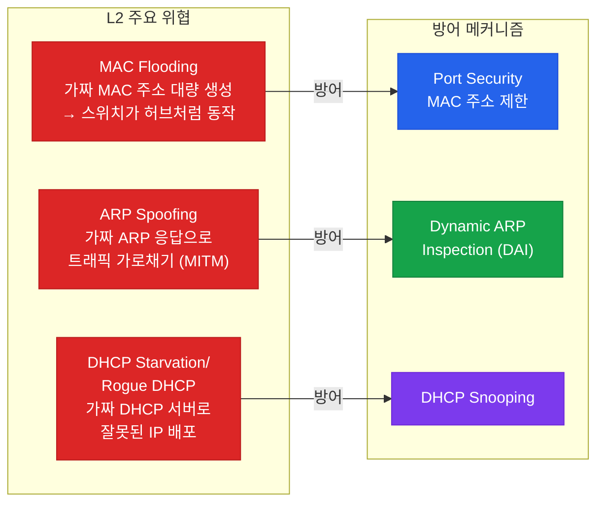
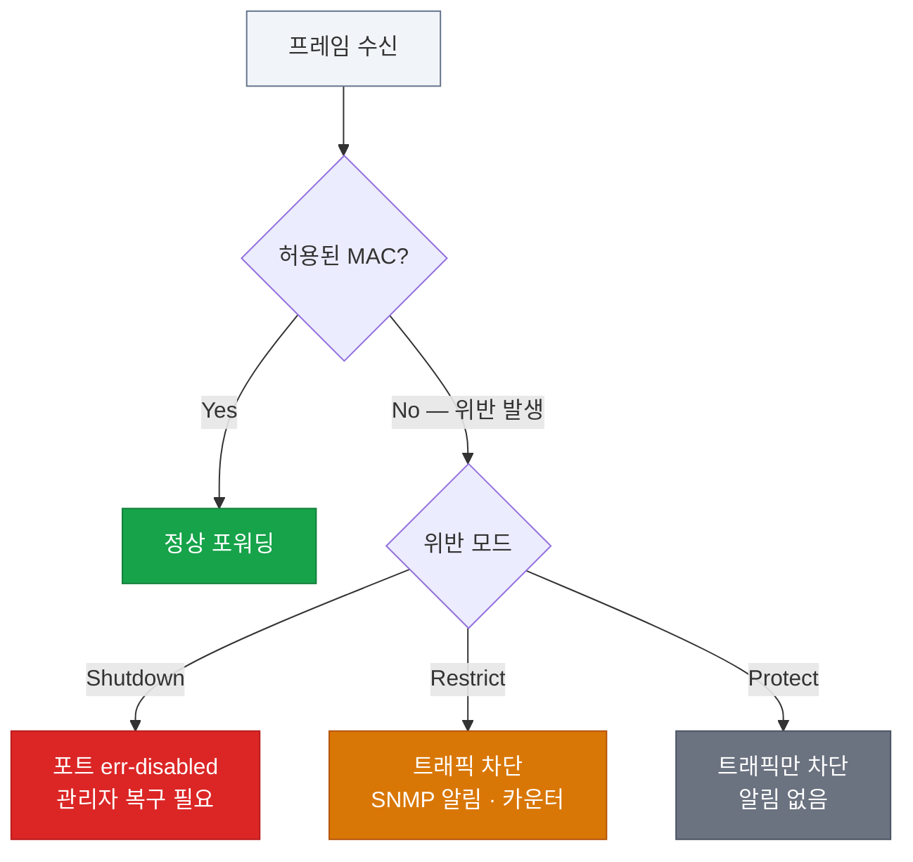
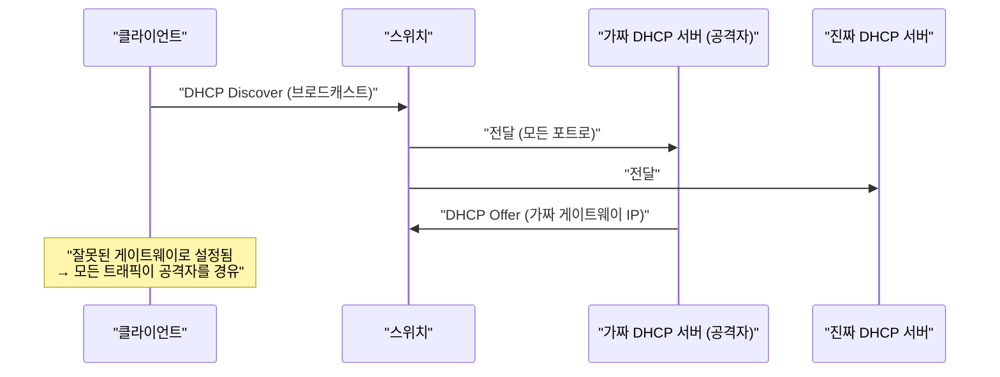
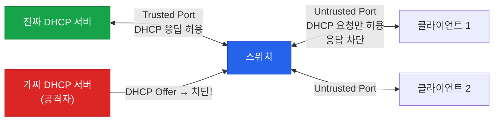
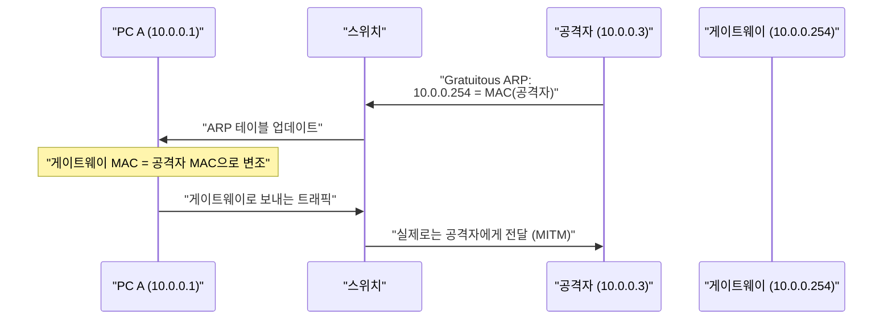
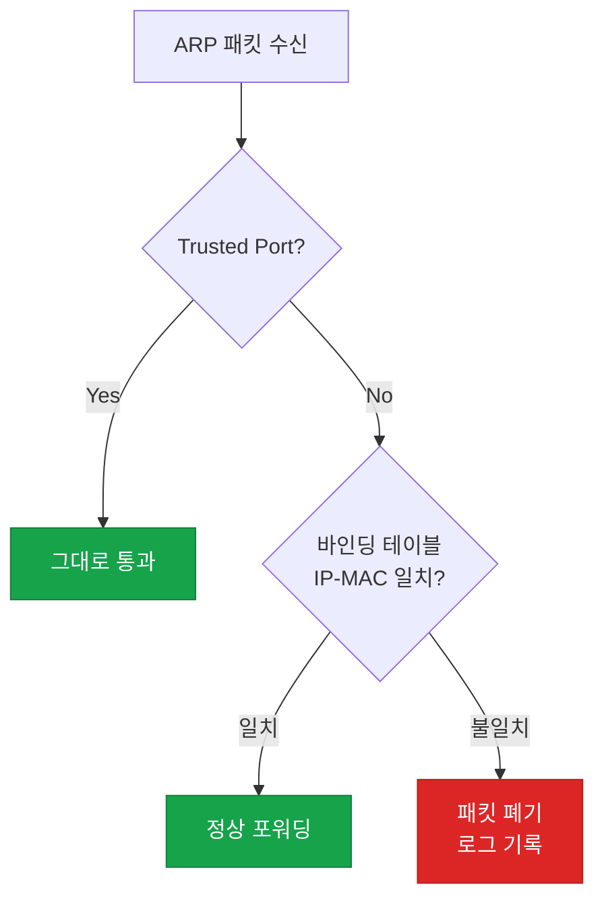
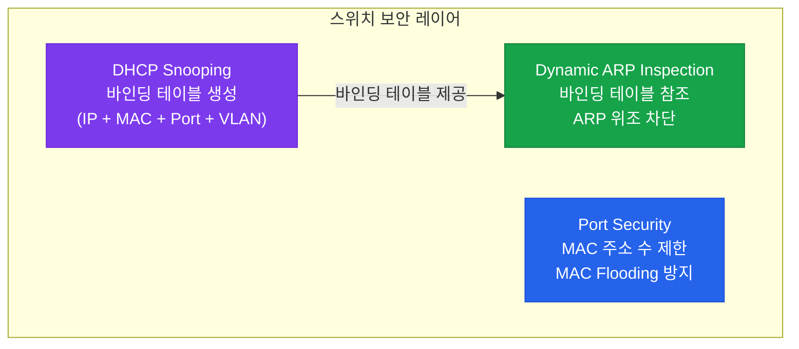

# 포트 보안
**Port Security / DAI / DHCP Snooping**

## 왜 필요한가?

L2 네트워크는 MAC 주소를 신뢰 기반으로 동작하기 때문에 다양한 공격에 취약하다. 대표적인 3가지 위협과 그 방어책을 다룬다.



---

## 1. Port Security — MAC 플러딩 방어

### 동작 원리

포트에 허용할 **MAC 주소의 수와 종류**를 제한한다. 위반 시 설정된 위반 모드에 따라 포트를 차단하거나 트래픽을 버린다.



### MAC 학습 방식 비교

| 방식 | 설명 | 재부팅 후 유지 |
|------|------|----------------|
| **Static** | 관리자가 직접 MAC 지정 | 유지 |
| **Dynamic** | 자동 학습 (기본) | 유지 안됨 |
| **Sticky** | 자동 학습 + running-config 저장 | 저장 시 유지 |

### 설정 예시

```bash
! Access 포트에만 적용 가능
SW(config)# interface FastEthernet0/1
SW(config-if)# switchport mode access
SW(config-if)# switchport port-security                         ! 활성화
SW(config-if)# switchport port-security maximum 2              ! 최대 2개 MAC 허용
SW(config-if)# switchport port-security mac-address sticky     ! Sticky 학습
SW(config-if)# switchport port-security violation shutdown      ! 위반 시 차단

! err-disabled 복구
SW(config-if)# shutdown
SW(config-if)# no shutdown
! 또는 자동 복구 (타이머)
SW(config)# errdisable recovery cause psecure-violation
SW(config)# errdisable recovery interval 300
```

### 검증

```bash
SW# show port-security
SW# show port-security interface FastEthernet0/1
SW# show port-security address
```

---

## 2. DHCP Snooping — 가짜 DHCP 방어

### 공격 시나리오



### DHCP Snooping 동작

**Trusted Port** (업링크, 진짜 DHCP 서버 방향)와 **Untrusted Port** (엔드포인트)를 구분한다. Untrusted 포트에서 DHCP Offer/Ack가 오면 차단한다.



DHCP Snooping은 **바인딩 테이블**을 생성한다: `MAC 주소 + IP + VLAN + 포트`

### 설정 예시

```bash
! DHCP Snooping 활성화
SW(config)# ip dhcp snooping
SW(config)# ip dhcp snooping vlan 10,20

! Trusted Port (DHCP 서버 방향)
SW(config)# interface GigabitEthernet0/1
SW(config-if)# ip dhcp snooping trust

! Rate Limit (Untrusted 포트, 기본 적용됨)
SW(config)# interface range FastEthernet0/1 - 24
SW(config-if-range)# ip dhcp snooping limit rate 15    ! 초당 15 패킷

! 검증
SW# show ip dhcp snooping
SW# show ip dhcp snooping binding
```

---

## 3. Dynamic ARP Inspection (DAI) — ARP 스푸핑 방어

### ARP Spoofing 공격



### DAI 동작

**DHCP Snooping 바인딩 테이블**을 참조해 ARP 패킷의 IP-MAC 매핑이 올바른지 검증한다.



### 설정 예시

```bash
! DAI 활성화 (DHCP Snooping 설정 필요)
SW(config)# ip arp inspection vlan 10,20

! Trusted Port (업링크 방향)
SW(config)# interface GigabitEthernet0/1
SW(config-if)# ip arp inspection trust

! ARP Rate Limit
SW(config)# interface range FastEthernet0/1 - 24
SW(config-if-range)# ip arp inspection limit rate 100    ! 초당 100 ARP

! 정적 IP 환경: ARP ACL로 예외 처리
SW(config)# arp access-list STATIC_ARP
SW(config-arp-nacl)# permit ip host 10.0.0.100 mac host aabb.cc00.0100
SW(config)# ip arp inspection filter STATIC_ARP vlan 10

! 검증
SW# show ip arp inspection
SW# show ip arp inspection vlan 10
SW# show ip arp inspection statistics
```

---

## 3가지 보안 기능 통합 구조



### 설정 순서 (권장)

```
1. DHCP Snooping 활성화 → 바인딩 테이블 생성
2. DAI 활성화 → 바인딩 테이블 참조
3. Port Security 적용 → MAC 수 제한
```

---

## 기능 비교 요약

| 기능 | 방어 대상 | 기반 기술 | Trusted 개념 |
|------|-----------|-----------|--------------|
| Port Security | MAC Flooding | MAC 주소 테이블 | 없음 |
| DHCP Snooping | Rogue DHCP / DHCP 고갈 | 바인딩 테이블 | Trusted Port |
| DAI | ARP Spoofing (MITM) | DHCP Snooping 바인딩 | Trusted Port |

---

## CCNP/CCIE 시험 포인트

- Port Security는 **Access 포트**에만 적용 가능 (Trunk 포트 불가)
- Sticky MAC: `copy running-config startup-config` 없이는 재부팅 후 사라짐
- DHCP Snooping이 비활성화 상태에서 DAI 설정 시 → 모든 ARP 폐기 (바인딩 테이블 없음)
- `ip dhcp snooping information option` — DHCP Option 82 삽입 (중간 스위치에서 비활성화 필요할 수 있음)
- DAI에서 `arp access-list`는 DHCP 없이 정적 IP를 사용하는 장비에 필수
- Rate limit 초과 시 포트 **err-disabled** → `errdisable recovery cause arp-inspection`으로 자동 복구 설정
