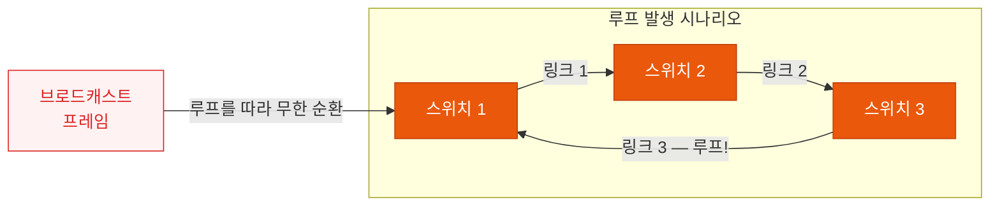
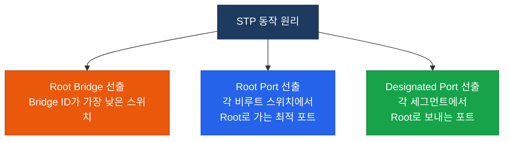
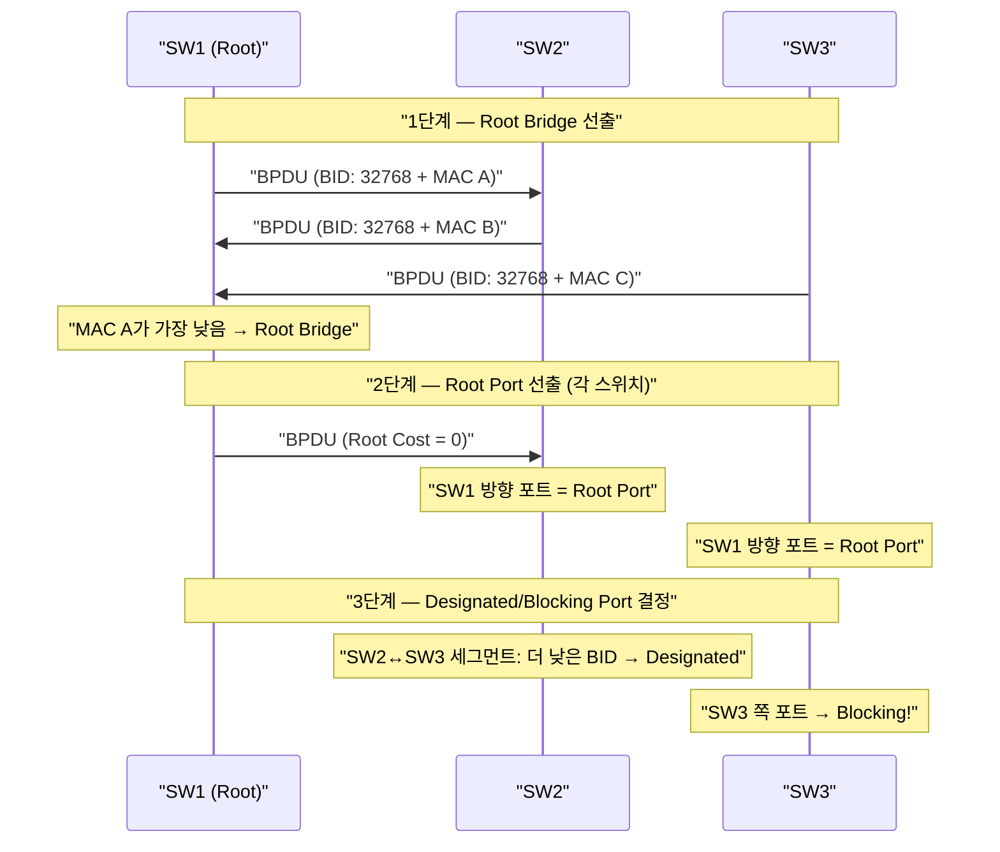
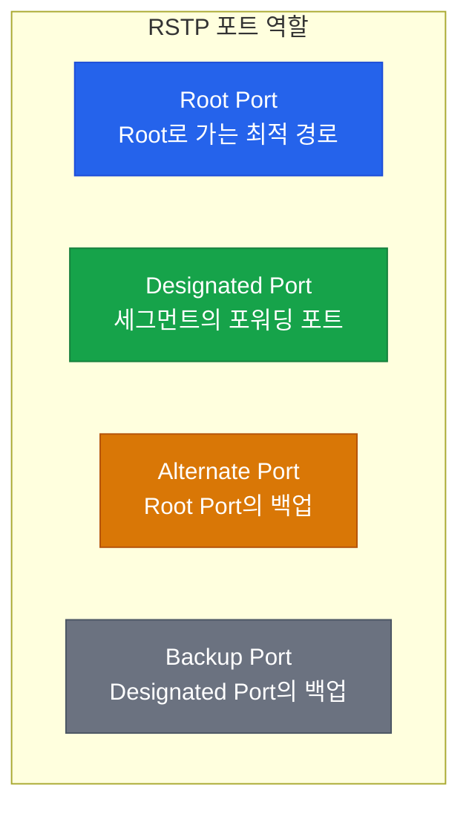
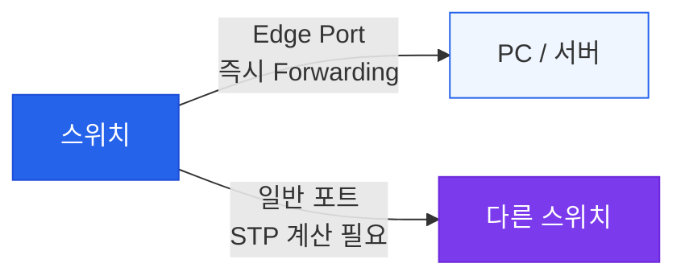
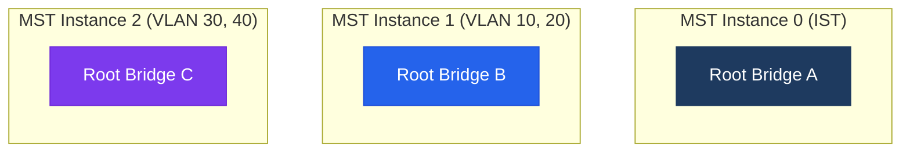
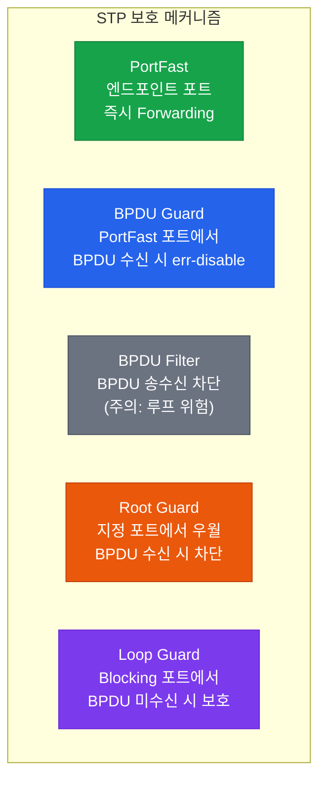

# 스패닝 트리 프로토콜
**Spanning Tree Protocol (STP / RSTP / MSTP)**

## 정의

스위치 네트워크에서 **물리적 루프**를 감지하고 특정 포트를 논리적으로 차단함으로써 루프 없는 **트리(Tree) 구조**를 형성하는 IEEE 802.1D 기반 프로토콜. RSTP(802.1w)와 MSTP(802.1s)는 그 확장 표준이다.

## 특징

- **(루프 방지)** BPDU 교환으로 중복 경로를 감지하고 해당 포트를 Blocking 상태로 전환하여 브로드캐스트 스톰 차단
- **(자동 대체 경로 활성화)** 링크 장애 시 Blocking 포트가 자동으로 Forwarding으로 전환되어 네트워크 복구 (STP 최대 50초, RSTP 수 초)
- **(Root Bridge 중심 트리 구조)** Bridge ID가 가장 낮은 스위치를 Root로 선출하고 모든 스위치가 Root 방향으로 단일 경로를 유지

## 왜 필요한가? — 루프의 재앙

스위치를 두 대 이상 연결하면 **물리적 루프**가 생길 수 있다. 루프가 발생하면 브로드캐스트 프레임이 네트워크를 영구히 순환하면서 **브로드캐스트 스톰(Broadcast Storm)** 을 일으켜 네트워크를 완전히 마비시킨다.



STP는 특정 포트를 논리적으로 **차단(Blocking)** 해서 루프 없는 트리 구조를 만든다.

---

## STP 구성 요소

### 핵심 개념 3가지



### Bridge ID 구조

```
[ Priority (2B) ] [ MAC Address (6B) ]
     32768           아래 MAC 주소
```

- 기본 Priority: **32768** (0~61440, 4096 단위)
- Bridge ID가 **낮을수록** Root Bridge로 선출
- Priority가 같으면 **MAC 주소가 낮은** 스위치가 Root

### Path Cost (포트 속도별)

| 링크 속도 | STP Cost | RSTP Cost |
|-----------|----------|-----------|
| 10 Mbps | 100 | 2,000,000 |
| 100 Mbps | 19 | 200,000 |
| 1 Gbps | 4 | 20,000 |
| 10 Gbps | 2 | 2,000 |

---

## STP 동작 흐름



### STP 포트 상태 전이 (802.1D)


> 링크 장애 → 수렴까지 **최대 50초** (20 + 15 + 15)

---

## RSTP (802.1w) — 빠른 수렴

RSTP는 STP의 느린 수렴 문제를 해결한다. 50초 → **수 초 이내** 수렴.

### RSTP 포트 역할



### RSTP 포트 상태 (단순화)

| STP 상태 | RSTP 상태 |
|----------|-----------|
| Disabled | Discarding |
| Blocking | Discarding |
| Listening | Discarding |
| Learning | Learning |
| Forwarding | Forwarding |

### Edge Port (PortFast)



---

## MSTP (802.1s) — VLAN별 트리

여러 VLAN에 하나의 STP 인스턴스를 사용하는 낭비를 줄이기 위해, VLAN 그룹별로 **독립된 STP 인스턴스**를 구성한다.



---

## STP / RSTP / MSTP 비교

| 구분 | STP (802.1D) | RSTP (802.1w) | MSTP (802.1s) |
|------|--------------|----------------|----------------|
| 수렴 시간 | ~50초 | ~수 초 | ~수 초 |
| VLAN 지원 | 단일 인스턴스 | 단일 인스턴스 | 그룹별 인스턴스 |
| 포트 상태 | 5단계 | 3단계 | 3단계 |
| Cisco 기본 | PVST+ | Rapid-PVST+ | 별도 설정 |

> **PVST+** (Per-VLAN Spanning Tree Plus): Cisco의 STP 확장판 — VLAN마다 별도 STP 인스턴스

---

## 설정 및 검증

### Root Bridge 수동 지정

```bash
! Root Bridge로 지정 (Priority 낮춤)
SW1(config)# spanning-tree vlan 10 priority 4096
! 또는 매크로 사용
SW1(config)# spanning-tree vlan 10 root primary
SW1(config)# spanning-tree vlan 20 root secondary
```

### Rapid-PVST+ 활성화

```bash
SW1(config)# spanning-tree mode rapid-pvst
```

### PortFast + BPDU Guard (엔드포인트 포트)

```bash
SW1(config-if)# spanning-tree portfast
SW1(config-if)# spanning-tree bpduguard enable
```

### 검증 명령어

```bash
SW# show spanning-tree vlan 10
SW# show spanning-tree vlan 10 detail
SW# show spanning-tree summary
```

---

## STP 보호 기능 비교



| 기능 | 적용 위치 | 목적 |
|------|-----------|------|
| PortFast | 엔드포인트 포트 | 빠른 포워딩 전환 |
| BPDU Guard | PortFast 포트 | 비인가 스위치 연결 차단 |
| Root Guard | 업링크 포트 | 비인가 Root 선출 방지 |
| Loop Guard | 블로킹 포트 | 단방향 링크 장애 보호 |

---

## CCNP/CCIE 시험 포인트

- Root Bridge 선출 기준: **낮은 Priority → 낮은 MAC 주소**
- 기본 타이머: Hello=**2초**, Max Age=**20초**, Forward Delay=**15초**
- RSTP에서 Alternate Port는 STP의 Blocking Port와 동일 역할
- PortFast + BPDU Guard는 **항상 함께** 설정 (단독 PortFast는 루프 위험)
- MSTP는 **Region** 개념이 있고, Region 내부만 MSTP 인스턴스 공유
- `show spanning-tree inconsistentports` — 루프 가드/루트 가드에 의해 차단된 포트 확인
