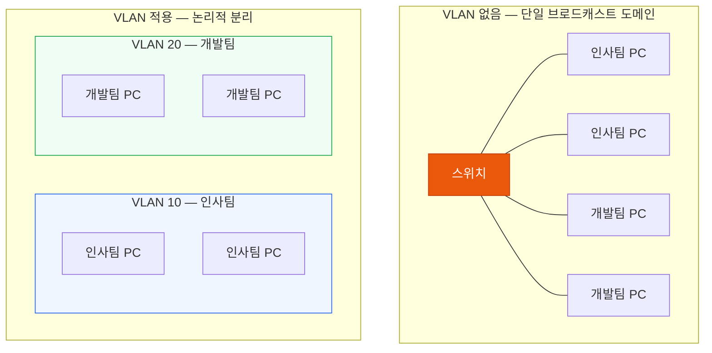
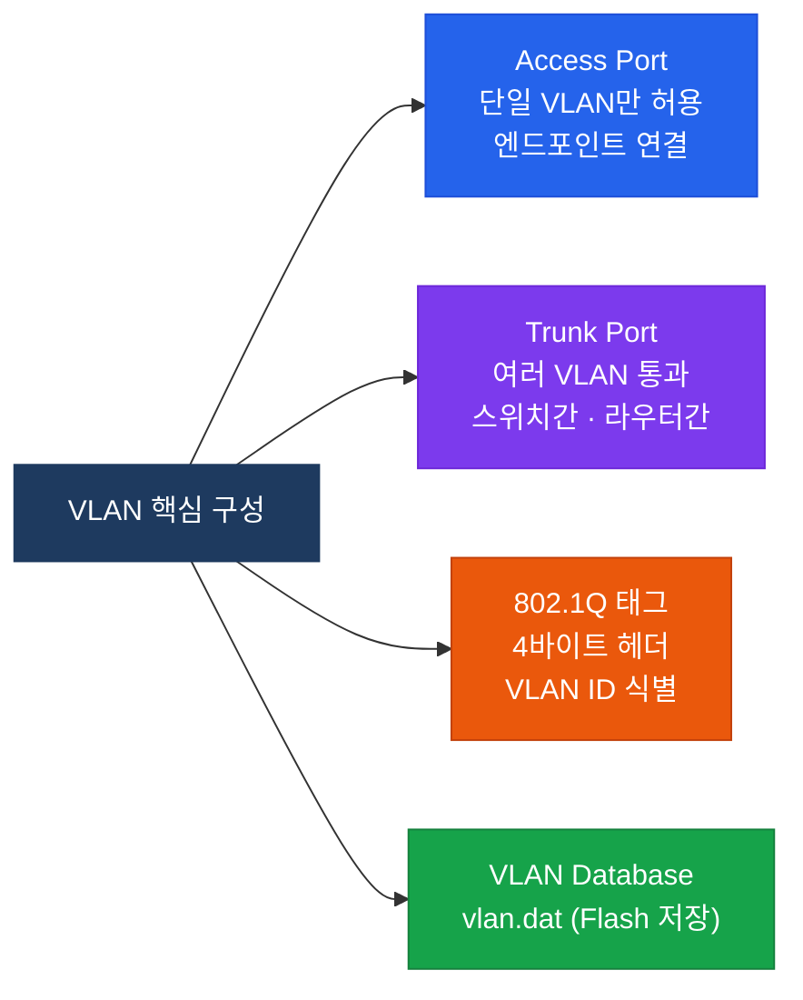
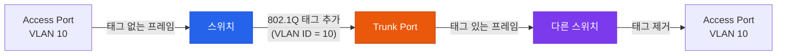
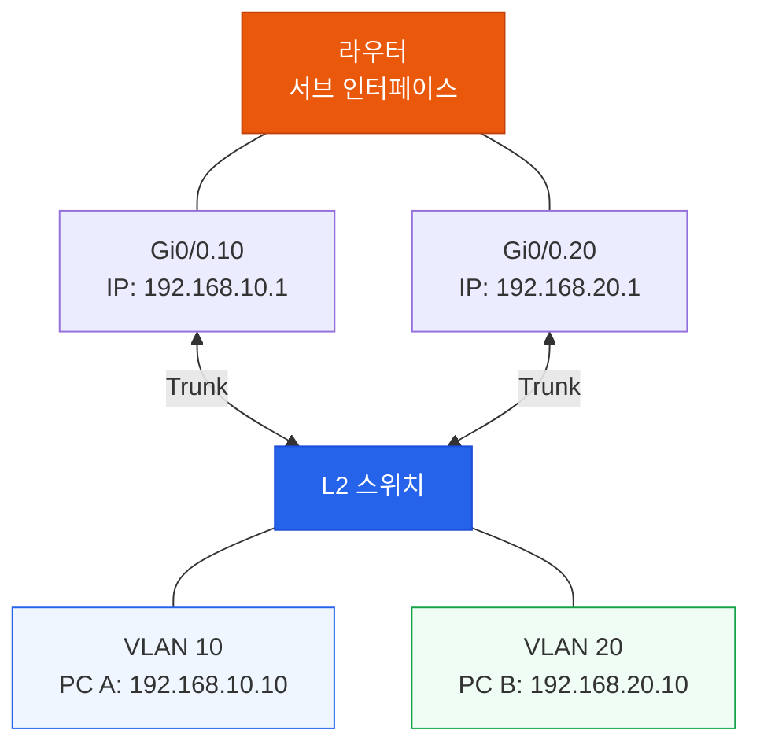
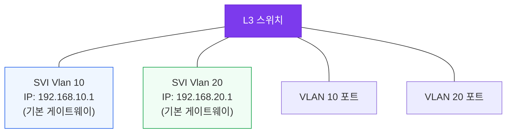
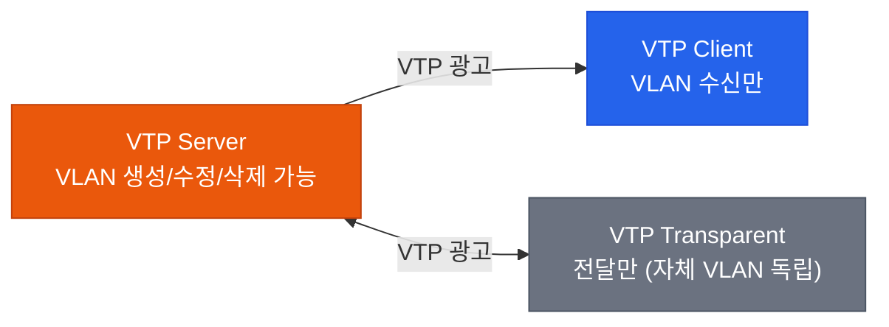

# VLAN & 트렁킹
**VLANs & Trunking (802.1Q)**

## 정의

하나의 물리적 스위치 인프라를 논리적으로 분리하여 서로 다른 **브로드캐스트 도메인**을 구성하는 가상 네트워크 기술. IEEE 802.1Q 태그로 다수의 VLAN을 단일 링크에서 전달한다.

## 특징

- **(논리적 네트워크 분리)** 물리적 위치와 무관하게 포트를 그룹화하여 독립된 브로드캐스트 도메인을 구성
- **(보안 및 트래픽 격리)** VLAN 간 통신은 L3 라우팅을 거쳐야 하므로 부서 간 트래픽이 자동으로 격리
- **(802.1Q 태그 기반 다중 전송)** 4바이트 태그로 여러 VLAN을 하나의 트렁크 링크로 동시에 전달

## 왜 필요한가?

하나의 스위치는 기본적으로 **단일 브로드캐스트 도메인**이다. 부서가 달라도 같은 스위치에 연결되면 서로의 브로드캐스트를 모두 받게 되어 보안·성능 문제가 생긴다.

**VLAN(Virtual LAN)** 은 하나의 물리적 스위치를 여러 개의 논리적 스위치로 분리한다.



---

## VLAN 구성 요소



---

## 802.1Q 태그 구조

트렁크 포트를 통과하는 프레임에는 4바이트의 **802.1Q 태그**가 삽입된다.

```
[ Destination MAC ] [ Source MAC ] [ 802.1Q Tag (4B) ] [ Type ] [ Data ] [ FCS ]
                                    ↑
                          [ TPID (0x8100) | PCP (3b) | DEI (1b) | VLAN ID (12b) ]
```

- **TPID**: 0x8100 — 802.1Q 태그임을 식별
- **PCP (Priority Code Point)**: 3비트 — QoS 우선순위 (CoS 값)
- **DEI (Drop Eligible Indicator)**: 혼잡 시 폐기 가능 여부
- **VLAN ID**: 12비트 — 0~4095, 실제 사용 가능 범위 **1~4094**



---

## Native VLAN

트렁크 포트에서 **태그 없이** 전달되는 VLAN이 Native VLAN이다. 기본값은 **VLAN 1**.


:::warning Native VLAN 불일치
양쪽 스위치의 Native VLAN이 다르면 VLAN 간 트래픽이 섞이는 **VLAN Hopping** 공격에 노출된다. 보안 강화를 위해 Native VLAN을 사용하지 않는 VLAN(예: VLAN 999)으로 변경하는 것이 권장된다.
:::

---

## 동작 흐름 — 인터 VLAN 통신

VLAN 간 통신은 L2 스위치만으로는 불가능하다. **라우터 또는 L3 스위치**가 필요하다.

### Router-on-a-Stick (서브 인터페이스)



### L3 스위치 SVI (권장)



---

## VLAN 범위 및 종류

| VLAN 범위 | 번호 | 용도 |
|-----------|------|------|
| 기본 VLAN | 1 | 기본값, 삭제 불가 |
| 일반 VLAN | 2~1001 | 사용자 정의 |
| 예약 VLAN | 1002~1005 | FDDI/Token Ring (레거시) |
| 확장 VLAN | 1006~4094 | VTP Transparent/Off 모드 필요 |

---

## 설정 — 완전한 예시

```bash
! VLAN 생성
SW(config)# vlan 10
SW(config-vlan)# name HR_DEPT
SW(config)# vlan 20
SW(config-vlan)# name DEV_DEPT

! Access Port 설정
SW(config)# interface FastEthernet0/1
SW(config-if)# switchport mode access
SW(config-if)# switchport access vlan 10

! Trunk Port 설정
SW(config)# interface GigabitEthernet0/1
SW(config-if)# switchport trunk encapsulation dot1q
SW(config-if)# switchport mode trunk
SW(config-if)# switchport trunk allowed vlan 10,20
SW(config-if)# switchport trunk native vlan 999

! L3 SVI (인터 VLAN 라우팅)
SW(config)# ip routing
SW(config)# interface vlan 10
SW(config-if)# ip address 192.168.10.1 255.255.255.0
SW(config-if)# no shutdown
```

### 검증 명령어

```bash
SW# show vlan brief
SW# show interfaces trunk
SW# show interfaces GigabitEthernet0/1 switchport
SW# show ip interface brief
```

---

## VTP (VLAN Trunking Protocol)

VTP는 VLAN 설정을 자동으로 스위치 간에 전파하는 Cisco 독점 프로토콜이다.



:::danger VTP 주의사항
VTP Server 모드의 스위치를 기존 네트워크에 연결할 때, **Revision Number가 높으면** 기존 VLAN 설정이 전부 덮어써진다. 실무에서는 VTP를 **Off 모드** 또는 **Transparent 모드**로 사용하는 추세다.
:::

---

## CCNP/CCIE 시험 포인트

- VLAN 1은 삭제 불가, Native VLAN 기본값
- 확장 VLAN(1006~4094)은 **VTP Transparent** 또는 **VTP Off** 모드에서만 생성 가능
- `switchport trunk encapsulation dot1q` — 일부 스위치에서 trunk 설정 전 필수
- DTP (Dynamic Trunking Protocol) — 자동 협상 프로토콜, 보안상 비활성화 권장
  ```bash
  SW(config-if)# switchport nonegotiate  ! DTP 비활성화
  ```
- Native VLAN 불일치는 `%CDP-4-NATIVE_VLAN_MISMATCH` 메시지로 감지
