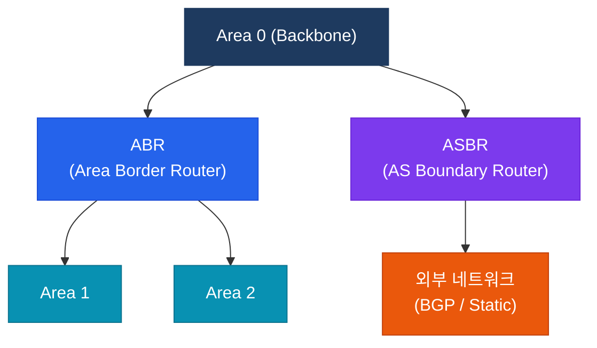

# OSPF (Open Shortest Path First)

OSPF는 대규모 엔터프라이즈 및 서비스 프로바이더 네트워크에서 가장 널리 사용되는 링크 상태 IGP(Interior Gateway Protocol)다.
이 섹션에서는 OSPF의 기본 동작 원리부터 영역 설계, 고급 설정, 성능 튜닝까지 CCNP/CCIE 시험 범위 전체를 다룬다.

---

## 정의

IETF RFC 2328(OSPFv2) / RFC 5340(OSPFv3)에 정의된 **링크 상태(Link-State)** 라우팅 프로토콜로, 각 라우터가 전체 토폴로지 맵(LSDB)을 유지하고 **Dijkstra SPF 알고리즘**으로 최단 경로를 계산하는 내부 게이트웨이 프로토콜.

---

## 특징

- **(링크 상태 방식)** 각 라우터가 네트워크 전체 토폴로지를 LSDB에 저장하고 SPF 알고리즘으로 루프 없는 최단 경로를 독립 계산
- **(계층적 영역 구조)** Area 0(백본)을 중심으로 다수의 영역을 계층화하여 LSA 플러딩 범위를 제한하고 대규모 네트워크의 확장성 확보
- **(빠른 수렴)** 링크 상태 변화 시 LSA를 즉시 플러딩하고 SPF를 재실행하여 RIP 등 거리 벡터 프로토콜 대비 수렴 속도가 현저히 빠름

---

## OSPF 구조 개요

---

## 이 섹션에서 다루는 내용

| 문서 | 주요 내용 |
|------|-----------|
| [OSPF 기본](ospf-basics) | 네이버 형성 절차, LSA 타입, DR/BDR 선출 |
| [OSPF 영역 설계](ospf-areas) | Area 타입(Stub/NSSA/Totally Stub), ABR/ASBR 역할 |
| [OSPF 고급 설정](ospf-advanced) | MD5/SHA 인증, Virtual Link, 경로 요약 |
| [OSPF 튜닝](ospf-tuning) | Hello/Dead 타이머, Interface Cost, BFD 연동 |

---

## CCNP/CCIE 시험에서의 OSPF 비중

OSPF는 CCNP ENCOR(350-401) 및 CCIE Enterprise Infrastructure 필기·실기 모두에서 **가장 높은 비중**을 차지하는 IGP 토픽이다.

- **ENCOR 필기**: IGP 섹션(~15%) 내 OSPF가 절반 이상 — 네이버 상태, LSA 타입, DR/BDR, 영역 타입이 핵심
- **CCIE 실기**: 복잡한 멀티 에어리어 설계, 경로 재분배, 필터링, 인증 설정이 반드시 출제
- **함정 포인트**: MTU 불일치로 인한 ExStart 고착, DR/BDR 선출 우선순위, Stub 영역에서의 외부 경로 차단 여부가 자주 출제됨
