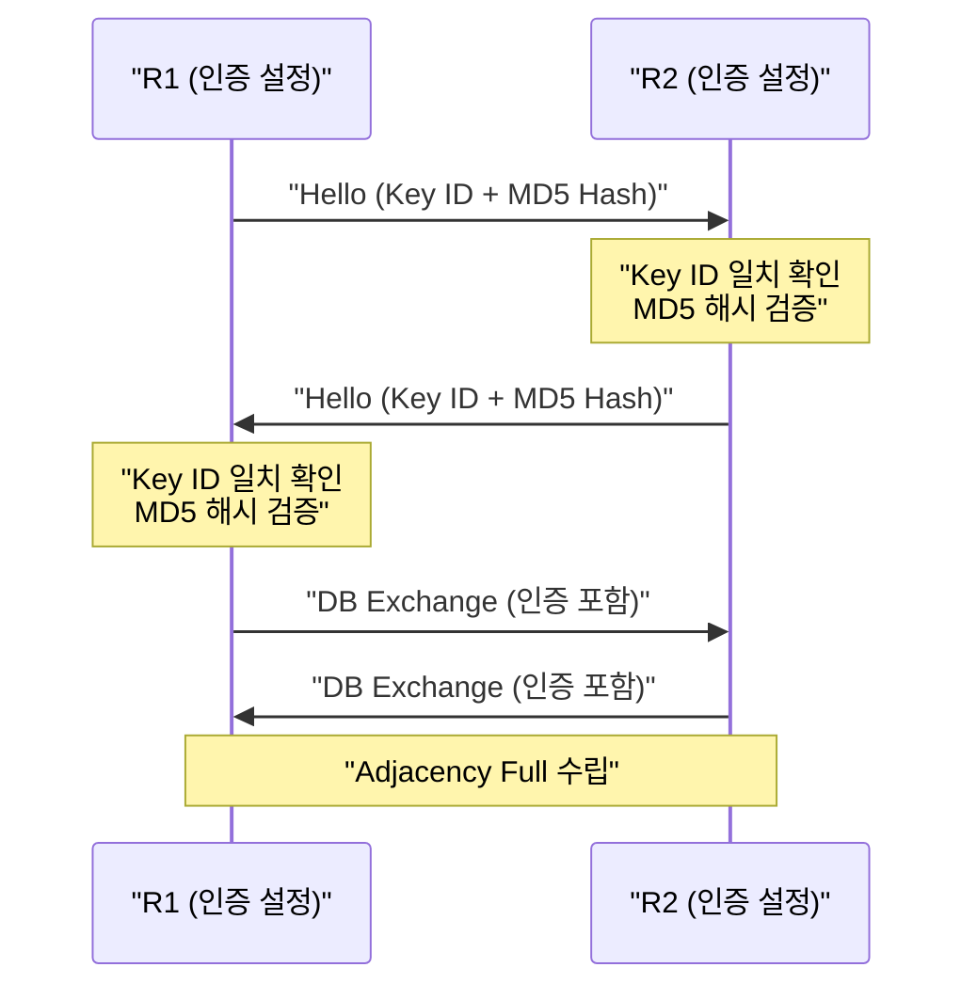
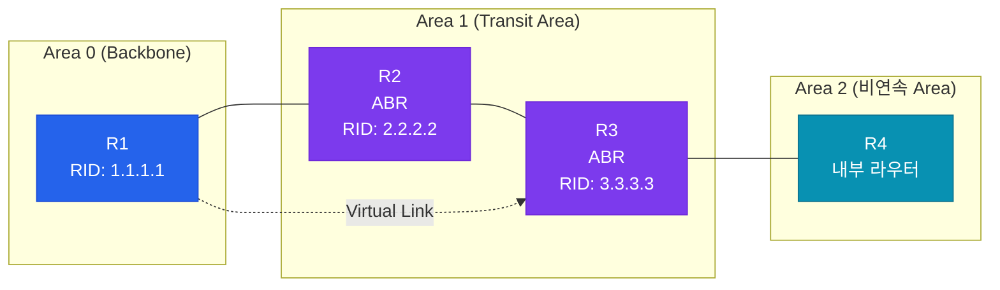
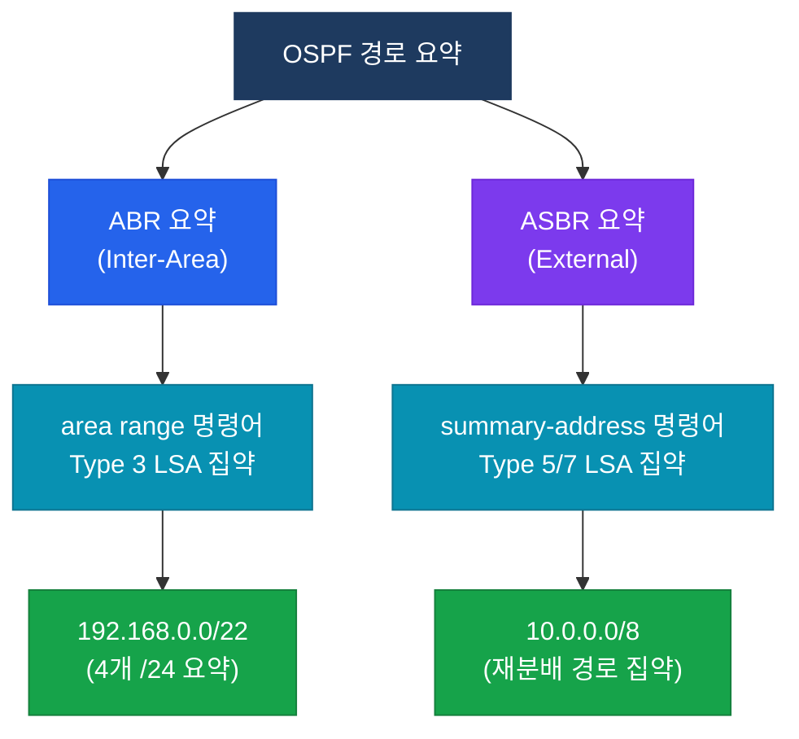
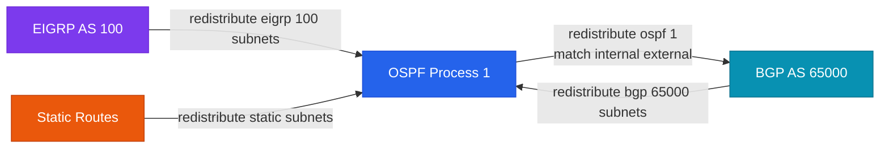
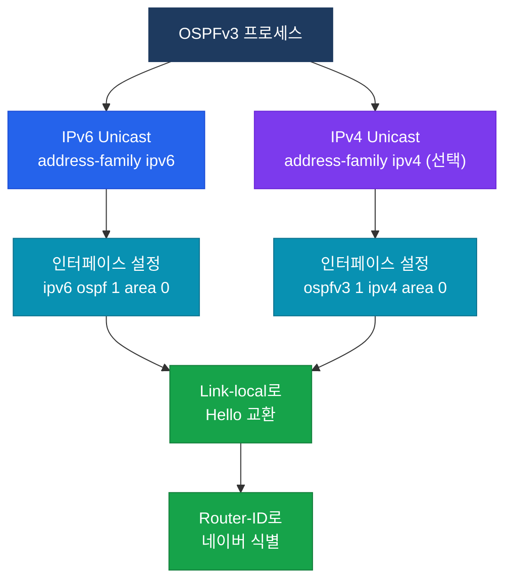

# OSPF 고급 설정

## 정의

OSPF 고급 기능이란 기본 OSPF 동작을 확장하여 **인증**, **비연속 Area 연결**, **경로 요약**, **재분배**, **IPv6 지원** 등 엔터프라이즈 환경에서 요구되는 복잡한 네트워크 요건을 충족하는 기능 집합.

---

## 특징

- **(인증 기반 보안)** Plain Text·MD5·SHA-HMAC 인증으로 OSPF 네이버 간 신뢰성을 보장하고 비인가 라우터 참여를 차단
- **(계층적 경로 요약)** ABR의 inter-area 요약과 ASBR의 external 요약으로 라우팅 테이블 크기를 줄이고 SPF 재계산 범위를 최소화
- **(프로토콜 간 재분배)** EIGRP·BGP·Static 경로를 OSPF로 유입하거나 반대 방향으로 내보내어 멀티 프로토콜 환경에서 일관된 라우팅 정책 적용

---

## OSPF 인증

### 인증 타입 비교

| 타입 | 명칭 | 설정 키워드 | 보안 수준 | 특징 |
|------|------|-------------|-----------|------|
| Type 0 | None | — | 없음 | 기본값, 인증 없음 |
| Type 1 | Plain Text | `authentication` | 낮음 | 비밀번호 평문 전송 |
| Type 2 | MD5 | `authentication message-digest` | 중간 | MD5 해시, CCNP 핵심 |
| SHA-HMAC | Key Chain | `ip ospf authentication key-chain` | 높음 | OSPFv2 SHA 지원 |

### 인증 동작 흐름



### 인증 설정 (Area 단위 MD5)

```bash
! Area 0 전체에 MD5 인증 적용
R1(config)# router ospf 1
R1(config-router)# area 0 authentication message-digest

! 인터페이스에 MD5 키 설정
R1(config)# interface GigabitEthernet0/0
R1(config-if)# ip ospf message-digest-key 1 md5 Cisco123

! SHA-HMAC 인증 (Key Chain 방식)
R1(config)# key chain OSPF-AUTH
R1(config-keychain)# key 1
R1(config-keychain-key)# key-string Cisco456
R1(config-keychain-key)# cryptographic-algorithm hmac-sha-256

R1(config)# interface GigabitEthernet0/1
R1(config-if)# ip ospf authentication key-chain OSPF-AUTH

! 검증
R1# show ip ospf interface GigabitEthernet0/0
R1# show ip ospf neighbor
```

---

## Virtual Link

### 개념 및 필요성

Area 0(Backbone Area)에 직접 연결되지 않은 Area는 OSPF 규칙상 존재할 수 없다. Virtual Link는 Transit Area를 통해 가상의 Point-to-Point 링크를 생성하여 비연속 Area 0 문제를 해결한다.



### Virtual Link 설정 규칙

- **양쪽 ABR 모두** 설정 필요 (R2와 R3 양쪽에서 설정)
- Transit Area는 Stub Area가 되어서는 안 됨
- `area [transit-area-id] virtual-link [상대 ABR Router-ID]`

```bash
! R2 설정 (Transit Area: Area 1, 상대 ABR RID: 3.3.3.3)
R2(config)# router ospf 1
R2(config-router)# area 1 virtual-link 3.3.3.3

! R3 설정 (Transit Area: Area 1, 상대 ABR RID: 2.2.2.2)
R3(config)# router ospf 1
R3(config-router)# area 1 virtual-link 2.2.2.2

! Virtual Link에 MD5 인증 추가
R2(config-router)# area 1 virtual-link 3.3.3.3 authentication message-digest message-digest-key 1 md5 VLinkPass

! 검증
R2# show ip ospf virtual-links
R2# show ip ospf neighbor
```

---

## 경로 요약

### 요약 위치에 따른 분류



### ABR Inter-Area 요약 설정

```bash
! ABR에서 Area 1의 192.168.0.0~192.168.3.0/24 네 개를 /22로 요약
ABR(config)# router ospf 1
ABR(config-router)# area 1 range 192.168.0.0 255.255.252.0

! not-advertise 옵션: 요약 경로도 광고하지 않음 (필터링 효과)
ABR(config-router)# area 1 range 192.168.0.0 255.255.252.0 not-advertise

! 검증
ABR# show ip ospf database summary
ABR# show ip route ospf
```

### ASBR External 요약 설정

```bash
! ASBR에서 재분배되는 외부 경로를 요약
ASBR(config)# router ospf 1
ASBR(config-router)# summary-address 10.0.0.0 255.0.0.0

! 검증
ASBR# show ip ospf database external
ASBR# show ip route ospf | include O E
```

---

## OSPF 재분배

### 재분배 방향별 구성



### E1 vs E2 메트릭 타입

| 구분 | E1 (metric-type 1) | E2 (metric-type 2) |
|------|--------------------|--------------------|
| 비용 계산 | External cost + Internal cost | External cost 고정 |
| 기본값 | — | 기본값 (type 2) |
| 경로 선호 | E1 > E2 (같은 external cost) | — |
| 용도 | 내부 토폴로지 반영 필요 시 | 단순 외부 경로 광고 |

### 재분배 설정 예시

```bash
! EIGRP 100 → OSPF 재분배 (subnets 필수: 클래스풀 외 경로 포함)
ASBR(config)# router ospf 1
ASBR(config-router)# redistribute eigrp 100 subnets metric 20 metric-type 1

! Static → OSPF 재분배
ASBR(config-router)# redistribute static subnets

! BGP → OSPF 재분배
ASBR(config-router)# redistribute bgp 65000 subnets metric 100 metric-type 2

! OSPF → BGP 재분배 (internal + external 경로 모두)
ASBR(config)# router bgp 65000
ASBR(config-router)# redistribute ospf 1 match internal external 1 external 2

! 검증
ASBR# show ip ospf database external
ASBR# show ip route ospf | include O E
ASBR# show ip bgp
```

---

## OSPFv3

### OSPFv2 vs OSPFv3 비교

| 구분 | OSPFv2 | OSPFv3 |
|------|--------|--------|
| 주소 체계 | IPv4 | IPv6 (IPv4도 지원, address-family) |
| Hello 주소 | 224.0.0.5 / 224.0.0.6 | FF02::5 / FF02::6 |
| 네이버 식별 | IP 주소 | Router ID (32bit) |
| 링크 주소 | IP 주소 | Link-local 주소 |
| 인증 | Type 1/2 내장 | IPsec AH/ESP 활용 |
| 설정 위치 | 인터페이스 or 프로세스 | 인터페이스 모드 |

### OSPFv3 동작 구조



### OSPFv3 설정 예시

```bash
! IPv6 라우팅 활성화
R1(config)# ipv6 unicast-routing

! OSPFv3 프로세스 생성 및 Router-ID 지정
R1(config)# ipv6 router ospf 1
R1(config-rtr)# router-id 1.1.1.1

! 인터페이스에 OSPFv3 Area 0 할당 (인터페이스 모드에서 설정)
R1(config)# interface GigabitEthernet0/0
R1(config-if)# ipv6 ospf 1 area 0

! OSPFv3 IPsec 인증 설정 (SHA-1)
R1(config)# interface GigabitEthernet0/0
R1(config-if)# ipv6 ospf authentication ipsec spi 500 sha1 1234567890ABCDEF1234567890ABCDEF12345678

! 검증
R1# show ipv6 ospf neighbor
R1# show ipv6 ospf database
R1# show ipv6 route ospf
```

---

## 설정 및 검증

### 종합 설정 시나리오

아래는 인증 + Virtual Link + 경로 요약 + 재분배를 포함한 종합 설정이다.

```bash
! === ABR (R2) 종합 설정 ===
R2(config)# router ospf 1
R2(config-router)# router-id 2.2.2.2

! Area 0 MD5 인증
R2(config-router)# area 0 authentication message-digest

! Area 1 → Area 0 경로 요약 (ABR inter-area)
R2(config-router)# area 1 range 172.16.0.0 255.255.240.0

! Area 3 비연속: Virtual Link (Transit: Area 1, 상대 ABR RID: 3.3.3.3)
R2(config-router)# area 1 virtual-link 3.3.3.3

! 인터페이스 MD5 키 설정
R2(config)# interface GigabitEthernet0/0
R2(config-if)# ip ospf message-digest-key 1 md5 Secure!Pass

! === ASBR 종합 설정 ===
ASBR(config)# router ospf 1
ASBR(config-router)# router-id 10.10.10.1

! EIGRP 재분배
ASBR(config-router)# redistribute eigrp 100 subnets metric 20 metric-type 1

! External 경로 요약
ASBR(config-router)# summary-address 192.168.0.0 255.255.0.0
```

### 주요 검증 명령어

```bash
! 인증 상태 확인
R1# show ip ospf interface GigabitEthernet0/0 | include auth

! Virtual Link 상태 확인
R2# show ip ospf virtual-links

! 경로 요약 확인 (Type 3 LSA)
ABR# show ip ospf database summary

! 재분배 경로 확인 (Type 5 LSA)
ASBR# show ip ospf database external

! 전체 OSPF 라우팅 테이블
R1# show ip route ospf

! OSPFv3 네이버 및 데이터베이스
R1# show ipv6 ospf neighbor
R1# show ipv6 ospf database
```

---

## CCNP/CCIE 시험 포인트

- **`subnets` 키워드 필수**: `redistribute` 시 `subnets`를 생략하면 클래스풀 네트워크만 재분배됨 — 서브넷 경로가 누락되는 함정 문제로 자주 출제
- **E1 > E2 선호**: 동일한 External cost를 가진 E1과 E2 경로가 있을 때 E1이 선택됨 (내부 cost 합산 반영)
- **Virtual Link는 Stub Area 통과 불가**: Transit Area가 Stub/Totally Stub이면 Virtual Link 설정 불가
- **ABR 요약 위치**: `area range`는 요약할 네트워크가 속한 Area의 ABR에서 설정 (반대 Area에 설정하면 미동작)
- **OSPFv3 Router-ID 필수**: IPv6 only 환경에서 IPv4 인터페이스가 없으면 `router-id` 수동 설정 필수, 없으면 프로세스 미시작
- **MD5 Key ID 일치**: 양쪽 라우터의 Key ID(`message-digest-key` 번호)가 다르면 인증 실패 — 같은 Key ID와 같은 패스워드 필수
- **`area range not-advertise`**: 요약 경로 자체도 광고를 막는 옵션으로, Type 3 LSA 필터링 용도로 활용 가능
