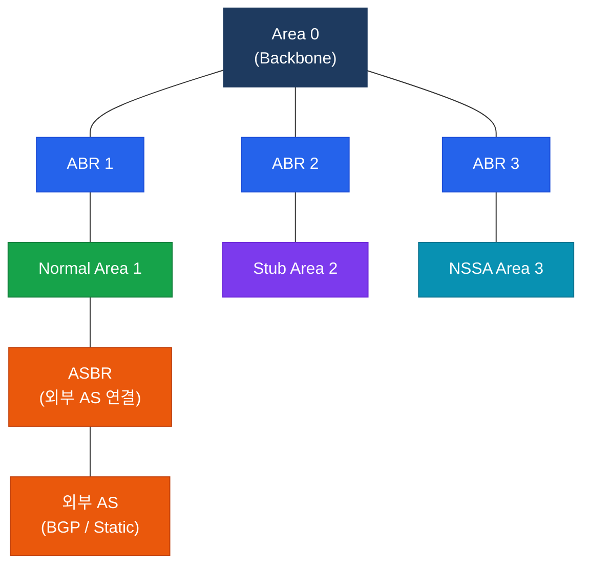
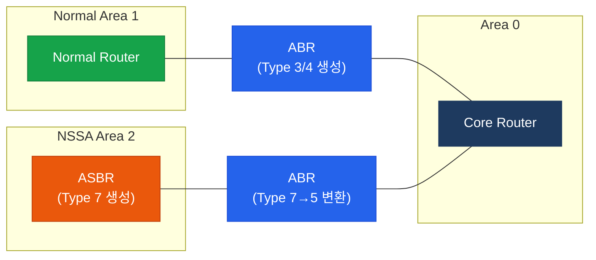

# OSPF 영역 설계

## 정의

OSPF에서 **Area**는 동일한 링크 상태 데이터베이스(LSDB)를 공유하는 라우터 집합으로, 계층적 토폴로지를 구성하여 LSA 전파 범위를 제한하고 SPF 재계산 비용을 최소화하는 논리적 분할 단위.

## 특징

- **(계층적 2계층 구조)** Backbone Area(Area 0)를 반드시 중심에 두고 모든 Non-Backbone Area는 Area 0에 직접 연결되어야 한다
- **(LSA 전파 범위 제한)** Area 경계에서 ABR이 LSA를 요약·필터링하여 링크 상태 정보가 전체 도메인으로 범람하는 것을 차단한다
- **(SPF 연산 분리)** Intra-area 토폴로지 변경 시 해당 Area 내 라우터만 SPF를 재실행하므로 대규모 네트워크에서 CPU 부하가 격리된다

## 왜 필요한가?

### 단일 Area의 한계

대규모 OSPF 네트워크를 하나의 Area로 운영하면 다음과 같은 문제가 발생한다.

- **LSDB 폭증**: 수백 개 라우터의 LSA가 모든 장비에 동기화되어 메모리 소모 급증
- **SPF 재계산 부담**: 링크 하나가 변경될 때마다 전체 라우터가 SPF를 재실행
- **경로 요약 불가**: Area 경계가 없으면 서브넷 수준까지 모든 경로가 라우팅 테이블에 노출

### 멀티 Area 설계의 해결책

```
단일 Area (문제)                멀티 Area (해결)
─────────────────              ──────────────────────────
[R1]─[R2]─[R3]─[R4]    →     Area 1 ─ ABR ─ Area 0 ─ ABR ─ Area 2
 모든 LSA가 전 도메인            LSA 전파를 Area 경계에서 차단
 SPF 전체 재계산                 Area별 독립 SPF 실행
 경로 요약 불가                  ABR에서 경로 요약 가능
```

## OSPF Area 구성 요소



| 구성 요소 | 역할 |
|----------|------|
| Area 0 (Backbone) | 모든 Area의 허브, 반드시 연속적이어야 함 |
| Normal Area | 표준 LSA 수신, 외부 경로 포함 |
| Stub Area | Type 5 LSA 차단, ABR이 default route 주입 |
| NSSA | Stub 속성을 유지하면서 외부 경로 재분배 허용 |
| ABR | Area 간 경계 라우터, Type 3/4 LSA 생성 |
| ASBR | 외부 AS와 OSPF 간 재분배, Type 5/7 LSA 생성 |

## Area 타입 비교

| Area 타입 | LSA Type 3 | LSA Type 5 | LSA Type 7 | 설명 |
|----------|:----------:|:----------:|:----------:|------|
| Backbone (Area 0) | O | O | X | 모든 Area의 허브, 반드시 연속성 유지 |
| Normal Area | O | O | X | 표준 Area, 모든 LSA 수신 |
| Stub Area | O | X | X | 외부 경로 차단, default route 자동 주입 |
| Totally Stub | default만 | X | X | ABR이 default route만 전달, Type 3도 차단 |
| NSSA | O | X | O | Stub에서 외부 경로 재분배 허용 (Type 7 사용) |
| Totally NSSA | default만 | X | O | Type 3도 차단, 외부 재분배는 Type 7로 허용 |

> **핵심**: Stub/Totally Stub은 외부 AS 연결(ASBR)이 없는 Area에 적용. NSSA는 ASBR이 존재하지만 Type 5 범람을 막고 싶을 때 사용.

## ABR / ASBR 역할

### ABR (Area Border Router)

ABR은 두 개 이상의 Area에 인터페이스를 가진 라우터로, Area 간 경로 정보를 전달한다.

- 각 연결 Area별로 별도 LSDB를 유지
- **Type 3 LSA** (Summary Network LSA): 인접 Area의 네트워크 경로를 요약하여 광고
- **Type 4 LSA** (Summary ASBR LSA): ASBR의 위치를 다른 Area에 알림
- `area X range` 명령으로 Area 간 경로 요약(inter-area summarization) 수행

### ASBR (AS Boundary Router)

ASBR은 OSPF 도메인과 외부 AS(BGP, EIGRP, Static 등) 사이에서 경로를 재분배하는 라우터다.

- **Type 5 LSA** (AS External LSA): Normal Area 전체로 전파
- **Type 7 LSA** (NSSA External LSA): NSSA 내부에서만 전파, ABR이 Area 0으로 나갈 때 Type 5로 변환



## 설정 및 검증

### Stub Area 설정

```bash
! ABR과 Stub Area 내 모든 라우터에 동일하게 적용
R1(config)# router ospf 1
R1(config-router)# area 1 stub            ! Area 1을 Stub으로 선언

! Totally Stub: ABR에서만 추가 옵션 적용
R1(config-router)# area 1 stub no-summary ! ABR만 입력 — Type 3 LSA도 차단
```

### NSSA 설정

```bash
! ABR과 NSSA 내 모든 라우터에 동일하게 적용
R2(config)# router ospf 1
R2(config-router)# area 2 nssa             ! Area 2를 NSSA로 선언

! Totally NSSA: ABR에서만 추가 옵션 적용
R2(config-router)# area 2 nssa no-summary  ! ABR만 입력 — Type 3도 차단

! NSSA 내 ASBR에서 외부 경로 재분배
R3(config)# router ospf 1
R3(config-router)# redistribute static subnets  ! Type 7 LSA 생성
```

### 경로 요약 (ABR)

```bash
! ABR에서 Area 1의 네트워크를 요약하여 Area 0으로 광고
R1(config)# router ospf 1
R1(config-router)# area 1 range 10.1.0.0 255.255.0.0  ! 10.1.0.0/16 으로 요약
```

### 검증 명령어

```bash
! OSPF 전체 요약 및 Area 정보 확인
R# show ip ospf

! 인터페이스별 OSPF Area 및 상태 확인
R# show ip ospf interface brief

! LSDB 전체 확인
R# show ip ospf database

! Type 3 (Summary) LSA 확인
R# show ip ospf database summary

! Type 5 (External) LSA 확인
R# show ip ospf database external

! Type 7 (NSSA External) LSA 확인
R# show ip ospf database nssa-external

! 특정 Area의 라우터 목록 확인
R# show ip ospf border-routers
```

## CCNP/CCIE 시험 포인트

- **Area 0 연속성**: 모든 Non-Backbone Area는 반드시 Area 0에 직접 연결되어야 한다. 불연속 Backbone은 Virtual Link로 해결한다.
- **Stub Area 조건**: Stub Area는 ASBR을 가질 수 없다. ASBR이 필요하면 NSSA를 사용한다.
- **no-summary 적용 범위**: `stub no-summary` 및 `nssa no-summary`는 ABR에서만 설정하며, 일반 라우터에 입력하면 neighbor 관계가 형성되지 않는다.
- **Type 7 → Type 5 변환**: NSSA ABR은 Type 7 LSA를 Type 5로 변환하여 Backbone으로 전파한다. 여러 ABR이 있을 경우 Router-ID가 높은 ABR이 변환을 담당한다.
- **Totally Stub default route**: Totally Stub Area의 ABR은 Type 3 Summary LSA로 `0.0.0.0/0`을 자동으로 주입한다. 별도의 `default-information originate` 명령이 필요 없다.
- **Stub Area 내 default route metric**: ABR이 주입하는 default route의 metric 기본값은 **1**이며, `area X default-cost` 명령으로 변경할 수 있다.
- **Virtual Link**: 불연속 Area 0을 복구하기 위한 임시 수단이며, Stub/NSSA Area를 통과하는 Virtual Link는 허용되지 않는다.
