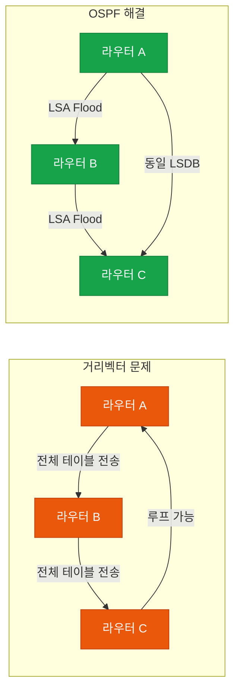
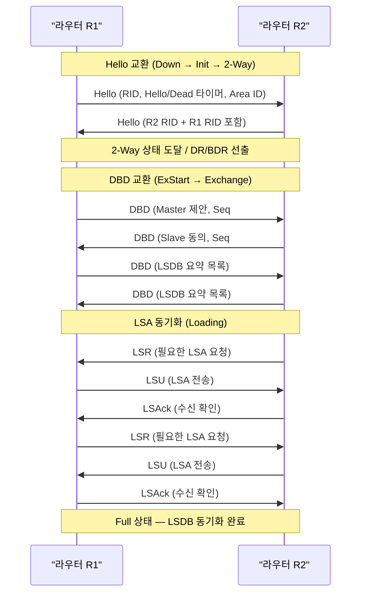
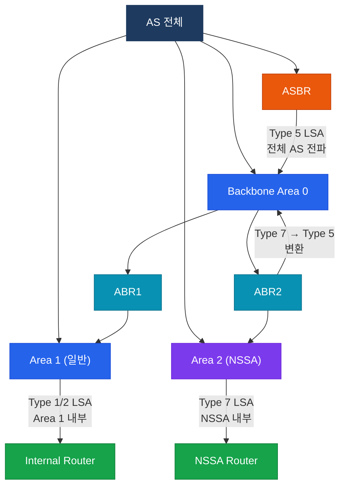
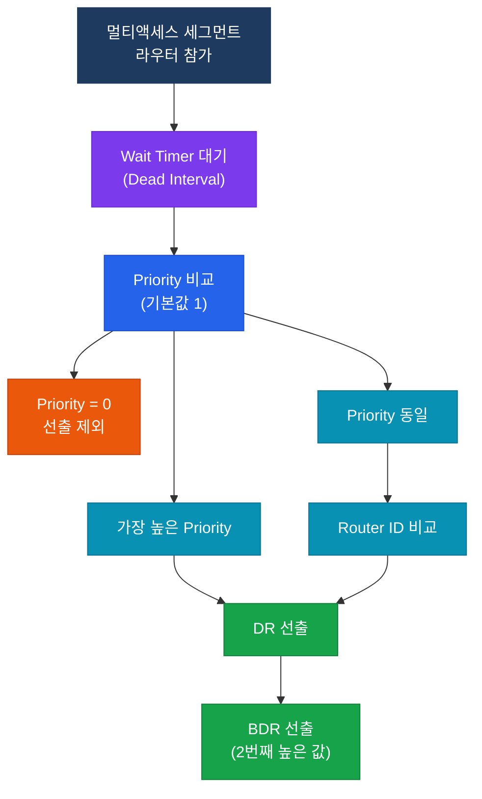

# OSPF 기본

## 정의

OSPF(Open Shortest Path First)는 RFC 2328 기반의 링크 상태(Link-State) IGP 라우팅 프로토콜로, 각 라우터가 전체 토폴로지 정보를 수집·공유하여 Dijkstra SPF 알고리즘으로 최단 경로를 계산하는 오픈 스탠더드 프로토콜이다.

## 특징

- **(링크 상태 데이터베이스)** 각 라우터가 동일한 LSDB를 유지하므로 루프 없는 최단 경로를 빠르게 수렴한다
- **(계층적 Area 구조)** Backbone Area(0)를 중심으로 다중 Area를 구성해 LSA 전파 범위를 제한하고 라우팅 테이블을 축소한다
- **(Classless 및 VLSM 지원)** 서브넷 마스크를 LSA에 포함하여 VLSM과 불연속 서브넷 환경에서도 정확한 경로 정보를 교환한다

## 왜 필요한가?

### 링크 상태 vs 거리 벡터 비교

거리 벡터 프로토콜(RIP 등)은 인접 라우터에게 전체 라우팅 테이블을 주기적으로 전달하기 때문에 수렴이 느리고 루프가 발생할 수 있다. OSPF는 링크 상태 방식으로 이 문제를 해결한다.

| 구분 | 거리 벡터 (RIP) | 링크 상태 (OSPF) |
|------|----------------|-----------------|
| 경로 정보 기반 | 인접 라우터의 라우팅 테이블 | 전체 토폴로지 LSDB |
| 수렴 속도 | 느림 (수십 초~분) | 빠름 (초 단위) |
| 루프 방지 | Split Horizon, Poisoned Reverse | SPF 알고리즘 자체적 방지 |
| 메트릭 | Hop Count | Cost (대역폭 기반) |
| 확장성 | 소규모 (최대 15 홉) | 대규모 (Area로 분리) |
| 업데이트 방식 | 주기적 전체 전송 | 변경 시 LSA만 Flood |



## OSPF 구성 요소

```mermaid
flowchart TD
    ROOT["OSPF 구성 요소"]

    ROOT --> ROUTER["라우터 유형"]
    ROOT --> LSA["LSA 데이터베이스"]
    ROOT --> AREA["Area 구조"]
    ROOT --> PKT["패킷 유형"]

    ROUTER --> IR["Internal Router<br/>단일 Area 소속"]
    ROUTER --> ABR["ABR<br/>Area 경계 라우터"]
    ROUTER --> ASBR["ASBR<br/>외부 AS 연결 라우터"]
    ROUTER --> BR["Backbone Router<br/>Area 0 소속"]

    LSA --> L1["Type 1: Router LSA"]
    LSA --> L2["Type 2: Network LSA"]
    LSA --> L3["Type 3: Summary LSA"]
    LSA --> L5["Type 5: AS External LSA"]

    AREA --> A0["Backbone Area 0"]
    AREA --> ASTUB["Stub Area"]
    AREA --> ANSSA["NSSA"]

    PKT --> HELLO["Hello"]
    PKT --> DBD["DBD"]
    PKT --> LSR["LSR"]
    PKT --> LSU["LSU"]
    PKT --> LSACK["LSAck"]

    style ROOT fill:#1E3A5F,stroke:#1E3A5F,color:#fff
    style ROUTER fill:#2563EB,stroke:#1D4ED8,color:#fff
    style LSA fill:#2563EB,stroke:#1D4ED8,color:#fff
    style AREA fill:#2563EB,stroke:#1D4ED8,color:#fff
    style PKT fill:#2563EB,stroke:#1D4ED8,color:#fff
    style IR fill:#7C3AED,stroke:#6D28D9,color:#fff
    style ABR fill:#7C3AED,stroke:#6D28D9,color:#fff
    style ASBR fill:#7C3AED,stroke:#6D28D9,color:#fff
    style BR fill:#7C3AED,stroke:#6D28D9,color:#fff
    style L1 fill:#0891B2,stroke:#0E7490,color:#fff
    style L2 fill:#0891B2,stroke:#0E7490,color:#fff
    style L3 fill:#0891B2,stroke:#0E7490,color:#fff
    style L5 fill:#0891B2,stroke:#0E7490,color:#fff
    style A0 fill:#16A34A,stroke:#15803D,color:#fff
    style ASTUB fill:#16A34A,stroke:#15803D,color:#fff
    style ANSSA fill:#16A34A,stroke:#15803D,color:#fff
    style HELLO fill:#EA580C,stroke:#C2410C,color:#fff
    style DBD fill:#EA580C,stroke:#C2410C,color:#fff
    style LSR fill:#EA580C,stroke:#C2410C,color:#fff
    style LSU fill:#EA580C,stroke:#C2410C,color:#fff
    style LSACK fill:#EA580C,stroke:#C2410C,color:#fff
```



## 동작 흐름 — 네이버 상태 머신

OSPF 네이버 형성은 Down 상태부터 Full 상태까지 7단계를 거친다.


### 네이버 형성 상세 흐름



### Hello 패킷 주요 필드

| 필드 | 설명 | 기본값 |
|------|------|--------|
| Hello Interval | Hello 전송 주기 | P2P/브로드캐스트: 10초, NBMA: 30초 |
| Dead Interval | 네이버 타임아웃 (Hello × 4) | P2P/브로드캐스트: 40초 |
| Area ID | 동일해야 네이버 형성 | - |
| Authentication | MD5/Plain 인증 | - |
| Stub Flag | Stub Area 여부 | - |
| MTU | DBD 교환 시 일치 필요 | - |

## LSA 타입 비교

| Type | 이름 | 생성자 | 전파 범위 | 설명 |
|------|------|--------|-----------|------|
| 1 | Router LSA | 모든 라우터 | Area 내 | 라우터의 인터페이스와 링크 상태 정보 |
| 2 | Network LSA | DR | Area 내 | 멀티액세스 세그먼트의 연결된 라우터 목록 |
| 3 | Summary LSA | ABR | Area 간 | 타 Area의 네트워크 요약 정보 |
| 4 | ASBR Summary LSA | ABR | Area 간 | ASBR의 위치(RID) 정보 |
| 5 | AS External LSA | ASBR | 전체 AS | 외부 AS에서 재분배된 경로 |
| 7 | NSSA External LSA | ASBR(NSSA) | NSSA Area | NSSA 내 외부 경로 (ABR에서 Type 5로 변환) |



## DR/BDR 선출

멀티액세스 네트워크(이더넷 등)에서는 N×(N-1)/2 개의 네이버 관계 문제를 해결하기 위해 DR(Designated Router)과 BDR(Backup DR)을 선출한다. DR/BDR이 아닌 라우터는 DROther로서 DR과 BDR하고만 Full 상태를 형성한다.

### 선출 기준 (우선순위 순)

1. **OSPF Priority 높은 값** — 기본값 1, 범위 0~255 (0으로 설정 시 선출 제외)
2. **Router ID 높은 값** — 루프백 IP > 물리 인터페이스 IP (수동 설정 우선)

> DR/BDR 선출은 **비선점(Non-preemptive)** 방식이다. 이미 선출된 후 더 높은 Priority 라우터가 추가되어도 재선출이 발생하지 않는다.



### DR/BDR 멀티캐스트 주소

| 주소 | 대상 |
|------|------|
| `224.0.0.5` | 모든 OSPF 라우터 (AllSPFRouters) |
| `224.0.0.6` | DR/BDR만 수신 (AllDRouters) |

## 설정 및 검증

### 기본 OSPF 설정

```bash
R1(config)# router ospf 1                          ! OSPF 프로세스 ID 1 (로컬 의미만 있음)
R1(config-router)# router-id 1.1.1.1               ! Router ID 수동 지정 (권장)
R1(config-router)# network 192.168.1.0 0.0.0.255 area 0  ! 와일드카드 마스크로 Area 지정
R1(config-router)# network 10.0.0.0 0.0.0.3 area 1
R1(config-router)# passive-interface GigabitEthernet0/1  ! 불필요한 Hello 전송 차단
R1(config-router)# auto-cost reference-bandwidth 10000   ! 기준 대역폭 10Gbps로 변경 (권장)
```

### DR/BDR Priority 설정

```bash
R1(config)# interface GigabitEthernet0/0
R1(config-if)# ip ospf priority 255                ! DR 강제 선출 (높은 Priority)
R1(config-if)# ip ospf priority 0                  ! DR/BDR 선출 제외

R1(config)# interface GigabitEthernet0/0
R1(config-if)# ip ospf hello-interval 5            ! Hello 타이머 변경 (양단 동일해야 함)
R1(config-if)# ip ospf dead-interval 20            ! Dead 타이머 변경 (Hello × 4 권장)
```

### OSPF 인증 설정 (MD5)

```bash
R1(config)# router ospf 1
R1(config-router)# area 0 authentication message-digest   ! Area 전체 MD5 인증

R1(config)# interface GigabitEthernet0/0
R1(config-if)# ip ospf message-digest-key 1 md5 CiscoPass  ! Key ID 1, 패스워드 설정
```

### 검증 명령어

```bash
R1# show ip ospf neighbor                          ! 네이버 상태 및 DR/BDR 확인
R1# show ip ospf neighbor detail                   ! 네이버 상세 정보 (타이머 등)
R1# show ip ospf database                          ! LSDB 전체 요약
R1# show ip ospf database router                   ! Type 1 Router LSA 목록
R1# show ip ospf database network                  ! Type 2 Network LSA 목록
R1# show ip ospf database summary                  ! Type 3 Summary LSA 목록
R1# show ip ospf database external                 ! Type 5 AS External LSA 목록
R1# show ip ospf interface GigabitEthernet0/0      ! 인터페이스 OSPF 정보 (DR/BDR, Cost)
R1# show ip route ospf                             ! OSPF로 학습한 라우팅 테이블
R1# show ip ospf                                   ! OSPF 프로세스 정보 (SPF 횟수 등)
```

### 출력 예시 해석

```bash
R1# show ip ospf neighbor
Neighbor ID   Pri   State           Dead Time   Address      Interface
2.2.2.2         1   FULL/DR         00:00:36    10.0.0.2     Gi0/0
3.3.3.3         1   FULL/BDR        00:00:38    10.0.0.3     Gi0/0
4.4.4.4         1   2WAY/DROTHER    00:00:35    10.0.0.4     Gi0/0
! State: FULL/DR → 2.2.2.2가 DR, 현재 라우터와 Full 상태
! State: 2WAY/DROTHER → DROther와는 2-Way까지만 형성
```

## CCNP/CCIE 시험 포인트

- **네이버 형성 실패 원인**: Area ID 불일치, Hello/Dead 타이머 불일치, 인증 불일치, MTU 불일치, Stub 플래그 불일치 중 하나라도 다르면 2-Way 이상 진행 불가
- **DR/BDR 비선점**: Priority를 올려도 현재 DR이 살아있는 한 재선출 없음. `clear ip ospf process`로 강제 재선출 가능
- **Router ID 결정 순서**: 수동 설정 > Loopback 인터페이스 중 가장 높은 IP > 물리 인터페이스 중 가장 높은 IP (Up/Up 기준)
- **OSPF Cost 계산**: `Reference Bandwidth / Interface Bandwidth` — 기본 Reference는 100Mbps이므로 GigabitEthernet의 Cost가 FastEthernet과 동일하게 1이 됨. 반드시 `auto-cost reference-bandwidth`로 조정
- **Type 7 → Type 5 변환**: ABR이 NSSA의 Type 7 LSA를 Type 5로 변환하여 Backbone에 전파. NSSA에는 Type 5가 들어오지 않음
- **Stub Area**: Type 5 LSA 차단, ABR이 Default Route(Type 3) 자동 생성. Totally Stub은 Type 3도 차단
- **`passive-interface`**: Hello 전송을 차단하므로 네이버 형성 불가. 루프백 인터페이스나 호스트 연결 인터페이스에 적용
- **DBD 교환 시 Master/Slave**: 높은 Router ID가 Master, Sequence Number를 주도함
