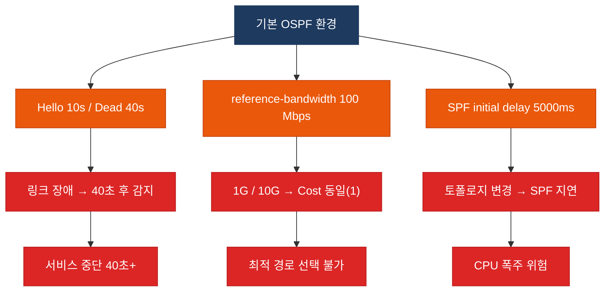
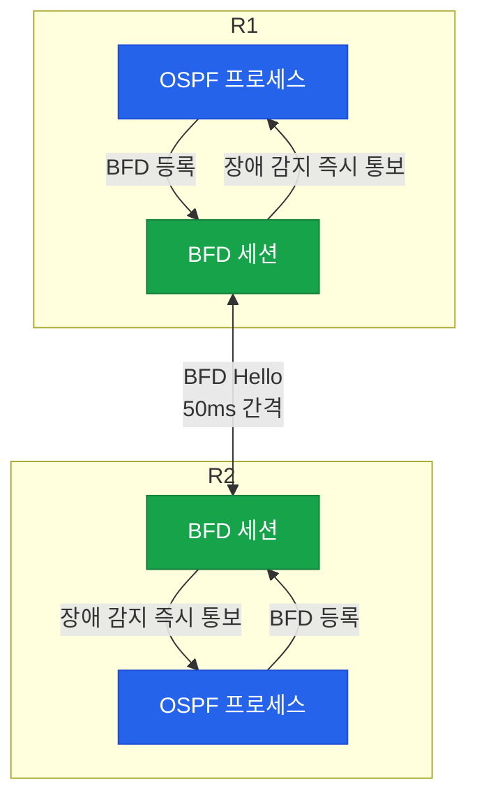
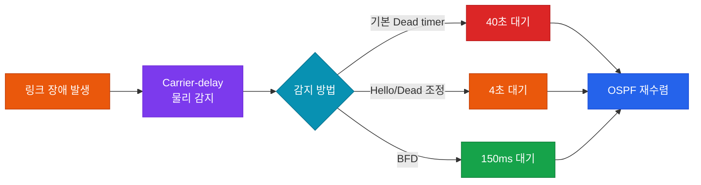

# OSPF 튜닝

## 정의

OSPF 네트워크에서 **타이머 조정·Cost 조작·BFD 연동** 등을 통해 장애 감지 속도와 경로 수렴 시간을 최적화하고, 프로토콜 오버헤드를 제어하는 일련의 성능 튜닝 기법.

---

## 특징

- **(빠른 장애 감지)** Hello/Dead 타이머 단축 또는 BFD 연동으로 기본 40초 Dead timer 대비 최대 800배 빠른 링크 장애 감지 가능
- **(경로 비용 정밀 제어)** reference-bandwidth 조정과 인터페이스 Cost 직접 지정으로 기가비트·10기가비트 환경에서 최적 경로를 정확하게 제어
- **(SPF 폭풍 방지)** SPF·LSA throttle 타이머로 연속 토폴로지 변경 시 불필요한 재계산을 억제하여 CPU 과부하와 라우팅 불안정 방지

---

## 왜 필요한가?

OSPF 기본값은 안정성 위주로 설계되어 있어 현대 엔터프라이즈·데이터센터 환경에서는 컨버전스 속도가 지나치게 느리다.

```
기본 Hello : 10초  →  Dead : 40초  →  SPF 계산 : 최대 5초
→ 총 링크 장애 감지 + 경로 전환 시간 : 45초 이상
```

또한 100 Mbps 기준의 reference-bandwidth는 1 Gbps 이상 인터페이스에서 Cost를 모두 1로 만들어 경로 선택을 왜곡한다.



튜닝을 통해 세 가지 문제를 모두 해결할 수 있다.

---

## OSPF 타이머

### Hello / Dead 타이머

| 타이머 | 기본값 | 빠른 설정 예시 | 설명 |
|--------|--------|--------------|------|
| Hello interval | 10초 (Broadcast/P2P) | 1초 | 이웃 라우터에 전송하는 주기 |
| Dead interval | 40초 (4 × Hello) | 4초 | Hello 미수신 시 이웃 Down 판정 |
| Hello interval (NBMA) | 30초 | — | NBMA 네트워크 기본값 |
| Dead interval (NBMA) | 120초 | — | NBMA 네트워크 기본값 |

> 같은 세그먼트의 모든 OSPF 라우터는 Hello/Dead 타이머가 **반드시 일치**해야 이웃 관계가 성립한다.

### SPF 스로틀 타이머

연속적인 토폴로지 변경 시 SPF 재계산이 폭발적으로 증가하는 것을 방지한다.

```
timers throttle spf <initial> <min-delay> <max-delay>
```

| 파라미터 | 기본값 | 권장값 | 설명 |
|----------|--------|--------|------|
| initial | 5000ms | 0ms | 최초 토폴로지 변경 후 SPF 시작 지연 |
| min-delay | 10000ms | 50ms | 연속 변경 시 최소 재계산 간격 |
| max-delay | 10000ms | 5000ms | 연속 변경 시 최대 재계산 간격 |

### LSA 스로틀 타이머

```
timers throttle lsa all <start> <hold> <max>
timers lsa arrival <ms>
```

| 파라미터 | 기본값 | 권장값 | 설명 |
|----------|--------|--------|------|
| LSA start | 0ms | 0ms | 첫 LSA 생성 지연 |
| LSA hold | 5000ms | 200ms | 연속 LSA 생성 최소 간격 |
| LSA max | 5000ms | 5000ms | LSA 생성 최대 간격 |
| LSA arrival | 1000ms | 0ms | 동일 LSA 수신 허용 최소 간격 |


---

## OSPF Cost 조작

### Cost 계산 공식

```
Cost = Reference Bandwidth / Interface Bandwidth
```

기본 reference-bandwidth는 **100 Mbps**이므로 1 Gbps 이상 인터페이스는 모두 Cost = 1이 되어 경로 구분이 불가능하다.

| 인터페이스 | 실제 속도 | 기본 Cost (ref=100M) | 권장 Cost (ref=10G) |
|-----------|---------|---------------------|---------------------|
| FastEthernet | 100 Mbps | 1 | 100 |
| GigabitEthernet | 1 Gbps | 1 | 10 |
| 10GigabitEthernet | 10 Gbps | 1 | 1 |
| 100GigabitEthernet | 100 Gbps | 1 | 1 (수동 지정 필요) |

> 전체 OSPF 도메인의 모든 라우터에서 **동일한 reference-bandwidth** 값을 사용해야 한다.

### 인터페이스 Cost 직접 지정

자동 계산 대신 인터페이스에 Cost를 직접 지정할 수 있다. 직접 지정값이 자동 계산값보다 **우선**한다.

```bash
R1(config-if)# ip ospf cost 50   ! Cost 직접 지정 (1~65535)
```

---

## BFD (Bidirectional Forwarding Detection) 연동

### BFD 개요

BFD는 두 라우터 간 양방향 포워딩 경로를 밀리초 단위로 감시하는 별도 프로토콜이다. OSPF Hello 타이머와 무관하게 독립적으로 동작하며, 장애 감지 후 즉시 OSPF에 통보한다.



### BFD 타이머 파라미터

```
bfd interval <tx-ms> min_rx <rx-ms> multiplier <n>
```

| 파라미터 | 설명 | 권장값 |
|----------|------|--------|
| interval | BFD Hello 전송 간격 (ms) | 50 |
| min_rx | 상대방 Hello 수신 최소 간격 (ms) | 50 |
| multiplier | 미수신 허용 횟수 | 3 |

위 설정 시 장애 감지 시간 = 50ms × 3 = **150ms** (최대).

---

## OSPF Fast Convergence 기법 비교

| 기법 | 감지 시간 | 설정 복잡도 | 추가 프로토콜 | 비고 |
|------|----------|------------|--------------|------|
| 기본 Dead timer | ~40초 | 없음 | 불필요 | 기본값 |
| Hello/Dead 조정 | ~4초 | 낮음 | 불필요 | 동일 세그먼트 모두 변경 필요 |
| BFD | ~150ms | 중간 | BFD 필요 | 하드웨어 지원 필요 |
| Carrier-delay 0 | 즉시 (~0ms) | 낮음 | 불필요 | 물리 링크 플랩 필터링 제거 |
| IP SLA + track | 가변 | 높음 | IP SLA 필요 | 논리 장애 감지 가능 |



---

## 설정 및 검증

### Hello / Dead 타이머 조정

```bash
R1(config)# interface GigabitEthernet0/0
R1(config-if)# ip ospf hello-interval 1    ! Hello 간격 1초로 단축
R1(config-if)# ip ospf dead-interval 4     ! Dead 간격 4초로 단축 (4 × Hello 권장)
```

### Reference Bandwidth 조정

```bash
R1(config)# router ospf 1
R1(config-router)# auto-cost reference-bandwidth 10000  ! 단위: Mbps, 10Gbps 기준으로 설정
! 주의: 도메인 내 모든 OSPF 라우터에 동일하게 적용해야 함
```

### SPF / LSA 스로틀 조정

```bash
R1(config)# router ospf 1
R1(config-router)# timers throttle spf 0 50 5000     ! initial=0ms, min=50ms, max=5000ms
R1(config-router)# timers throttle lsa all 0 200 5000 ! LSA 생성 throttle
R1(config-router)# timers lsa arrival 0               ! 동일 LSA 즉시 수신 허용
```

### BFD 연동 설정

```bash
! 1단계: 인터페이스에 BFD 타이머 설정
R1(config)# interface GigabitEthernet0/0
R1(config-if)# bfd interval 50 min_rx 50 multiplier 3  ! 50ms 간격, 3회 미수신 시 Down

! 2단계: OSPF와 BFD 연동
R1(config-if)# ip ospf bfd                  ! 인터페이스 단위 활성화
! 또는 OSPF 프로세스 전체에 적용
R1(config)# router ospf 1
R1(config-router)# bfd all-interfaces       ! 모든 OSPF 인터페이스에 BFD 활성화
```

### 인터페이스 Cost 직접 지정

```bash
R1(config)# interface GigabitEthernet0/1
R1(config-if)# ip ospf cost 50             ! Cost 50으로 직접 지정
```

### 검증 명령어

```bash
! OSPF 타이머 및 BFD 상태 확인
R1# show ip ospf                            ! SPF throttle, LSA throttle 타이머 확인
R1# show ip ospf interface GigabitEthernet0/0  ! Hello/Dead interval, Cost 확인

! BFD 세션 확인
R1# show bfd neighbors                      ! BFD 이웃 세션 상태 확인
R1# show bfd neighbors detail               ! BFD 타이머 및 세션 상세 확인

! Cost 확인
R1# show ip ospf interface brief            ! 인터페이스별 Cost 목록 확인

! 수렴 이벤트 확인
R1# show ip ospf event                      ! OSPF 이벤트 로그 확인
R1# debug ip ospf events                    ! OSPF 이벤트 실시간 디버그
R1# debug ip ospf adj                       ! 이웃 관계 변화 실시간 디버그
```

---

## CCNP/CCIE 시험 포인트

- **Hello/Dead 타이머 불일치** 시 이웃 관계가 성립하지 않는다. 같은 세그먼트의 모든 OSPF 라우터가 동일한 값을 가져야 한다.
- **reference-bandwidth 기본값은 100 Mbps**이며, 1 Gbps 이상 링크가 있는 환경에서는 반드시 조정해야 한다. 도메인 내 모든 라우터에 동일하게 적용하지 않으면 SPF 계산이 불일치한다.
- **BFD는 OSPF와 별개의 세션**이다. BFD가 Down을 감지하면 OSPF에 즉시 통보하지만, BFD 자체가 OSPF 이웃을 재형성하지는 않는다.
- **SPF throttle의 initial delay를 0**으로 설정하면 첫 토폴로지 변경 시 지연 없이 SPF가 실행된다. 단, 연속 변경 시에는 min-delay 간격으로 조절된다.
- **ip ospf dead-interval minimal hello-multiplier** 명령어로 Dead interval을 1초 미만(서브초)으로 설정할 수 있다. 이 경우 Hello 간격은 Dead/multiplier가 된다.
- **Cost 직접 지정(ip ospf cost)** 은 auto-cost reference-bandwidth 계산값보다 우선한다. 두 설정이 충돌하면 직접 지정값이 항상 이긴다.
- **BFD는 하드웨어 지원이 필요**하다. 소프트웨어 포워딩 경로(일부 가상 플랫폼)에서는 BFD 타이머가 제대로 동작하지 않을 수 있다.
