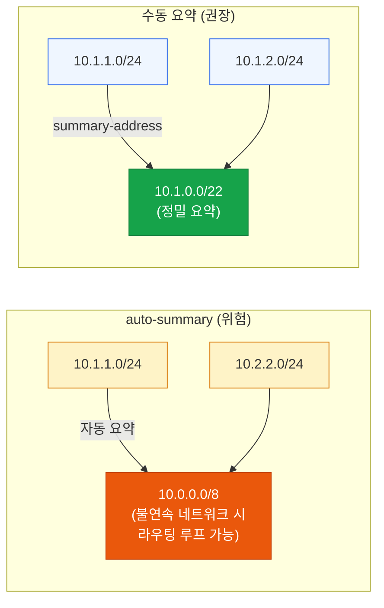
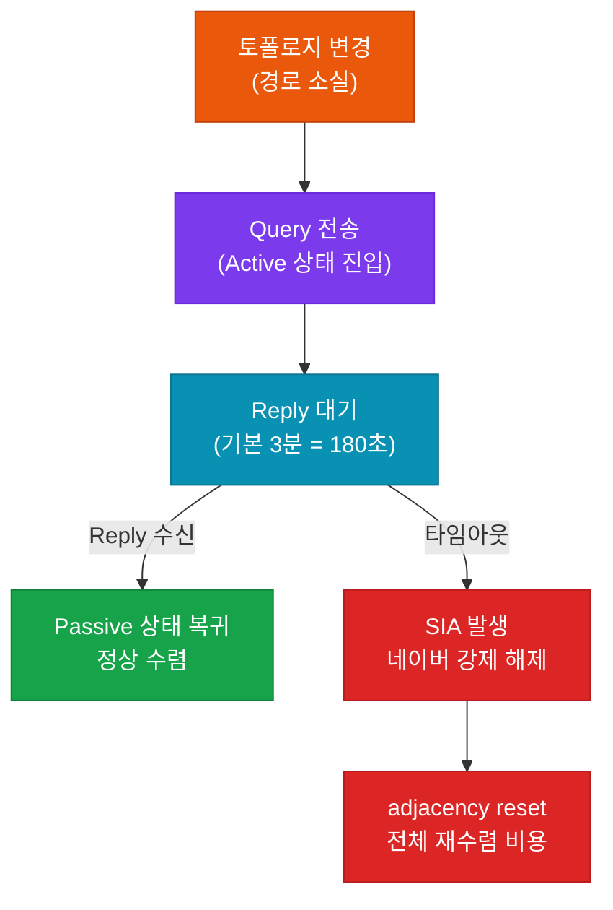

# EIGRP 고급 설정

## 정의

EIGRP 고급 설정은 **인증·경로 요약·재분배·Stub·부하 분산·SIA 방지** 등 프로덕션 네트워크 운영에 필수적인 EIGRP 기능으로, CCNP/CCIE 실기 시험의 핵심 출제 범위다.

## 특징

- **(Stub 라우터)** 스포크 라우터를 Stub으로 선언해 불필요한 Query 전파를 차단하여 SIA 장애와 CPU 과부하를 예방
- **(Unequal-cost 부하 분산)** `variance` 명령으로 FD×multiplier 조건을 충족하는 Feasible Successor 경로까지 트래픽을 분산하여 링크 활용도 극대화
- **(계층적 경로 요약)** 인터페이스 레벨에서 수동 요약을 적용해 토폴로지 테이블 크기를 줄이고 Query 전파 범위를 제한

## EIGRP 인증 (MD5 vs SHA-256)

### MD5 인증 (Classic & Named 공통)

```bash
! Key Chain 생성
R1(config)# key chain EIGRP-KEY
R1(config-keychain)#  key 1
R1(config-keychain-key)#   key-string MySecret123         ! 인증 키 문자열
R1(config-keychain-key)#   accept-lifetime infinite       ! 수락 기간 (무기한)
R1(config-keychain-key)#   send-lifetime infinite         ! 전송 기간 (무기한)

! Classic EIGRP 인터페이스 적용
R1(config)# interface GigabitEthernet0/0
R1(config-if)#  ip authentication mode eigrp 100 md5      ! MD5 모드 지정
R1(config-if)#  ip authentication key-chain eigrp 100 EIGRP-KEY  ! Key Chain 연결
```

### SHA-256 인증 (Named EIGRP 전용)

```bash
! Named EIGRP af-interface에서 설정
R1(config)# router eigrp CORP
R1(config-router)# address-family ipv4 unicast autonomous-system 100
R1(config-router-af)#  af-interface GigabitEthernet0/0
R1(config-router-af-interface)#   authentication mode hmac-sha-256 MYPASSWORD  ! SHA-256
```

| 구분 | MD5 | HMAC-SHA-256 |
|------|-----|--------------|
| 지원 모드 | Classic + Named | Named EIGRP만 |
| 보안 강도 | 128비트 해시 | 256비트 해시 |
| 설정 위치 | 인터페이스 / af-interface | af-interface |

---

## 경로 요약 (auto-summary vs manual)



```bash
! 수동 경로 요약 (인터페이스 모드)
R1(config)# interface GigabitEthernet0/0
R1(config-if)#  ip summary-address eigrp 100 10.1.0.0 255.255.252.0  ! 요약 주소 선언

! 검증
R1# show ip eigrp topology 10.1.0.0/22   ! 요약 경로 확인
R1# show ip route 10.1.0.0               ! 라우팅 테이블에서 확인
```

---

## 재분배

```bash
! 외부 경로를 EIGRP로 재분배
R1(config)# router eigrp 100
R1(config-router)#  redistribute ospf 1 metric 10000 100 255 1 1500  ! BW/Delay/Rel/Load/MTU
R1(config-router)#  redistribute static metric 10000 100 255 1 1500   ! 정적 경로 재분배
R1(config-router)#  redistribute connected metric 10000 100 255 1 1500 ! 직접 연결 재분배

! 재분배 경로는 AD 170 (외부 EIGRP)으로 설치됨
R1# show ip route eigrp | include EX    ! 외부 EIGRP 경로 확인 (D EX 표시)
```

---

## SIA (Stuck-In-Active) 방지



```bash
! SIA 타이머 조정 (기본 180초)
R1(config)# router eigrp 100
R1(config-router)#  timers active-time 60   ! Active 타임아웃 60초로 단축

! Stub 설정으로 SIA 근본 예방
R1(config-router)#  eigrp stub connected summary  ! 연결된 경로와 요약만 광고
! stub 라우터는 Query를 받지 않으므로 SIA 위험 없음
```

---

## 부하 분산 (equal / unequal-cost)

```bash
! Equal-cost 부하 분산 (기본값: 최대 4경로)
R1(config)# router eigrp 100
R1(config-router)#  maximum-paths 8         ! 최대 8개 경로 동시 사용

! Unequal-cost 부하 분산 (variance)
! 조건: FD × variance >= Feasible Successor의 FD
R1(config-router)#  variance 2              ! Successor FD의 2배 이내 FS도 포함

! 확인
R1# show ip route eigrp                     ! 여러 경로 설치 여부 확인
R1# show ip eigrp topology                  ! FS 등록 여부 및 메트릭 비교
```

| 구분 | Equal-cost LB | Unequal-cost LB |
|------|---------------|-----------------|
| 조건 | 동일 FD 경로 | FD × variance 이내의 FS |
| 명령어 | `maximum-paths` | `variance` |
| 기본 경로 수 | 4 | 1 (variance 설정 전) |
| 트래픽 분배 | 균등 | 메트릭 비율에 따라 분배 |

---

## 설정 및 검증

```bash
! 전체 고급 기능 종합 설정 예시
R1(config)# router eigrp 100
R1(config-router)#  no auto-summary                          ! 자동 요약 비활성화
R1(config-router)#  eigrp stub connected summary             ! Stub 선언
R1(config-router)#  variance 2                               ! Unequal LB
R1(config-router)#  maximum-paths 4                          ! 최대 경로 수
R1(config-router)#  timers active-time 90                    ! SIA 타이머 조정

! 인터페이스별 요약 및 인증
R1(config)# interface GigabitEthernet0/0
R1(config-if)#  ip summary-address eigrp 100 10.0.0.0 255.0.0.0  ! 경로 요약
R1(config-if)#  ip authentication mode eigrp 100 md5
R1(config-if)#  ip authentication key-chain eigrp 100 EIGRP-KEY

! 검증 명령어 모음
R1# show ip eigrp neighbors detail          ! 인증 상태 포함 상세 네이버 정보
R1# show ip eigrp topology all-links        ! 모든 경로 (FS 포함) 표시
R1# show ip protocols                       ! EIGRP 파라미터 (variance, AD 등)
R1# show ip eigrp traffic                   ! Hello/Update/Query/Reply 패킷 통계
```

---

## CCNP/CCIE 시험 포인트

- **Stub 설정 시 Query 전파 차단**: Stub 라우터는 Query를 수신하지 않으므로 허브-앤-스포크 토폴로지에서 SIA 예방에 필수적이다
- **variance와 FD 조건**: `variance n`은 Successor의 FD × n 이내의 Feasible Successor만 적용되며, Feasibility Condition(RD < FD)을 충족하지 못한 경로는 FS가 아니므로 variance 대상이 되지 않는다
- **SHA-256은 Named EIGRP 전용**: Classic EIGRP에서 SHA-256 설정 시도 시 오류 발생 — 시험 함정
- **외부 EIGRP AD = 170**: 재분배된 경로(D EX)의 Administrative Distance는 170이며, 내부(90)보다 높아 라우팅 결정에 주의가 필요하다
- **`eigrp stub`** 만 선언하면 connected + summary만 광고하는 것이 기본값 — `redistributed`나 `static`을 추가해야 해당 경로도 광고된다
- **경로 요약 시 Null0 생성**: `ip summary-address eigrp` 설정 시 요약 경로를 위한 Null0 인터페이스 경로가 자동 생성되어 라우팅 루프를 방지한다
- **SIA 디버그**: `debug eigrp fsm`으로 DUAL 상태 전이를 확인하고, `show ip eigrp topology active`로 현재 Active 상태의 경로를 조회한다
