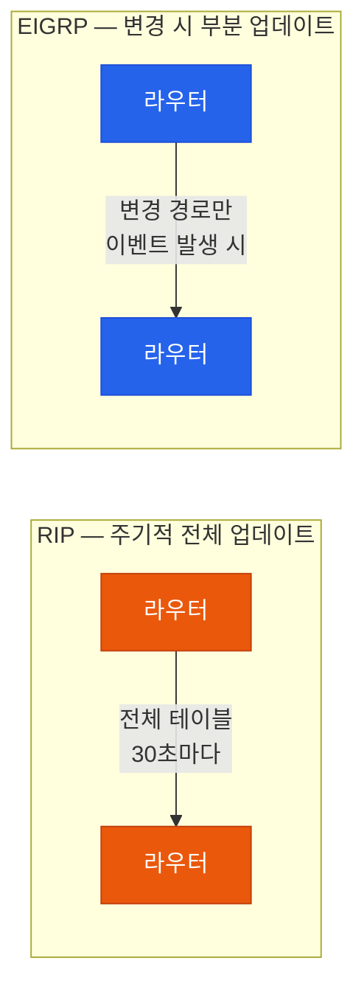
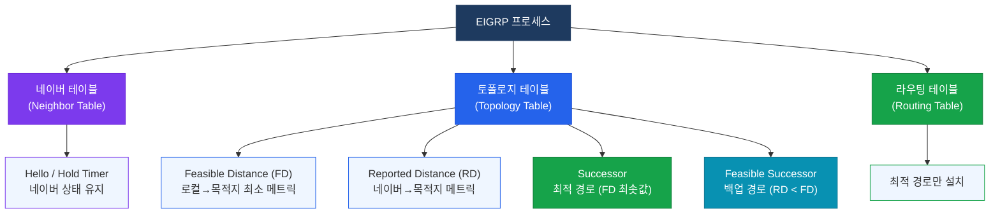
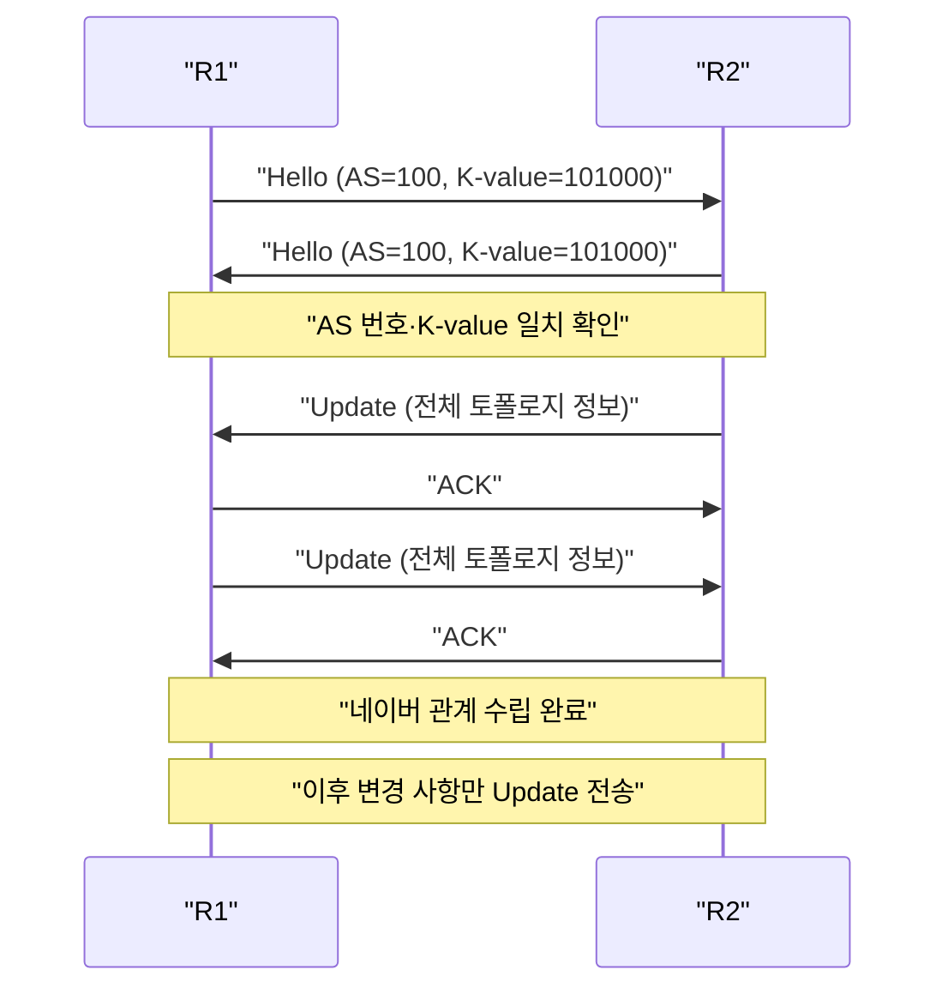

# EIGRP 기본

## 정의

EIGRP는 Cisco 개발의 고급 거리 벡터 프로토콜로, **DUAL(Diffusing Update Algorithm)** 을 통해 루프 없는 최적 경로와 백업 경로를 유지하며 신뢰적 전송 프로토콜(RTP)로 업데이트를 교환한다.

## 특징

- **(신뢰적 부분 업데이트)** 토폴로지 변경 시 영향받는 경로만 인접 라우터에 전송하여 대역폭 낭비 없이 정확한 정보 전파
- **(세 가지 테이블 유지)** 네이버·토폴로지·라우팅 테이블을 독립적으로 관리하여 빠른 경로 전환과 루프 방지를 동시에 달성
- **(복합 메트릭)** 대역폭과 지연을 기본 요소로 사용하는 K-value 기반 메트릭으로 세밀한 경로 제어 가능

## 왜 필요한가?

**RIP**은 홉 카운트만 사용해 최대 15홉을 넘으면 동작하지 않으며, 30초마다 전체 라우팅 테이블을 전송해 대역폭을 낭비한다. **OSPF**는 대규모 네트워크에서 LSA 플러딩과 SPF 재계산 비용이 크다.

EIGRP는 이 두 문제를 동시에 해결한다. 변경된 경로만 전송(부분 업데이트)하고, DUAL로 즉각 수렴하며, 대규모 네트워크에서도 안정적으로 동작한다.



---

## 구성 요소



### EIGRP 패킷 타입

| 패킷 | 기능 | 전송 방식 |
|------|------|-----------|
| **Hello** | 네이버 발견 및 유지 | Multicast (224.0.0.10) |
| **Update** | 라우팅 정보 전송 | Multicast/Unicast (신뢰적) |
| **Query** | 경로 소실 시 대안 탐색 | Multicast (신뢰적) |
| **Reply** | Query에 대한 응답 | Unicast (신뢰적) |
| **ACK** | 신뢰적 패킷 확인 응답 | Unicast |

---

## 동작 흐름 — 네이버 협상



### 네이버 형성 조건

| 조건 | 내용 |
|------|------|
| AS 번호 | 양쪽 동일해야 함 |
| K-value | K1~K5 모두 일치해야 함 (기본: 101000) |
| 인증 | 설정된 경우 Key Chain 일치 |
| Subnet | 동일 서브넷에 속해야 함 |

---

## EIGRP 메트릭 비교

EIGRP 메트릭 공식 (Classic):

```
Metric = (K1 × BW + K3 × Delay) × 256
```

기본 K-value: K1=1, K2=0, K3=1, K4=0, K5=0

| 항목 | Classic EIGRP | Named EIGRP (Wide Metric) |
|------|---------------|--------------------------|
| 메트릭 비트 수 | 32비트 | 64비트 |
| 최소 BW 단위 | Kbps | Kbps (×65536) |
| 고속 링크 지원 | 10Gbps 이상 불가 | 10Gbps 이상 정확 표현 |
| Rib-scale | 없음 | 128 (라우팅 테이블 호환) |

> BW는 경로상 최소 대역폭, Delay는 경로상 누적 지연값(마이크로초 단위)을 사용한다.

---

## 설정 및 검증

```bash
! EIGRP 기본 설정 (Classic 모드)
R1(config)# router eigrp 100                  ! AS 번호 100
R1(config-router)# network 10.0.0.0           ! 클래스풀 네트워크 선언
R1(config-router)# network 192.168.1.0 0.0.0.255  ! 와일드카드 마스크 지정
R1(config-router)# no auto-summary            ! 자동 요약 비활성화 (중요!)
R1(config-router)# eigrp router-id 1.1.1.1    ! Router-ID 수동 지정

! 검증 명령어
R1# show ip eigrp neighbors                   ! 네이버 테이블 확인
R1# show ip eigrp topology                    ! 토폴로지 테이블 (모든 경로)
R1# show ip eigrp topology all-links          ! Feasible Successor 포함 전체 경로
R1# show ip eigrp interfaces                  ! EIGRP 활성 인터페이스 확인
R1# show ip route eigrp                       ! EIGRP 학습 경로만 표시
R1# debug eigrp packets                       ! EIGRP 패킷 디버그 (주의)
```

### show ip eigrp neighbors 출력 예시

```bash
R1# show ip eigrp neighbors
EIGRP-IPv4 Neighbors for AS(100)
H   Address         Interface       Hold  Uptime   SRTT   RTO  Q  Seq
                                    (sec)          (ms)       Cnt Num
0   10.0.0.2        Gi0/0             12  00:05:30   10   100  0  15
1   10.0.1.2        Gi0/1             11  00:04:22    8   100  0  12
```

---

## CCNP/CCIE 시험 포인트

- **K-value 불일치** 시 네이버 관계가 형성되지 않으며, `%DUAL-5-NBRCHANGE` 메시지가 로그에 기록된다
- **auto-summary** 는 IOS 기본 활성화(구 버전)이며, 비연속 네트워크에서 반드시 비활성화해야 한다
- **Stuck-In-Active(SIA)**: Query에 대한 Reply가 `active-time`(기본 3분) 내에 오지 않으면 네이버를 강제 해제한다
- **AD 기본값**: 내부 EIGRP = **90**, 외부 EIGRP(재분배) = **170**
- **Feasibility Condition**: RD < FD를 충족해야만 Feasible Successor로 등록 (루프 방지)
- **wildcard mask** 로 특정 인터페이스만 선택적으로 EIGRP에 포함할 수 있다
- **Hello/Hold Timer 기본값**: LAN = 5초/15초, WAN(T1 이하) = 60초/180초
