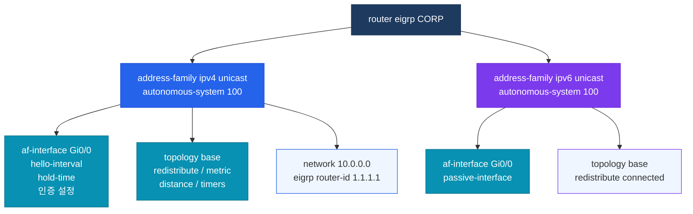

# Named EIGRP (네임드 EIGRP)

## 정의

IOS 15.0(1)M 이상에서 지원되는 `router eigrp [name]` 구조의 EIGRP 설정 방식으로, **address-family** 기반으로 IPv4/IPv6를 단일 프로세스에서 관리하며 64비트 Wide Metric을 지원한다.

## 특징

- **(address-family 계층 구조)** af-interface와 topology base 서브섹션으로 인터페이스·토폴로지별 설정을 체계적으로 분리하여 관리 용이성 극대화
- **(Wide Metric 지원)** 64비트 메트릭으로 10Gbps 이상 고속 링크를 정확히 표현하며, Rib-scale 128로 Classic 라우팅 테이블과 호환
- **(SHA-256 인증)** Classic에서 지원하지 않는 HMAC-SHA-256 인증을 af-interface 내에서 직접 설정 가능

## Classic vs Named 비교

| 구분 | Classic EIGRP | Named EIGRP |
|------|---------------|-------------|
| 설정 명령어 | `router eigrp [ASN]` | `router eigrp [name]` |
| 인터페이스 설정 | `ip eigrp` 인터페이스 명령어 | `af-interface` 서브섹션 |
| IPv6 지원 | 별도 `ipv6 router eigrp` | address-family로 통합 |
| 메트릭 비트 | 32비트 | 64비트 (Wide Metric) |
| 인증 | MD5만 지원 | MD5 + SHA-256 지원 |
| 설정 가시성 | 분산 | 단일 계층 구조로 집중 |
| IOS 요구 | 12.x 이상 | 15.0(1)M 이상 |

---

## Named EIGRP 구조



---

## 설정 및 검증

```bash
! Named EIGRP 기본 설정
R1(config)# router eigrp CORP                              ! 이름 기반 프로세스 생성

R1(config-router)# address-family ipv4 unicast autonomous-system 100
R1(config-router-af)#  af-interface GigabitEthernet0/0
R1(config-router-af-interface)#   hello-interval 5        ! Hello 간격 5초
R1(config-router-af-interface)#   hold-time 15            ! Hold 타이머 15초
R1(config-router-af-interface)#   exit
R1(config-router-af)#  af-interface GigabitEthernet0/1
R1(config-router-af-interface)#   passive-interface        ! 해당 인터페이스 passive
R1(config-router-af-interface)#   exit
R1(config-router-af)#  topology base
R1(config-router-af-topology)#   redistribute static      ! 정적 경로 재분배
R1(config-router-af-topology)#   exit
R1(config-router-af)#  network 10.0.0.0                   ! 네트워크 선언
R1(config-router-af)#  eigrp router-id 1.1.1.1            ! Router-ID 지정
R1(config-router-af)#  exit

! Wide Metric 확인 (Named 전용)
R1(config-router)# address-family ipv4 unicast autonomous-system 100
R1(config-router-af)#  metric rib-scale 128               ! 기본값, Classic 호환

! SHA-256 인증 (Named 전용)
R1(config-router-af)#  af-interface GigabitEthernet0/0
R1(config-router-af-interface)#   authentication mode hmac-sha-256 MYKEY  ! SHA-256
R1(config-router-af-interface)#   exit

! 검증 명령어
R1# show eigrp address-family ipv4 neighbors              ! Named EIGRP 네이버 확인
R1# show eigrp address-family ipv4 topology               ! 토폴로지 테이블
R1# show eigrp address-family ipv4 interfaces             ! 인터페이스 상태
R1# show running-config | section router eigrp            ! Named 설정 전체 확인
```

---

## CCNP/CCIE 시험 포인트

- **`show ip eigrp neighbors`** 는 Classic 명령어이며, Named에서는 **`show eigrp address-family ipv4 neighbors`** 를 사용한다 (두 명령어 모두 동작하는 경우도 있으나 Named 전용 명령어가 기준)
- **Wide Metric**은 Named EIGRP 전용이며, Classic 라우터와 혼용 시 Rib-scale 128 변환으로 호환성 유지
- **SHA-256 인증**은 Named EIGRP에서만 지원 — Classic은 MD5만 가능
- **passive-interface**는 af-interface 서브섹션에서 설정하며, Classic의 `passive-interface [인터페이스]` 방식과 다르다
- **address-family 내 autonomous-system** 번호가 양쪽 라우터에서 일치해야 네이버가 형성된다
