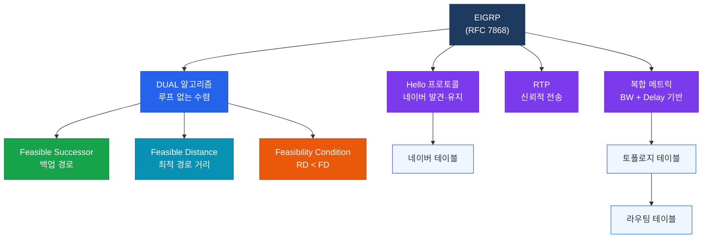

# EIGRP (Enhanced Interior Gateway Routing Protocol)

## 정의

Cisco가 독자 개발하고 이후 IETF RFC 7868로 표준화된 **고급 거리 벡터(Advanced Distance Vector)** 라우팅 프로토콜로, DUAL 알고리즘을 사용해 루프 없는 빠른 수렴을 제공한다.

## 특징

- **(DUAL 알고리즘)** Diffusing Update Algorithm으로 루프 없는 최적 경로와 백업 경로(Feasible Successor)를 즉시 제공
- **(빠른 수렴)** 토폴로지 변경 시 Feasible Successor가 있으면 즉각 전환하여 OSPF보다 빠른 수렴 달성
- **(멀티 프로토콜 지원)** IPv4, IPv6, IPX, AppleTalk를 단일 프로세스로 처리하는 프로토콜 독립 아키텍처

## EIGRP 개요 다이어그램

---

## 섹션 내 문서

| 문서 | 내용 |
|------|------|
| [EIGRP 기본](./eigrp-basics) | 패킷 타입, 네이버 조건, DUAL 상세, 메트릭, 기본 설정 |
| [Named EIGRP](./eigrp-named) | address-family 구조, Wide Metric, Classic vs Named 비교 |
| [EIGRP 고급](./eigrp-advanced) | 인증, 경로 요약, 재분배, SIA, Stub, 부하 분산 |

---

## CCNP/CCIE 시험 비중

| 시험 | 관련 도메인 | 비중 |
|------|-------------|------|
| ENCOR (350-401) | Layer 3 Technologies | 약 15~20% |
| ENARSI (300-410) | Layer 3 Technologies | 약 25~30% |
| CCIE Enterprise | Infrastructure (IGP) | 핵심 토픽 |

> EIGRP는 ENCOR 필수 토픽이며, Named EIGRP·DUAL 동작·인증·Stub 설정은 시험에 자주 출제된다.
