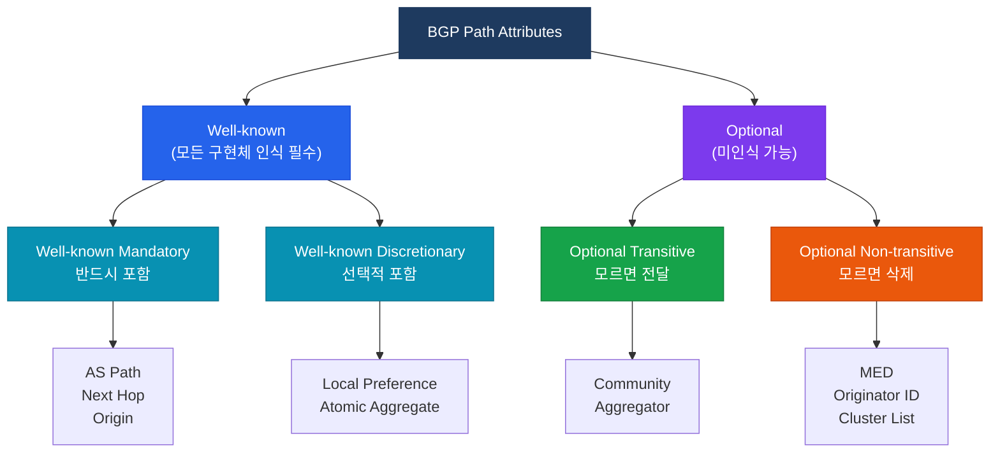
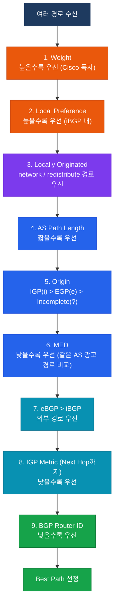

# BGP 속성 (BGP Attributes)

## 정의

BGP가 Update 메시지에 포함시켜 경로와 함께 전달하는 **경로 특성 정보**로, 경로 선택(Best Path Selection) 알고리즘의 입력값이 되며 정책 제어의 핵심 수단이다.

## 특징

- **(분류 체계)** Well-known(필수/선택)과 Optional(전이/비전이)으로 구분되어 구현 의무와 전파 범위가 결정됨
- **(우선순위 기반 선택)** 동일 목적지로의 경로가 여러 개일 때 정해진 순서의 속성 값을 비교하여 단 하나의 Best Path를 선정
- **(정책 조작 가능)** Route Map을 통해 속성 값을 변경할 수 있어 트래픽 엔지니어링과 비즈니스 정책 반영이 가능

## 속성 분류



### 주요 속성 요약 표

| 속성 | 유형 | 전파 범위 | 기본값 |
|------|------|-----------|--------|
| Weight | Cisco 독자 | 로컬 라우터만 | 0 (neighbor 학습), 32768 (local) |
| Local Preference | Well-known Discretionary | iBGP 전체 | 100 |
| AS Path | Well-known Mandatory | 전체 | - |
| Origin | Well-known Mandatory | 전체 | IGP(i) / EGP(e) / Incomplete(?) |
| MED | Optional Non-transitive | eBGP 피어 1홉 | 0 |
| Next Hop | Well-known Mandatory | 전체 | - |
| Community | Optional Transitive | 정책 의존 | - |

---

## BGP Best Path Selection 알고리즘



> 암기 팁: **W**e **L**ove **L**arge **A**nd **O**ld **M**ap **E**very **I**nteresting **R**oute — Weight, Local-Pref, Local-Origin, AS-Path, Origin, MED, eBGP>iBGP, IGP-metric, Router-ID

---

## 주요 속성 상세

### Weight (Cisco 독자)
- 범위: 0 ~ 65535, 높을수록 우선
- **로컬 라우터에만** 적용 (업데이트 메시지로 전달되지 않음)
- 기본값: neighbor에게서 학습한 경로 = 0, 자신이 생성한 경로 = 32768

### Local Preference
- iBGP 도메인 전체에 전파되어 **AS 출구 선택**에 사용
- 기본값: 100, 높을수록 우선
- eBGP에서 수신한 경로에 설정하여 AS 내부 선호도 결정

### AS Path
- 경로가 통과한 AS 번호의 목록 (AS_SEQUENCE)
- 짧을수록 우선 — AS Path Prepend로 인위적으로 길게 만들어 트래픽 조정 가능

### MED (Multi-Exit Discriminator)
- **동일 AS의 여러 eBGP 경로** 비교 시 사용
- 낮을수록 우선, AS 경계를 넘어가면 기본적으로 비교하지 않음
- `bgp always-compare-med` 명령으로 다른 AS 경로도 비교 가능

---

## 설정 및 검증

```bash
! Weight 설정 (neighbor별)
R1(config-router)# neighbor 203.0.113.2 weight 200

! Weight 설정 (Route Map으로 조건별 적용)
R1(config)# route-map SET-WEIGHT permit 10
R1(config-route-map)# match ip address prefix-list PL-ISP1
R1(config-route-map)# set weight 200
R1(config-router)# neighbor 203.0.113.2 route-map SET-WEIGHT in

! Local Preference 설정
R1(config)# route-map SET-LP permit 10
R1(config-route-map)# set local-preference 200
R1(config-router)# neighbor 203.0.113.2 route-map SET-LP in

! MED 설정 (아웃바운드)
R1(config)# route-map SET-MED permit 10
R1(config-route-map)# set metric 50
R1(config-router)# neighbor 203.0.113.2 route-map SET-MED out

! AS Path Prepend (아웃바운드 경로를 덜 선호하게)
R1(config)# route-map PREPEND permit 10
R1(config-route-map)# set as-path prepend 65001 65001 65001
R1(config-router)# neighbor 203.0.113.3 route-map PREPEND out

! 검증
R1# show bgp ipv4 unicast
R1# show bgp ipv4 unicast 192.168.1.0/24
R1# show bgp ipv4 unicast 192.168.1.0/24 longer-prefixes
```

---

## CCNP/CCIE 시험 포인트

- Best Path 순서는 **반드시 암기** — Weight → Local-Pref → Local-Origin → AS-Path → Origin → MED → eBGP/iBGP → IGP Metric → Router-ID
- Weight는 Cisco 독자 속성으로 **다른 라우터에 전달되지 않음**
- Local Preference는 iBGP에서만 전파, **eBGP 피어에게는 전달하지 않음**
- MED 비교는 **같은 AS에서 광고한 경로끼리만** 기본 적용 (`bgp always-compare-med`로 변경 가능)
- `Origin incomplete(?)` 는 redistribute로 유입된 경로에 붙는 값 — IGP(i)보다 낮은 우선순위
- AS Path Prepend는 **아웃바운드** 정책 — 피어가 우리 AS로 들어오는 트래픽을 조정할 때 사용
- Weight=0이면 경로가 있어도 best path가 되지 못할 수 있음 — neighbor별 weight 설정과 기본값 혼용 주의
