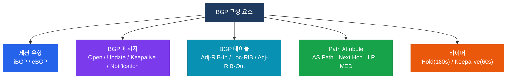
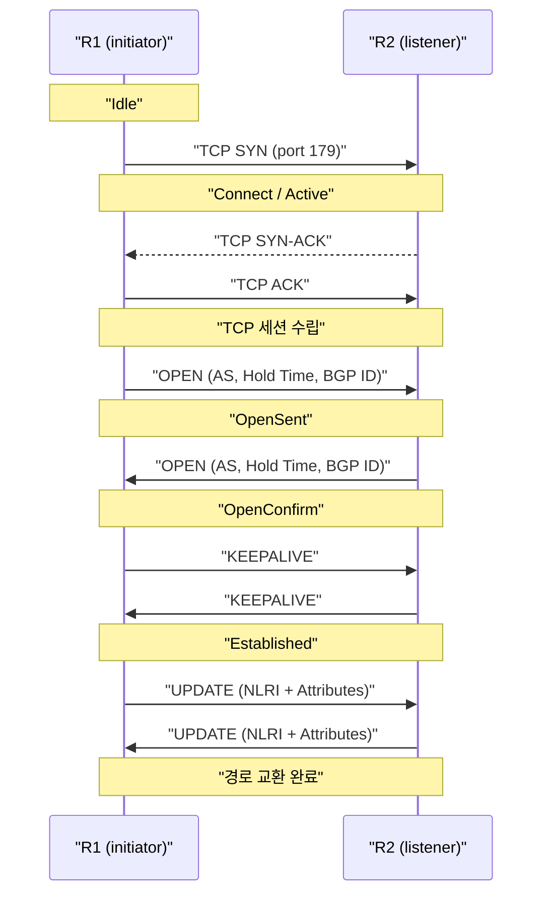
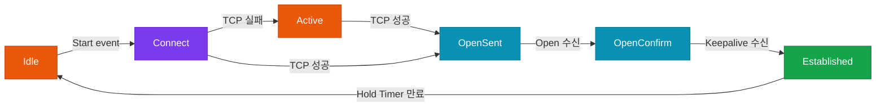

# BGP 기본

## 정의

BGP(Border Gateway Protocol)는 TCP 179 포트 위에서 동작하는 **EGP(External Gateway Protocol)** 로, AS 내부 피어(iBGP)와 AS 간 피어(eBGP) 모두를 지원하며 세션 수립부터 경로 교환까지 상태 머신(State Machine)으로 관리한다.

## 특징

- **(TCP 기반 신뢰성)** TCP 세션 위에서 동작하여 자체적인 신뢰성 보장 없이 대용량 라우팅 정보를 안정적으로 교환
- **(증분 업데이트)** 전체 테이블을 주기적으로 재전송하지 않고 변경된 경로만 Update 메시지로 전달하여 대역폭 효율 극대화
- **(AS 간 정책 제어)** iBGP와 eBGP를 구분하여 AS 내부 전파와 외부 광고를 독립적으로 제어 가능

## 왜 필요한가?

OSPF, EIGRP 같은 IGP는 단일 조직 내에서의 경로 교환에 최적화되어 있다. 하지만 인터넷처럼 수십만 개의 프리픽스와 수천 개의 AS가 존재하는 환경에서는 IGP의 메트릭 기반 경로 선택만으로는 **비즈니스 정책(트래픽 비용, SLA, 경쟁사 회피)** 을 반영할 수 없다. BGP는 속성 기반의 정책 제어를 통해 이 문제를 해결한다.

## 구성 요소



### BGP 메시지 유형

| 메시지 | 용도 |
|--------|------|
| **Open** | 세션 수립 요청 (AS 번호, Hold Time, BGP ID 교환) |
| **Update** | 경로 광고 및 철회 (Path Attribute + NLRI 포함) |
| **Keepalive** | 세션 유지 확인 (기본 60초 주기) |
| **Notification** | 오류 알림 후 세션 종료 |

---

## 동작 흐름 — BGP State Machine



### BGP 상태 전이



---

## iBGP vs eBGP 비교

| 구분 | iBGP | eBGP |
|------|------|------|
| 피어 위치 | 같은 AS 내부 | 다른 AS |
| Administrative Distance | 200 | 20 |
| Next Hop 변경 | 변경하지 않음 (기본) | 자신의 인터페이스로 변경 |
| TTL | 255 (기본) | 1 (기본, 직접 연결 필요) |
| 전파 규칙 | iBGP에서 학습한 경로를 다른 iBGP로 재광고 안 함 | 제한 없음 |
| Loop Prevention | AS Path 대신 Split Horizon | AS Path 루프 방지 |
| 확장 구조 | Route Reflector 또는 Confederation 필요 | 불필요 |

---

## 설정 및 검증

```bash
! eBGP 기본 설정 (R1 — AS65001, 피어: 203.0.113.2/AS65002)
R1(config)# router bgp 65001
R1(config-router)# bgp router-id 1.1.1.1
R1(config-router)# neighbor 203.0.113.2 remote-as 65002
R1(config-router)# network 192.168.1.0 mask 255.255.255.0

! iBGP 설정 (같은 AS 내 Loopback 사용)
R1(config-router)# neighbor 10.0.0.2 remote-as 65001
R1(config-router)# neighbor 10.0.0.2 update-source Loopback0

! iBGP next-hop-self 설정 (iBGP 피어에게 자신을 Next Hop으로 설정)
R1(config-router)# neighbor 10.0.0.2 next-hop-self

! eBGP Multihop (TTL을 늘려 직접 연결이 아닌 피어와 세션)
R1(config-router)# neighbor 203.0.113.2 ebgp-multihop 2

! 검증
R1# show bgp summary
R1# show bgp ipv4 unicast summary
R1# show bgp ipv4 unicast 192.168.1.0
R1# show ip bgp neighbors 203.0.113.2
R1# show ip bgp neighbors 203.0.113.2 routes
R1# show ip bgp neighbors 203.0.113.2 advertised-routes
```

---

## CCNP/CCIE 시험 포인트

- iBGP에서 학습한 경로는 다른 iBGP 피어에게 광고하지 않는다 — **iBGP Split Horizon** 규칙, Route Reflector 또는 Confederation으로 해결
- iBGP full-mesh: N(N-1)/2 개 세션 필요 — 규모가 커지면 Route Reflector로 대체
- iBGP AD = **200**, eBGP AD = **20** — 두 값 모두 암기 필수
- eBGP의 기본 TTL은 **1** — 직접 연결이 아닌 피어와 세션을 맺으려면 `ebgp-multihop` 설정 필요
- `next-hop-self` 없이 iBGP에 광고하면 Next Hop이 eBGP 피어 주소로 남아 도달 불가 문제 발생
- Hold Timer 기본값 **180초**, Keepalive 기본값 **60초** (Hold Timer의 1/3)
- `synchronization` 명령어: 현재 IOS에서 기본 비활성화 상태 — 활성화 시 IGP와 동기화되지 않은 경로는 BGP 테이블에 올리지 않음
