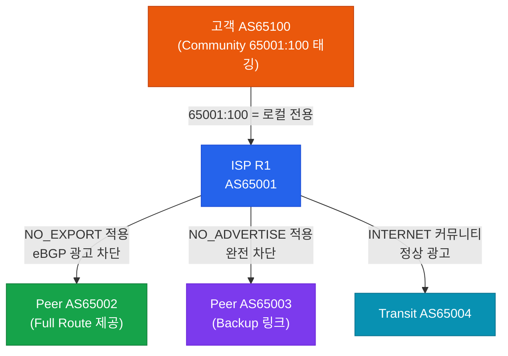
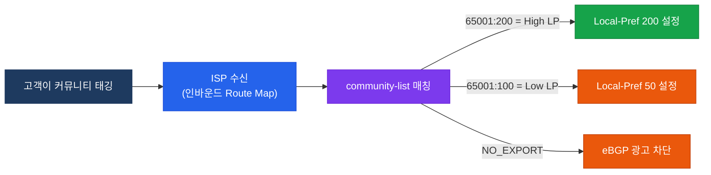

# BGP 커뮤니티 (BGP Communities)

## 정의

BGP Community는 경로에 **태그(Tag)** 를 붙여 그룹화하고, 피어 간 정책을 신호로 전달하는 Optional Transitive 속성으로, 개별 프리픽스마다 Route Map을 작성하지 않고 커뮤니티 값 하나로 일관된 정책을 적용할 수 있다.

## 특징

- **(태그 기반 정책 시그널링)** AS Path나 프리픽스 대신 커뮤니티 값으로 경로를 그룹화하여 ISP와 고객 간 정책 의사소통 가능
- **(Optional Transitive 속성)** 모르는 라우터도 삭제하지 않고 그대로 전달하며, `send-community` 명령 없이는 피어에게 전송되지 않음
- **(세대별 진화)** 32비트 Standard → 64비트 Extended → 96비트 Large Community로 발전하여 더 넓은 정책 표현 지원

## Well-known 커뮤니티

| 커뮤니티 이름 | 값 (숫자) | 동작 |
|--------------|-----------|------|
| **INTERNET** | 없음 (기본) | 모든 BGP 피어에게 광고 |
| **NO_EXPORT** | 65535:65281 | eBGP 피어에게 광고하지 않음 (같은 AS 내 유지) |
| **NO_ADVERTISE** | 65535:65282 | 어떤 BGP 피어에게도 광고하지 않음 |
| **LOCAL_AS** | 65535:65283 | 현재 Confederation Sub-AS 외부로 광고하지 않음 |

---

## Extended / Large Community

| 유형 | 크기 | 주요 용도 | 형식 |
|------|------|-----------|------|
| Standard Community | 32비트 | 일반 정책 태깅 | AS:Value (각 16비트) |
| Extended Community | 64비트 | VPN RT/RD, CoS 정책 | Type(2B):Administrator(4B):Value(2B) |
| Large Community | 96비트 | 4바이트 ASN 환경 | 4B:4B:4B (RFC 8092) |

---

## 커뮤니티 활용 시나리오



### 커뮤니티 기반 정책 흐름



---

## 설정 및 검증

```bash
! community 형식 설정 (aa:nn 형식 사용)
R1(config)# ip bgp-community new-format

! 커뮤니티 태깅 — 아웃바운드 Route Map
R1(config)# route-map SET-COMM permit 10
R1(config-route-map)# match ip address prefix-list PL-CUSTOMER
R1(config-route-map)# set community 65001:100 additive

! NO_EXPORT 적용
R1(config)# route-map SET-NO-EXPORT permit 10
R1(config-route-map)# set community no-export

! community-list 정의
R1(config)# ip community-list 10 permit 65001:100
R1(config)# ip community-list 20 permit 65001:200

! community-list 기반 Route Map (인바운드 정책)
R1(config)# route-map MATCH-COMM permit 10
R1(config-route-map)# match community 20
R1(config-route-map)# set local-preference 200

R1(config)# route-map MATCH-COMM permit 20
R1(config-route-map)# match community 10
R1(config-route-map)# set local-preference 50

! neighbor에 send-community 활성화 (필수)
R1(config-router)# neighbor 203.0.113.2 send-community
R1(config-router)# neighbor 203.0.113.2 send-community extended

! Extended Community (VPN Route Target)
R1(config)# ip extcommunity-list 1 permit rt 65001:100

! Large Community 설정
R1(config)# route-map SET-LARGE-COMM permit 10
R1(config-route-map)# set large-community 65001:1:100

! 검증
R1# show bgp ipv4 unicast community 65001:100
R1# show bgp ipv4 unicast community no-export
R1# show ip community-list 10
R1# show bgp ipv4 unicast 192.168.1.0/24
```

---

## CCNP/CCIE 시험 포인트

- `send-community` 명령 없이는 커뮤니티 속성이 **피어에게 전달되지 않음** — 설정 누락이 가장 흔한 실수
- `set community [value]`는 기존 커뮤니티를 **덮어씀** — 기존 값 유지하려면 `additive` 키워드 필수
- NO_EXPORT(65535:65281): eBGP 피어에게 광고하지 않음, iBGP 내부에서는 전파
- NO_ADVERTISE(65535:65282): iBGP 포함 **모든 피어에게 광고하지 않음** — 두 값의 차이 주의
- Extended Community는 VPN에서 **Route Target(RT)** 으로 VRF 간 경로 교환 제어에 사용
