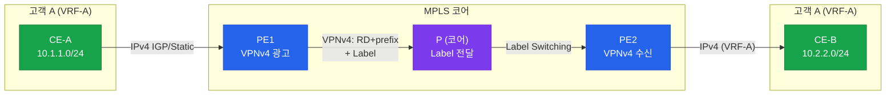
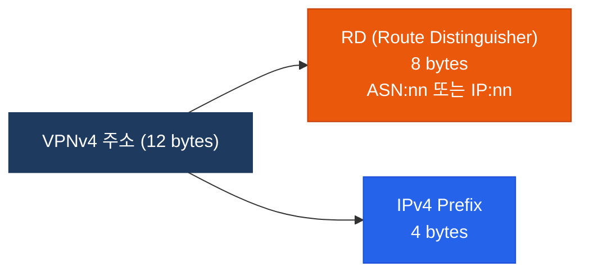
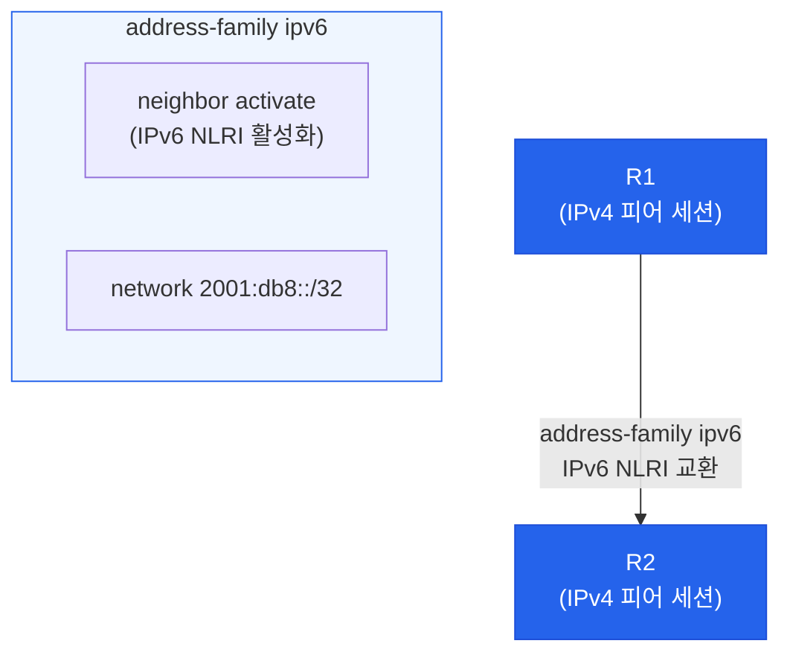

# MP-BGP (Multiprotocol BGP)

## 정의

MP-BGP(RFC 4760)는 기존 BGP-4를 확장하여 IPv4 유니캐스트 외에 **IPv6, VPNv4, L2VPN** 등 다양한 주소 패밀리를 단일 BGP 세션에서 처리할 수 있도록 AFI(Address Family Identifier)와 SAFI(Subsequent AFI)를 도입한 프로토콜이다.

## 특징

- **(다중 주소 패밀리)** 하나의 BGP 피어 세션에서 IPv4, IPv6, VPNv4 등 여러 AFI/SAFI를 동시에 교환하여 세션 오버헤드 감소
- **(MPLS L3VPN 핵심)** VPNv4 주소 패밀리로 RD가 포함된 12바이트 프리픽스를 PE 라우터 간 교환하여 고객 VRF 경로를 분리 전달
- **(확장 NLRI)** MP_REACH_NLRI와 MP_UNREACH_NLRI 속성을 통해 기존 IPv4 Update 형식과 하위 호환성을 유지하며 새 주소 패밀리 지원

## AFI / SAFI 표

| AFI | 의미 | SAFI | 의미 |
|-----|------|------|------|
| 1 | IPv4 | 1 | Unicast |
| 1 | IPv4 | 2 | Multicast |
| 1 | IPv4 | 128 | MPLS L3VPN (VPNv4) |
| 2 | IPv6 | 1 | Unicast |
| 2 | IPv6 | 2 | Multicast |
| 25 | L2VPN | 65 | VPLS (RFC 4761) |

---

## MPLS L3VPN에서의 MP-BGP



### VPNv4 주소 구조



| 개념 | 역할 | 형식 |
|------|------|------|
| **RD (Route Distinguisher)** | VPNv4 주소 고유화 (같은 IP라도 구별) | ASN:nn 또는 IP:nn |
| **RT (Route Target)** | VRF 간 경로 import/export 정책 | Extended Community로 전달 |

> RD는 주소를 **구별**하는 값, RT는 경로를 **어디에 import할지** 결정하는 값 — 혼동 주의

---

## IPv6 BGP



---

## 설정 및 검증

```bash
! MPLS L3VPN — VRF 정의
R1(config)# ip vrf CUSTOMER-A
R1(config-vrf)# rd 65001:100
R1(config-vrf)# route-target export 65001:100
R1(config-vrf)# route-target import 65001:100

! VRF 인터페이스 바인딩
R1(config)# interface GigabitEthernet0/1
R1(config-if)# ip vrf forwarding CUSTOMER-A
R1(config-if)# ip address 10.1.1.1 255.255.255.0

! MP-BGP — VPNv4 주소 패밀리 활성화
R1(config)# router bgp 65001
R1(config-router)# neighbor 10.0.0.2 remote-as 65001
R1(config-router)# neighbor 10.0.0.2 update-source Loopback0

R1(config-router)# address-family vpnv4
R1(config-router-af)# neighbor 10.0.0.2 activate
R1(config-router-af)# neighbor 10.0.0.2 send-community extended
R1(config-router-af)# exit-address-family

! VRF별 주소 패밀리 설정
R1(config-router)# address-family ipv4 vrf CUSTOMER-A
R1(config-router-af)# neighbor 192.168.1.2 remote-as 65100
R1(config-router-af)# neighbor 192.168.1.2 activate
R1(config-router-af)# exit-address-family

! IPv6 BGP 설정
R1(config-router)# address-family ipv6
R1(config-router-af)# neighbor 2001:db8::2 activate
R1(config-router-af)# network 2001:db8:1::/48
R1(config-router-af)# exit-address-family

! 검증
R1# show bgp vpnv4 unicast all summary
R1# show bgp vpnv4 unicast all
R1# show bgp vpnv4 unicast rd 65001:100 10.1.1.0/24
R1# show ip route vrf CUSTOMER-A
R1# show bgp ipv6 unicast summary
R1# show bgp ipv6 unicast
```

---

## CCNP/CCIE 시험 포인트

- RD는 경로를 **고유하게 식별**하는 값, RT는 VRF 간 경로 **공유 정책**을 결정하는 값 — 두 개념 혼동이 가장 흔한 실수
- VPNv4 세션에는 반드시 `send-community extended` 설정 필요 — RT가 Extended Community로 전달되기 때문
- `address-family vpnv4` 활성화 없이는 PE 간 VPN 경로 교환 불가
- IPv6 BGP는 IPv4 TCP 세션 위에서도 동작 가능 — `neighbor activate`로 해당 주소 패밀리만 활성화
- PE-CE 간 라우팅은 Static, OSPF, EIGRP, BGP 모두 가능 — 각 프로토콜의 VRF 컨텍스트 설정 방법 숙지 필요
- `show bgp vpnv4 unicast all`에서 각 경로의 RD와 RT 값을 식별할 수 있어야 함
