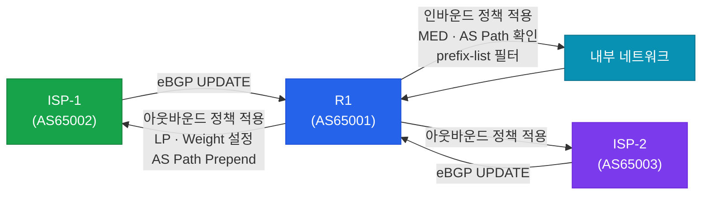
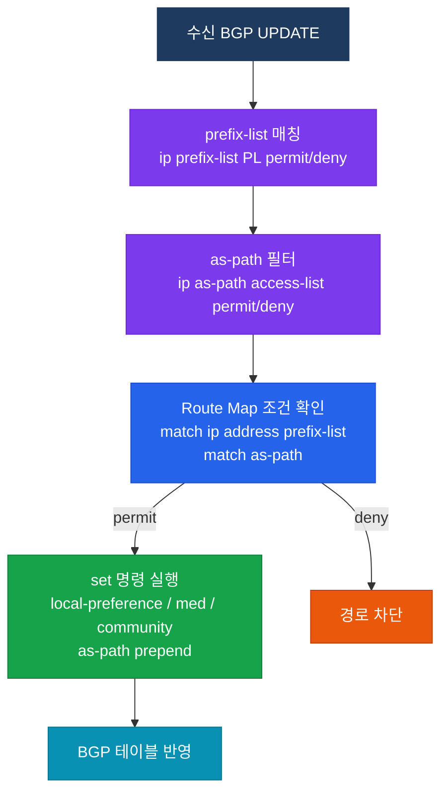

# BGP 정책 (BGP Policies)

## 정의

BGP 정책은 **Route Map, prefix-list, as-path 필터** 등의 도구를 결합하여 인바운드·아웃바운드 경로 광고를 제어하고 속성을 조작함으로써 트래픽 흐름과 비즈니스 요구사항을 반영하는 메커니즘이다.

## 특징

- **(인바운드/아웃바운드 분리 제어)** neighbor에 `in` 또는 `out` 방향으로 정책을 독립 적용하여 수신 및 송신 경로를 별도로 관리
- **(속성 조작 기반)** Route Map의 `set` 명령으로 Local Preference, MED, AS Path, Community 등을 조작하여 경로 선호도 변경 가능
- **(계층적 필터링)** prefix-list(주소 기반) → as-path filter(AS 경로 기반) → Route Map(종합 조건+조작)의 계층 구조로 정밀한 정책 구현

## 인바운드 vs 아웃바운드 정책



| 구분 | 인바운드 정책 | 아웃바운드 정책 |
|------|--------------|----------------|
| 적용 시점 | 피어로부터 경로 수신 시 | 피어에게 경로 광고 전 |
| 주요 속성 | Local Preference, Weight 설정 | MED, AS Path Prepend |
| 목적 | 들어오는 트래픽 경로 선택 | 피어가 우리에게 보내는 트래픽 조정 |
| 필터 도구 | prefix-list, as-path ACL, Route Map | prefix-list, Route Map |

---

## 정책 구현 도구 비교

| 도구 | 역할 | 매칭 기준 | 속성 조작 |
|------|------|-----------|-----------|
| **prefix-list** | 프리픽스 허용/차단 | IP 주소 + 마스크 길이 | 없음 (permit/deny만) |
| **as-path access-list** | AS Path 기반 필터 | 정규표현식 | 없음 |
| **community-list** | Community 값 기반 필터 | Community 값 | 없음 |
| **Route Map** | 종합 조건 매칭 + 속성 조작 | 위 도구 + 기타 조건 조합 | set으로 속성 변경 |

---

## Route Map + 필터 조합



---

## 설정 및 검증

```bash
! prefix-list — 특정 프리픽스만 허용
R1(config)# ip prefix-list PL-ALLOW seq 10 permit 10.0.0.0/8 le 24
R1(config)# ip prefix-list PL-ALLOW seq 20 deny 0.0.0.0/0 le 32

! as-path 필터 — 특정 AS 경유 경로 차단 (정규표현식)
R1(config)# ip as-path access-list 10 deny _65100_
R1(config)# ip as-path access-list 10 permit .*

! Route Map — 인바운드 Local Preference 조정
R1(config)# route-map RM-IN-ISP1 permit 10
R1(config-route-map)# match ip address prefix-list PL-ALLOW
R1(config-route-map)# set local-preference 200

R1(config)# route-map RM-IN-ISP1 permit 20
R1(config-route-map)# set local-preference 100

! Route Map — 아웃바운드 AS Path Prepend
R1(config)# route-map RM-OUT-ISP2 permit 10
R1(config-route-map)# set as-path prepend 65001 65001

! neighbor에 Route Map 적용
R1(config-router)# neighbor 203.0.113.1 route-map RM-IN-ISP1 in
R1(config-router)# neighbor 203.0.113.2 route-map RM-OUT-ISP2 out

! Route Map — MED 아웃바운드
R1(config)# route-map RM-MED permit 10
R1(config-route-map)# set metric 50
R1(config-router)# neighbor 203.0.113.1 route-map RM-MED out

! 검증
R1# show ip bgp neighbors 203.0.113.1 policy
R1# show route-map RM-IN-ISP1
R1# show ip prefix-list PL-ALLOW
R1# show ip bgp neighbors 203.0.113.1 received-routes
R1# show ip bgp neighbors 203.0.113.1 advertised-routes
R1# clear ip bgp 203.0.113.1 soft in
```

---

## CCNP/CCIE 시험 포인트

- Route Map에서 `deny`는 경로를 완전 차단, `permit` + `set` 없음은 속성 변경 없이 통과 — 두 동작 혼동 주의
- prefix-list의 `le/ge` 옵션: `le 32`는 해당 프리픽스 이하의 모든 서브넷 매칭
- as-path access-list 정규표현식: `^$`는 자신의 AS 유래 경로, `_65100_`은 AS 65100을 경유하는 모든 경로
- Route Map 적용 후 즉시 반영하려면 `clear ip bgp [neighbor] soft in/out` 필요 — hard reset은 세션 재수립 유발
- 인바운드 Local Preference 조정은 **AS 내부 선호도** 변경 — eBGP 피어에게 전달되지 않음
- 아웃바운드 MED는 **같은 AS 내 여러 eBGP 링크**에서만 비교 적용 — 기본적으로 다른 AS 경로와는 비교 안 함
