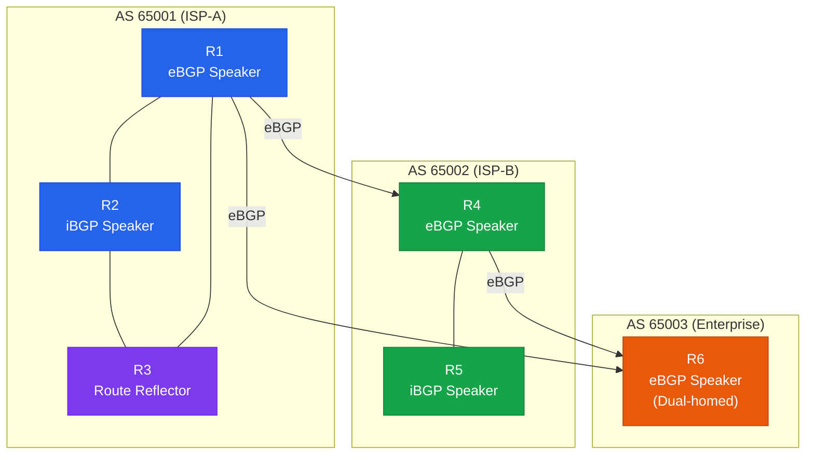

# BGP (Border Gateway Protocol)

## 정의

인터넷에서 **자율 시스템(AS)** 간 경로 교환을 담당하는 외부 게이트웨이 프로토콜(EGP)로, RFC 4271에 정의되어 있으며 TCP 179 포트를 사용해 신뢰성 있는 세션을 형성한다.

## 특징

- **(Path Vector 방식)** 경로에 포함된 AS 목록(AS Path)을 추적하여 루프를 방지하고 정책 기반의 경로 선택을 가능하게 함
- **(정책 기반 라우팅)** 속성(Attribute) 조작과 Route Map을 통해 인바운드·아웃바운드 트래픽을 세밀하게 제어 가능
- **(확장성)** 전체 인터넷 라우팅 테이블(90만+ 프리픽스)을 처리할 수 있는 유일한 라우팅 프로토콜

## BGP 전체 아키텍처

---

## 섹션 문서 목록

| 문서 | 설명 |
|------|------|
| [BGP 기본](bgp-basics) | 세션 수립, 상태 머신, iBGP/eBGP 차이, 기본 설정 |
| [BGP 속성](bgp-attributes) | Path Attribute 분류, 경로 선택 알고리즘 (Best Path) |
| [BGP 정책](bgp-policies) | Route Map, prefix-list, as-path 필터를 이용한 정책 구현 |
| [BGP 커뮤니티](bgp-communities) | Standard/Extended/Large Community, Well-known 커뮤니티 |
| [MP-BGP](bgp-mp) | AFI/SAFI, MPLS L3VPN, VPNv4, IPv6 BGP |

---

## CCNP/CCIE 시험 비중

| 시험 | 해당 도메인 | 출제 비중 |
|------|-------------|-----------|
| CCNP ENCOR (350-401) | Layer 3 Technologies | 약 15% |
| CCIE Enterprise Lab | BGP Design & Troubleshooting | 높음 |
| CCNP Advanced (ENARSI) | BGP Attributes & Policy | 약 20% |

> BGP는 CCNP/CCIE 전 과정에서 가장 높은 비중을 차지하는 토픽이다. 경로 선택 알고리즘(Best Path Selection) 순서는 반드시 암기해야 한다.
