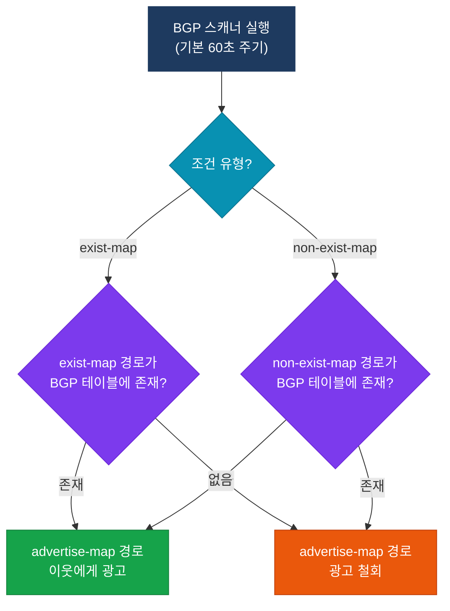
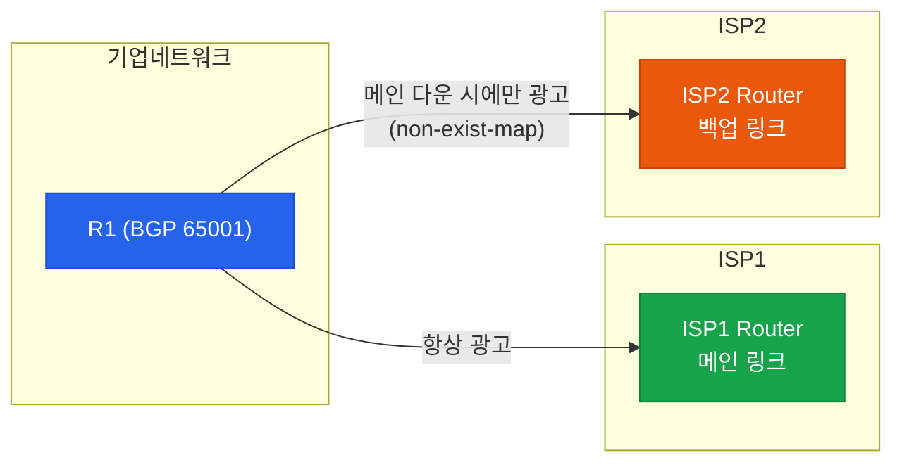

# 조건부 광고 (Conditional Advertisement)

## 정의

BGP에서 특정 경로의 존재 여부를 조건으로 다른 경로를 선택적으로 광고하는 기능으로, **exist-map** 과 **non-exist-map** 두 가지 조건을 제공한다.

## 특징

- **(동적 경로 제어)** 기본 링크 상태에 따라 백업 경로 광고를 자동으로 활성/비활성화하여 수동 개입 없이 장애 대응 가능
- **(BGP 스캐너 기반 평가)** BGP 스캐너가 기본 60초 주기로 조건을 재평가하므로 경로 상태 변화 후 최대 60초의 반응 지연이 발생
- **(Dual-homed 시나리오 최적화)** 인터넷 이중 연결 환경에서 메인 링크 장애 시에만 백업 ISP로 특정 경로를 광고하는 백업 정책 구현에 특화

## 조건부 광고 동작



### Dual-homed 시나리오



## BGP 조건부 광고 vs Route Map 비교

| 구분 | 조건부 광고 | Route Map (outbound) |
|------|-------------|----------------------|
| 조건 기준 | BGP 테이블의 특정 경로 존재 여부 | 경로 속성(prefix, AS-PATH, community 등) |
| 동적 반응 | 자동 (스캐너 주기) | 정적 (설정 변경 시에만) |
| 설정 복잡도 | 중간 (advertise-map + 조건 map) | 낮음 (단순 match/set) |
| 주요 용도 | 링크 상태 기반 백업 경로 광고 | 경로 속성 필터링 및 변환 |
| 평가 주기 | 60초 (bgp scan-time 조정 가능) | BGP 업데이트 수신 즉시 |

## 설정 및 검증

```bash
! ── 조건부 광고 설정 (non-exist-map) ────────────────
! 시나리오: 메인 경로(1.1.1.0/24)가 BGP 테이블에 없을 때만
!           백업 경로(2.2.2.0/24)를 ISP2에 광고

ip prefix-list MAIN_ROUTE seq 10 permit 1.1.1.0/24
ip prefix-list BACKUP_ROUTE seq 10 permit 2.2.2.0/24

route-map CHECK_MAIN permit 10
 match ip address prefix-list MAIN_ROUTE
!  메인 경로 존재 여부 확인용

route-map BACKUP_ADV permit 10
 match ip address prefix-list BACKUP_ROUTE
!  광고할 백업 경로

router bgp 65001
 neighbor 203.0.113.2 remote-as 65002
 neighbor 203.0.113.2 advertise-map BACKUP_ADV non-exist-map CHECK_MAIN
 !  CHECK_MAIN 경로가 없을 때 BACKUP_ADV 경로 광고

! ── 조건부 광고 설정 (exist-map) ─────────────────────
router bgp 65001
 neighbor 198.51.100.2 remote-as 65003
 neighbor 198.51.100.2 advertise-map BACKUP_ADV exist-map CHECK_MAIN
 !  CHECK_MAIN 경로가 있을 때만 BACKUP_ADV 경로 광고

! ── BGP 스캐너 주기 조정 ─────────────────────────────
router bgp 65001
 bgp scan-time 30
 !  기본값 60초 → 30초로 단축 (5~60초 범위)

! ── 검증 명령어 ──────────────────────────────────────
show ip bgp neighbors [IP] advertised-routes
show ip bgp [prefix]                   ! 특정 경로 BGP 테이블 확인
show ip bgp neighbors [IP] policy      ! 적용된 정책 확인
debug ip bgp [IP] updates              ! BGP 업데이트 실시간 확인
```

## CCNP/CCIE 시험 포인트

- **BGP 스캐너 기본 주기는 60초**로 경로 상태 변화 후 최대 60초 지연 발생; `bgp scan-time` 으로 조정
- **exist-map vs non-exist-map 혼동 주의**: exist-map은 경로 존재 시 광고, non-exist-map은 경로 없을 때 광고
- 조건부 광고는 **BGP 테이블** 기준이며 라우팅 테이블(RIB)이 아님에 주의
- `advertise-map` 의 경로가 로컬 BGP 테이블에 있어야 광고 가능하며 없으면 조건 충족 여부와 무관하게 광고 불가
- 조건부 광고와 `neighbor [IP] route-map out` 을 동시에 사용하면 route-map이 **추가 필터**로 동작
