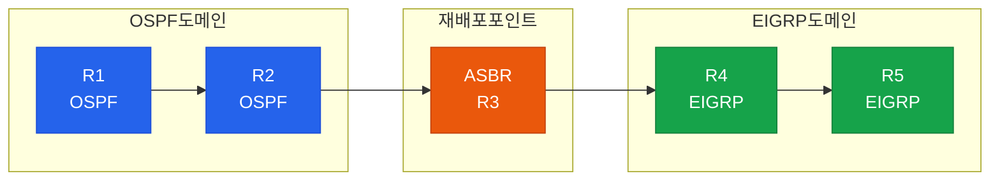
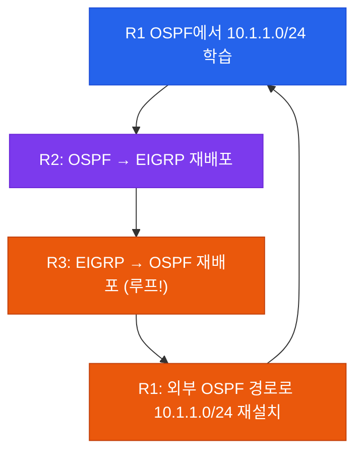
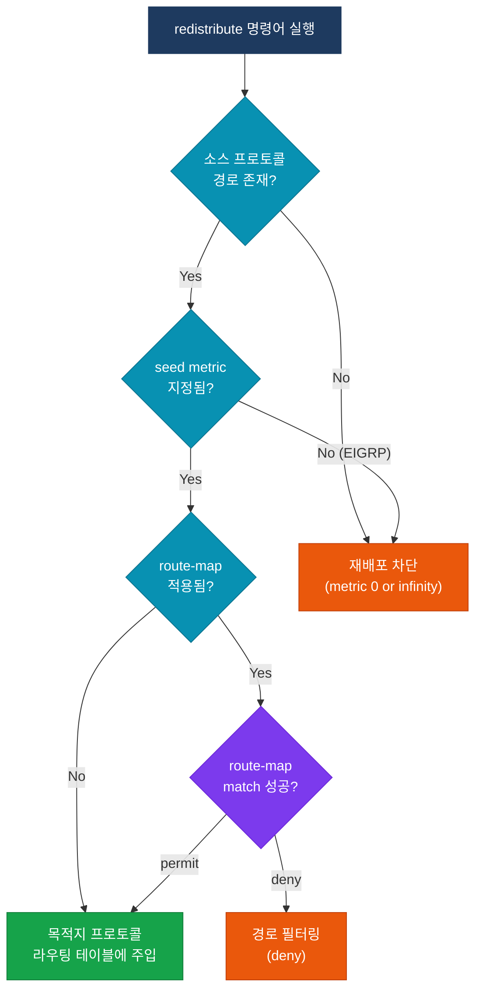

# 경로 재배포 (Route Redistribution)

## 정의

서로 다른 라우팅 프로토콜 도메인 간에 경로 정보를 교환하기 위해 한 프로토콜의 라우팅 테이블 항목을 다른 프로토콜로 **변환·주입**하는 기술.

## 특징

- **(프로토콜 경계 연결)** OSPF·EIGRP·BGP·RIP 등 이기종 프로토콜이 혼재하는 환경에서 단일 라우팅 도메인처럼 경로 정보를 공유
- **(메트릭 변환 필요)** 각 프로토콜은 메트릭 체계가 달라 재배포 시 seed metric을 명시적으로 지정해야 하며 미지정 시 일부 프로토콜에서 재배포가 차단됨
- **(루프 위험 내재)** 양방향 재배포 시 동일 경로가 두 프로토콜 사이를 순환하는 라우팅 루프가 발생할 수 있어 route-map + tag 기반 필터링이 필수

## 왜 필요한가?

기업 네트워크는 인수합병·레거시 시스템·멀티벤더 환경으로 인해 단일 라우팅 프로토콜만으로 운영하기 어렵다. 재배포 없이는 프로토콜 경계에서 경로 정보가 단절되어 통신이 불가능하다.



## 재배포 문제

### 서브옵티멀 라우팅

재배포된 경로의 AD(Administrative Distance)가 내부 경로보다 낮을 경우, 더 긴 경로가 라우팅 테이블에 설치된다.

| 해결책 | 방법 |
|--------|------|
| AD 조정 | `distance` 명령어로 재배포 경로의 AD 상향 조정 |
| Route-Map 필터 | 특정 경로만 재배포되도록 prefix-list로 제한 |

### 라우팅 루프



**루프 방지:** 재배포 시 `set tag` 로 경로에 태그를 부여하고, 역방향 재배포에서 `match tag` 로 해당 경로를 차단한다.

## 재배포 흐름



## AD 값 비교 표

| 프로토콜 | 내부(Internal) AD | 외부(External) AD |
|----------|-------------------|-------------------|
| Connected | 0 | — |
| Static | 1 | — |
| EIGRP | 90 | 170 |
| OSPF | 110 | 110 (E1/E2) |
| RIP | 120 | — |
| BGP (eBGP) | 20 | — |
| BGP (iBGP) | 200 | — |

## 설정 및 검증

```bash
! ── OSPF → EIGRP 재배포 ──────────────────────────────
router eigrp 100
 redistribute ospf 1 metric 10000 100 255 1 1500
 !  metric 형식: bandwidth delay reliability load mtu

! ── EIGRP → OSPF 재배포 ──────────────────────────────
router ospf 1
 redistribute eigrp 100 subnets
 !  subnets 키워드 필수: 미포함 시 /32 host route만 재배포

! ── 양방향 재배포 루프 방지 (tag 기반) ──────────────
route-map OSPF_TO_EIGRP permit 10
 match ip address prefix-list OSPF_NETS
 set tag 100
!
route-map EIGRP_TO_OSPF permit 10
 match ip address prefix-list EIGRP_NETS
 set tag 200
!
route-map EIGRP_TO_OSPF deny 5
 match tag 100         ! OSPF에서 온 경로 차단 (루프 방지)
!
route-map OSPF_TO_EIGRP deny 5
 match tag 200         ! EIGRP에서 온 경로 차단 (루프 방지)

! ── 검증 명령어 ──────────────────────────────────────
show ip route
show ip route ospf
show ip route eigrp
show ip ospf database external
show ip eigrp topology
```

## CCNP/CCIE 시험 포인트

- OSPF 재배포 시 **`subnets`** 키워드 미포함 → classful 네트워크 (/8, /16, /24)만 재배포됨
- EIGRP seed metric 미지정 → metric이 무한대(infinity)로 설정되어 재배포 실패
- OSPF E1은 내부 cost를 누적하고, **E2는 seed metric 고정** (기본값 20)
- 양방향 재배포에서 루프 방지는 **tag** 방식이 가장 일반적이며 AD 조정도 병행 가능
- EIGRP external 경로의 AD는 170으로, OSPF internal(110)보다 높아 서브옵티멀 발생 가능
- `redistribute connected` 는 인터페이스 직접 연결 네트워크를 재배포하며 `subnets` 불필요
- `redistribute static` 사용 시 기본 경로(0.0.0.0/0)도 함께 재배포되므로 route-map으로 제한 권장
