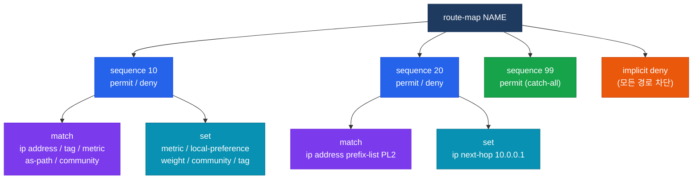
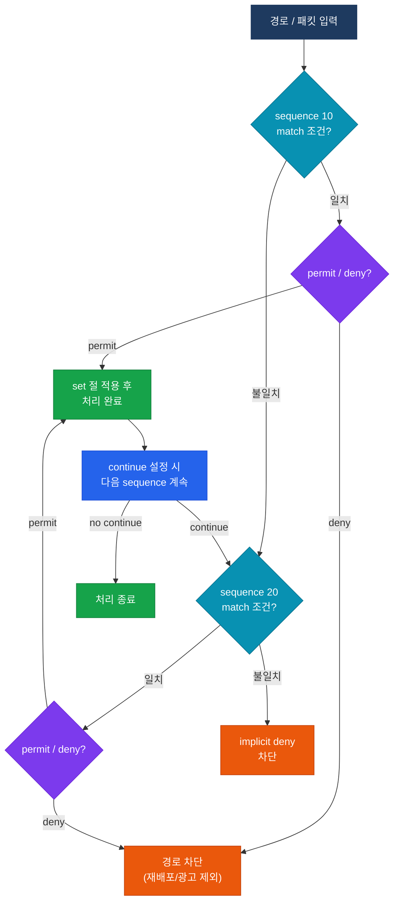

# Route Map

## 정의

경로나 패킷에 대해 **조건 매칭(match)** 과 **속성 변환(set)** 을 시퀀스 번호 순으로 처리하는 정책 도구로, 재배포·BGP 정책·PBR에 공통으로 사용된다.

## 특징

- **(match/set 구조)** match 절로 경로를 선택하고 set 절로 속성을 변환하는 두 단계 구조로 단순 필터링 이상의 정책 구현이 가능
- **(AND 조건 매칭)** 하나의 sequence 내 복수 match 절은 모두 일치해야 permit이 적용되는 AND 조건으로 동작
- **(암묵적 deny)** 마지막 sequence까지 일치하지 않는 경로는 implicit deny로 차단되어 재배포·BGP 광고에서 해당 경로가 제외됨

## Route Map 구조



### match 절 주요 옵션

| match 키워드 | 매칭 대상 |
|--------------|-----------|
| `ip address [ACL/prefix-list]` | 목적지 네트워크 주소 |
| `ip next-hop [ACL]` | 다음 홉 IP 주소 |
| `metric [value]` | 경로 메트릭 값 |
| `tag [value]` | 경로 태그 값 |
| `interface [type num]` | 수신 인터페이스 |
| `as-path [access-list]` | BGP AS-PATH 속성 |
| `community [list]` | BGP 커뮤니티 속성 |

### set 절 주요 옵션

| set 키워드 | 변환 내용 |
|------------|-----------|
| `metric [value]` | 메트릭 값 변경 |
| `metric-type [type1/type2]` | OSPF 외부 경로 유형 변경 |
| `local-preference [value]` | BGP local-preference 설정 |
| `weight [value]` | BGP weight 설정 (Cisco 독점) |
| `as-path prepend [ASN]` | BGP AS-PATH 조작 |
| `community [value]` | BGP 커뮤니티 속성 부여 |
| `tag [value]` | 경로 태그 부여 |
| `ip next-hop [IP]` | 다음 홉 변경 (PBR) |

## 동작 흐름



## 활용 시나리오

| 시나리오 | route-map 역할 |
|----------|----------------|
| 재배포 | match로 경로 선택, set으로 metric·tag 변환 |
| PBR (Policy-Based Routing) | match ip address로 패킷 선택, set ip next-hop으로 경로 우회 |
| BGP 인바운드 정책 | match as-path/community, set local-preference·weight |
| BGP 아웃바운드 정책 | match prefix-list, set as-path prepend·community |

## 설정 및 검증

```bash
! ── 재배포용 route-map ───────────────────────────────
ip prefix-list OSPF_NETS seq 10 permit 192.168.0.0/16 le 24

route-map OSPF_TO_EIGRP deny 5
 match tag 200               ! EIGRP에서 역재배포된 경로 차단

route-map OSPF_TO_EIGRP permit 10
 match ip address prefix-list OSPF_NETS
 set tag 100
 set metric 10000 100 255 1 1500

! ── PBR 설정 ─────────────────────────────────────────
ip access-list extended PBR_TRAFFIC
 permit tcp 10.10.10.0 0.0.0.255 any eq 80

route-map PBR_MAP permit 10
 match ip address PBR_TRAFFIC
 set ip next-hop 203.0.113.1   ! HTTP 트래픽을 ISP1으로 우회

interface GigabitEthernet0/0
 ip policy route-map PBR_MAP   ! 인터페이스에 PBR 적용

! ── BGP 정책용 route-map ─────────────────────────────
route-map BGP_IN permit 10
 match as-path 1
 set local-preference 200

route-map BGP_OUT permit 10
 match ip address prefix-list MY_NETS
 set as-path prepend 65001 65001  ! AS-PATH 길이 증가로 경로 비선호

! ── 검증 명령어 ──────────────────────────────────────
show route-map [NAME]
show ip policy                     ! PBR 적용 인터페이스 확인
debug ip policy                    ! PBR 패킷 처리 실시간 확인
show ip bgp neighbors [IP] advertised-routes
```

## CCNP/CCIE 시험 포인트

- route-map 마지막에는 **implicit deny** 가 존재하므로 모든 경로를 허용하려면 `permit` catch-all sequence 추가 필요
- **match 절 없는 sequence** 는 모든 경로와 일치(match all)하므로 catch-all 역할을 함
- 복수 `match` 절은 **AND 조건**: `match ip address` 와 `match tag` 가 모두 일치해야 permit
- **`continue`** 키워드 사용 시 permit 처리 후 다음 sequence도 계속 평가 (BGP 정책에 유용)
- PBR은 **라우팅 테이블을 우회**하므로 `set ip next-hop` 대상이 reachable해야 하며 그렇지 않으면 라우팅 테이블 사용
- `deny` sequence는 경로를 **차단만** 하고 set 절은 적용되지 않음
