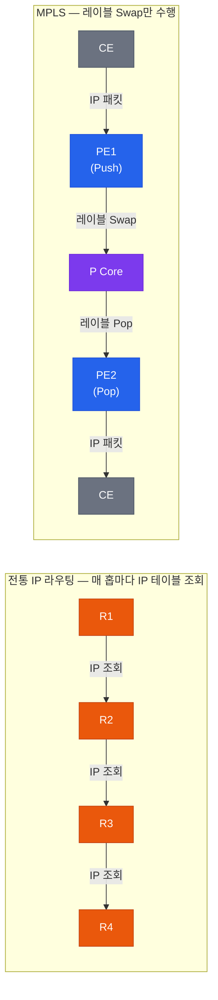
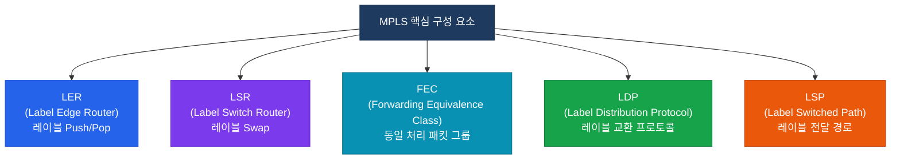
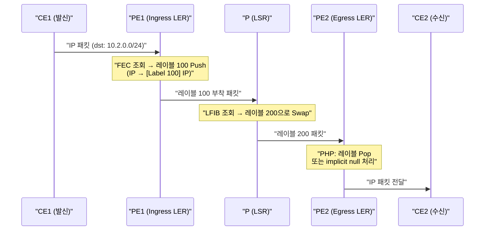

# MPLS 기본

## 정의

IP 네트워크에서 **레이블(Label)** 이라는 짧은 고정 길이 식별자를 패킷 헤더에 삽입해 목적지 IP 조회 없이 포워딩하는 스위칭 기술로, LDP(Label Distribution Protocol)가 레이블 교환을 담당한다.

## 특징

- **(레이블 스택 구조)** 20비트 레이블·3비트 TC·1비트 S(Bottom of Stack)·8비트 TTL로 구성된 4바이트 헤더를 L2/L3 사이에 삽입
- **(FEC 기반 그룹화)** 동일한 포워딩 처리를 받는 패킷 집합을 FEC로 묶어 레이블 한 개로 일괄 처리
- **(PHP로 코어 부하 절감)** 마지막에서 한 홉 전 라우터(Penultimate)가 레이블을 미리 제거하여 Egress PE의 이중 조회 부담 제거

---

## 왜 필요한가?

전통적인 IP 라우팅은 모든 라우터가 **목적지 IP를 Longest Prefix Match**로 조회해야 한다. 코어망 라우터는 수백만 개의 라우팅 엔트리를 매 패킷마다 검색하므로 처리 부하가 크다.



MPLS는 Ingress PE에서 한 번만 IP를 조회하고 레이블을 부착하면, 이후 코어 라우터는 레이블 값만 교체(Swap)하여 고속 포워딩한다.

---

## 구성 요소



| 구성 요소 | 설명 |
|-----------|------|
| **LER** | 도메인 경계에서 레이블을 삽입(Push) 또는 제거(Pop)하는 라우터 (= PE) |
| **LSR** | 도메인 내부에서 레이블만 교체(Swap)하는 코어 라우터 (= P) |
| **FEC** | 동일 목적지·QoS·VPN 처리를 받는 패킷 집합; 레이블 1개에 매핑 |
| **LDP** | TCP 646 포트 사용; IGP 수렴 후 레이블 바인딩을 자동 배포 |
| **LSP** | 소스 LER에서 목적지 LER까지 레이블로 고정된 단방향 경로 |
| **PHP** | 마지막 P 라우터가 레이블을 미리 제거하여 Egress PE 부하 절감 |

---

## 동작 흐름



### PHP (Penultimate Hop Popping)

마지막에서 한 홉 전(Penultimate) 라우터가 레이블을 제거해 Egress PE에 순수 IP 패킷을 전달한다.

| 구분 | 설명 |
|------|------|
| **Implicit Null (레이블 3)** | PHP 요청 시 사용; Penultimate 라우터가 레이블을 제거하고 IP 패킷 전달 |
| **Explicit Null (레이블 0)** | QoS TC 비트 보존이 필요한 경우; 레이블 값 0으로 교체 후 Egress에서 Pop |

---

## LDP vs RSVP-TE 비교

| 구분 | LDP | RSVP-TE |
|------|-----|---------|
| **목적** | 자동 레이블 배포 | Traffic Engineering 경로 제어 |
| **경로 결정** | IGP 최적 경로 그대로 따름 | 명시적 경로 지정 가능 |
| **설정 복잡도** | 단순 (`mpls ip`) | 복잡 (터널 설정 필요) |
| **장애 복구** | IGP 수렴 시간 의존 | FRR(Fast Reroute)로 50ms 복구 |
| **시그널링** | TCP 646 | RSVP (IP 프로토콜 46) |
| **주요 용도** | L3VPN 기본 포워딩 | SP 백본 TE, 대역폭 예약 |

---

## 설정 및 검증

```bash
! ─── 전역 MPLS 설정 ───
R(config)# mpls label protocol ldp          ! LDP를 레이블 배포 프로토콜로 지정
R(config)# mpls ldp router-id Loopback0 force ! LDP Router-ID를 Lo0으로 고정

! ─── 인터페이스별 MPLS 활성화 ───
R(config)# interface GigabitEthernet0/0
R(config-if)# mpls ip                       ! 해당 인터페이스에서 MPLS 포워딩 활성화

! ─── LDP 세션 확인 ───
R# show mpls ldp neighbors                  ! LDP 피어 목록 및 세션 상태 확인
R# show mpls ldp bindings                   ! 레이블 바인딩 테이블 (LIB) 확인

! ─── MPLS 포워딩 테이블 확인 ───
R# show mpls forwarding-table               ! LFIB (레이블 포워딩 정보 베이스) 확인
R# show mpls forwarding-table detail        ! 상세 포워딩 정보 (인터페이스·넥스트홉 포함)

! ─── MPLS 인터페이스 확인 ───
R# show mpls interfaces                     ! MPLS 활성화된 인터페이스 목록
R# show mpls interfaces GigabitEthernet0/0 detail

! ─── LDP 디버그 ───
R# debug mpls ldp advertisements           ! LDP 레이블 광고 디버그
```

### LFIB 출력 예시

```bash
R# show mpls forwarding-table
Local  Outgoing    Prefix            Bytes Label   Outgoing   Next Hop
Label  Label or    or Tunnel Id      Switched      interface
       Exp Nhdr
100    200         10.2.0.0/24       0             Gi0/1      192.168.1.2
101    Pop Label   10.3.0.0/24       0             Gi0/2      192.168.2.2  ! PHP
102    Untagged    10.1.0.0/24       0             Gi0/0      192.168.0.1
```

---

## CCNP/CCIE 시험 포인트

- **PHP(Penultimate Hop Popping)** 는 기본 동작이다 — Penultimate 라우터가 레이블을 제거하여 Egress PE의 이중 조회(IP + 레이블) 부담을 줄인다.
- **Implicit Null(레이블 3)** 은 PHP 신호; **Explicit Null(레이블 0)** 은 QoS TC 비트 보존 목적이다.
- LDP는 **TCP 포트 646** 을 사용한다 — Hello는 UDP 646.
- LDP Router-ID는 Loopback0으로 고정하지 않으면 인터페이스 다운 시 세션 재시작이 발생한다.
- `mpls ip`는 인터페이스 레벨 명령어 — 전역으로 MPLS를 켜는 것은 없다.
- FEC는 목적지 프리픽스 기준으로 생성된다 — 같은 목적지면 동일 레이블.
- LDP는 **IGP(OSPF/IS-IS) 수렴 후** 레이블을 배포한다 — IGP가 없으면 LDP 세션이 올라와도 레이블이 교환되지 않는다.
