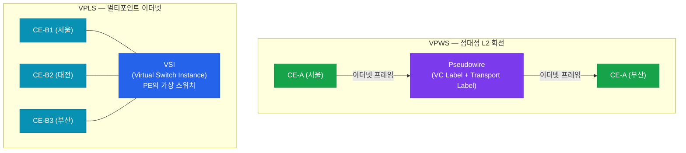
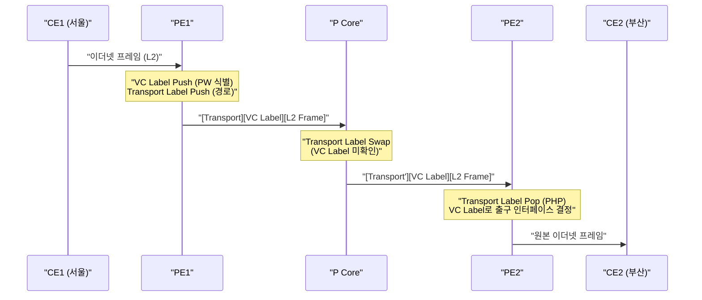

# MPLS L2VPN

## 정의

MPLS 네트워크를 통해 **레이어 2 프레임(Ethernet, Frame Relay, ATM 등)** 을 그대로 터널링하여 원격 사이트 간 L2 연결을 제공하는 가상 사설망 기술로, AToM(Any Transport over MPLS)과 VPLS(Virtual Private LAN Service)가 대표적이다.

## 특징

- **(L2 투명 전달)** IP 라우팅 없이 이더넷 프레임을 그대로 전달하여 고객이 L3를 완전히 제어 가능
- **(Pseudowire 에뮬레이션)** MPLS 레이블 스택으로 가상 L2 회선(Pseudowire)을 구성해 전용 회선과 동일한 경험 제공
- **(점대점·멀티포인트 지원)** VPWS(점대점)와 VPLS(멀티포인트 이더넷) 두 방식으로 다양한 토폴로지 수용

---

## L2VPN vs L3VPN 비교

| 구분 | L3VPN | L2VPN |
|------|-------|-------|
| **동작 계층** | Layer 3 (IP) | Layer 2 (Ethernet/Frame) |
| **라우팅 주체** | PE 라우터 (VRF) | 고객 CE 라우터 |
| **주소 관리** | 사업자가 VRF로 관리 | 고객이 완전히 제어 |
| **연결 방식** | Any-to-Any (RT 정책) | 점대점(VPWS) 또는 멀티포인트(VPLS) |
| **주요 프로토콜** | MP-BGP VPNv4 | LDP (AToM), BGP (VPLS) |
| **용도** | 엔터프라이즈 IP VPN | 이더넷 전용선 대체, 데이터센터 연동 |

---

## VPWS vs VPLS 비교

| 구분 | VPWS (AToM) | VPLS |
|------|-------------|------|
| **정식 명칭** | Any Transport over MPLS | Virtual Private LAN Service |
| **연결 형태** | 점대점 (Point-to-Point) | 멀티포인트 (Multipoint) |
| **에뮬레이션** | 전용 회선 (E-Line) | 이더넷 스위치 (E-LAN) |
| **MAC 학습** | 불필요 | PE에서 MAC 주소 학습 |
| **BUM 처리** | 상대 PE로만 전달 | 플러딩(모든 PE로) |
| **시그널링** | LDP (VC Label) | LDP 또는 BGP |
| **표준** | RFC 4905 | RFC 4762 (LDP), RFC 4761 (BGP) |



---

## Pseudowire 동작

Pseudowire(PW)는 두 PE 사이의 단방향 MPLS 레이블 터널이다. AToM에서 PW는 **VC Label(L2 식별)** 과 **Transport Label(PE간 경로)** 두 개의 레이블로 구성된다.



LDP 기반 AToM에서 PE1과 PE2는 **LDP Target Session** (직접 연결이 아닌 TCP 연결)으로 VC Label을 교환한다.

---

## 설정 및 검증

### AToM (VPWS) 설정

```bash
! ─── PE1: xconnect 설정 (이더넷 인터페이스) ───
PE1(config)# interface GigabitEthernet0/1      ! CE1과 연결된 인터페이스
PE1(config-if)# xconnect 2.2.2.2 100 encapsulation mpls
! xconnect [상대 PE IP] [VC-ID] encapsulation mpls
! VC-ID는 양쪽 PE에서 동일해야 함

! ─── PE2: xconnect 설정 ───
PE2(config)# interface GigabitEthernet0/1
PE2(config-if)# xconnect 1.1.1.1 100 encapsulation mpls

! ─── AToM 검증 ───
PE# show xconnect all                          ! Pseudowire 상태 확인
PE# show mpls l2transport vc detail           ! VC 상세 정보 (레이블, 상태)
PE# show l2vpn atom vc detail                 ! IOS-XE 스타일 검증
```

### VPLS 설정 (LDP 방식)

```bash
! ─── VPLS VFI (Virtual Forwarding Instance) 정의 ───
PE1(config)# l2 vfi CUSTOMER-VPLS manual      ! VPLS 인스턴스 생성
PE1(config-vfi)# vpn id 200                   ! VPN ID (모든 PE에서 동일)
PE1(config-vfi)# neighbor 2.2.2.2 encapsulation mpls  ! 원격 PE 추가
PE1(config-vfi)# neighbor 3.3.3.3 encapsulation mpls

! ─── CE 연결 인터페이스를 VPLS에 바인딩 ───
PE1(config)# interface GigabitEthernet0/1
PE1(config-if)# service instance 1 ethernet
PE1(config-if-srv)# encapsulation default
PE1(config-if-srv)# bridge-domain 200

PE1(config)# bridge-domain 200
PE1(config-bdomain)# member vfi CUSTOMER-VPLS

! ─── VPLS 검증 ───
PE# show l2 vfi                               ! VFI 목록 및 상태
PE# show l2 vfi CUSTOMER-VPLS detail         ! 특정 VFI 상세 정보
PE# show bridge-domain 200                   ! 브리지 도메인 MAC 테이블 확인
PE# show mpls l2transport vc                 ! 모든 Pseudowire 상태
```

---

## CCNP/CCIE 시험 포인트

- **VC-ID**는 양쪽 PE에서 **반드시 동일**해야 Pseudowire가 올라온다.
- AToM은 LDP **Targeted Session** 으로 동작한다 — 직접 연결이 없어도 Loopback 간 LDP 세션 형성.
- VPLS에서 PE는 **MAC 주소 학습**을 수행한다 — 처음 보는 목적지 MAC은 모든 PW로 플러딩.
- VPLS의 **split-horizon 규칙** 이 필수: 하나의 PW에서 수신한 BUM 트래픽을 다른 PW로 재전달하지 않아 루프 방지.
- `show mpls l2transport vc detail`에서 **Local VC Label**과 **Remote VC Label**이 모두 표시되어야 정상 동작.
