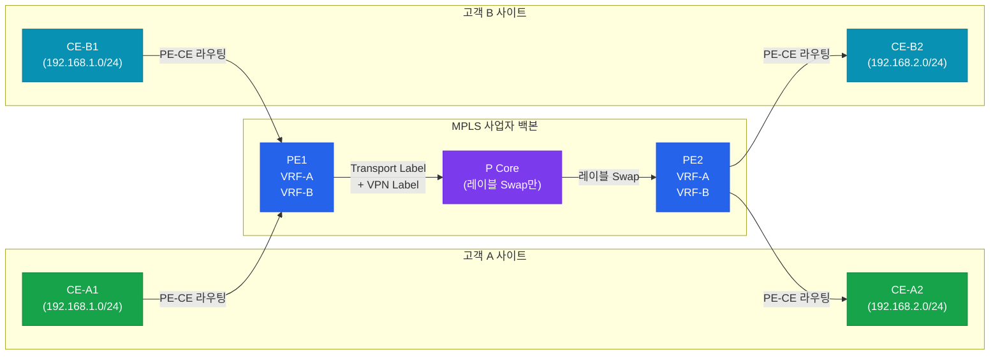
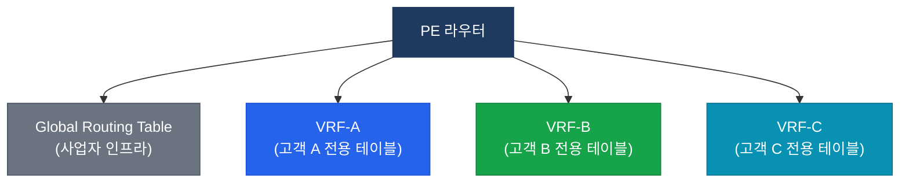
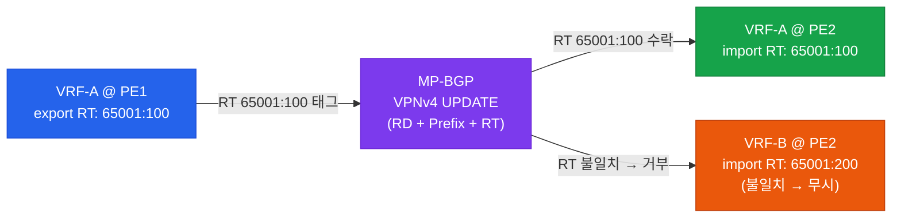
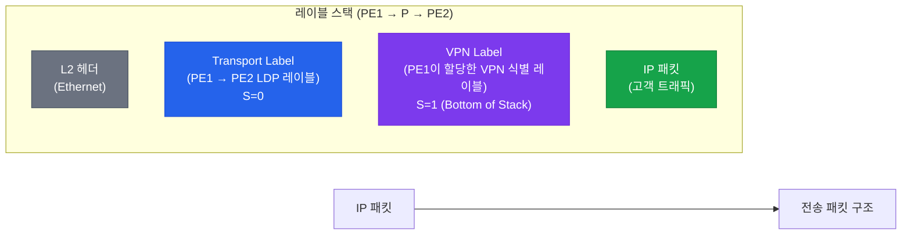

# MPLS L3VPN

## 정의

MPLS 백본 위에서 **VRF(Virtual Routing and Forwarding)** 를 사용하여 복수의 고객 네트워크를 논리적으로 분리하고, MP-BGP VPNv4로 PE 간 VPN 경로를 교환하는 Layer 3 가상 사설망 기술 (RFC 4364).

## 특징

- **(VRF 기반 트래픽 분리)** PE 라우터가 고객별 독립 라우팅 테이블(VRF)을 유지하여 동일 IP 주소 공간도 중복 없이 수용
- **(RD/RT로 경로 식별 및 공유)** RD(Route Distinguisher)로 VPNv4 주소를 전역 유일하게 만들고, RT(Route Target)로 VRF 간 선택적 경로 공유
- **(레이블 스택 이중 캡슐화)** Transport Label(PE-PE)과 VPN Label(PE-CE)을 스택으로 쌓아 코어 라우터가 고객 정보를 모른 채 포워딩

---

## L3VPN 아키텍처



---

## VRF 개념

VRF는 PE 라우터 내에 존재하는 **독립 라우팅 테이블**이다. 동일 PE가 수십 개의 고객 VPN을 수용할 때 각 고객마다 별도 VRF를 생성하여 완전히 분리된 라우팅 환경을 제공한다.



---

## RD / RT 동작

| 속성 | 이름 | 크기 | 목적 |
|------|------|------|------|
| **RD** (Route Distinguisher) | 경로 식별자 | 8바이트 | 동일 IP 프리픽스를 VPNv4 주소로 유일하게 만듦 |
| **RT** (Route Target) | 경로 대상 | 가변 (Extended Community) | export: VRF에서 MP-BGP로 내보낼 때 태그<br/>import: MP-BGP에서 VRF로 받아들일 때 필터 |

RD 형식: `ASN:nn` (예: `65001:100`) 또는 `IP:nn` (예: `1.1.1.1:100`)



---

## 레이블 스택 구조



P 코어 라우터는 **Transport Label만 Swap**하고 VPN Label을 보지 않는다. Egress PE가 VPN Label로 목적지 VRF와 CE를 결정한다.

---

## PE-CE 라우팅 프로토콜 비교

| 프로토콜 | 특징 | 주의사항 |
|---------|------|---------|
| **Static** | 단순, 소규모 | 경로 자동 감지 없음 |
| **RIPv2** | 간단한 설정 | 수렴 느림, 홉 카운트 제한 |
| **OSPF** | 도메인 확장 용이 | Sham-link 필요 (백도어 링크 시) |
| **EIGRP** | Cisco 전용, 빠른 수렴 | AS 번호 일치 필요 |
| **eBGP** | 대규모·멀티홈 최적 | AS 번호 관리 필요 |

---

## 설정 및 검증

```bash
! ─── VRF 정의 (IOS-XE 스타일) ───
PE(config)# vrf definition CUSTOMER-A          ! VRF 이름 정의
PE(config-vrf)# rd 65001:100                   ! Route Distinguisher 설정
PE(config-vrf)# route-target export 65001:100  ! 경로 내보낼 때 RT 태그
PE(config-vrf)# route-target import 65001:100  ! 경로 받아들일 때 RT 필터
PE(config-vrf)# address-family ipv4            ! IPv4 주소 패밀리 활성화
PE(config-vrf-af)# exit

! ─── PE-CE 인터페이스에 VRF 바인딩 ───
PE(config)# interface GigabitEthernet0/1
PE(config-if)# vrf forwarding CUSTOMER-A       ! 인터페이스를 VRF에 할당 (IP 삭제됨)
PE(config-if)# ip address 10.0.1.1 255.255.255.252
PE(config-if)# no shutdown

! ─── PE-CE BGP 설정 (eBGP 방식) ───
PE(config)# router bgp 65000
PE(config-router)# address-family ipv4 vrf CUSTOMER-A
PE(config-router-af)# neighbor 10.0.1.2 remote-as 65001
PE(config-router-af)# neighbor 10.0.1.2 activate
PE(config-router-af)# redistribute connected

! ─── MP-BGP VPNv4 피어 설정 (PE-PE) ───
PE(config)# router bgp 65000
PE(config-router)# neighbor 2.2.2.2 remote-as 65000          ! iBGP (같은 AS)
PE(config-router)# neighbor 2.2.2.2 update-source Loopback0
PE(config-router)# address-family vpnv4
PE(config-router-af)# neighbor 2.2.2.2 activate
PE(config-router-af)# neighbor 2.2.2.2 send-community extended

! ─── 검증 명령어 ───
PE# show ip vrf                                ! VRF 목록 및 인터페이스 확인
PE# show ip vrf detail CUSTOMER-A             ! VRF 상세 정보 (RD/RT 포함)
PE# show ip route vrf CUSTOMER-A             ! VRF 라우팅 테이블 확인
PE# show bgp vpnv4 unicast all               ! 전체 VPNv4 BGP 테이블
PE# show bgp vpnv4 unicast all summary       ! VPNv4 BGP 피어 요약
PE# show bgp vpnv4 unicast rd 65001:100 10.0.0.0/24  ! 특정 VPN 경로 상세
PE# show mpls forwarding-table               ! LFIB에 VPN 레이블 확인
```

---

## CCNP/CCIE 시험 포인트

- **RD는 유일성(Uniqueness)**, **RT는 정책(Policy)** 이다 — RD는 주소 충돌 방지, RT는 VRF 간 경로 공유 제어.
- `vrf forwarding` 명령어 입력 시 **인터페이스 IP가 자동 삭제**된다 — 반드시 재입력.
- MP-BGP VPNv4는 **`send-community extended`** 가 필수 — Extended Community(RT)가 없으면 VPN 경로 공유 불가.
- P 코어 라우터는 **VPN Label을 보지 않는다** — Transport Label만으로 포워딩하므로 고객 경로 테이블 불필요.
- OSPF PE-CE 구성 시 **백도어 링크**가 있으면 Sham-link를 설정해야 MPLS 경로가 우선시된다.
- RT import/export를 양쪽 PE에서 대칭으로 설정하지 않으면 단방향 통신만 된다.
- `show bgp vpnv4 unicast all`에서 경로는 보이지만 `show ip route vrf`에 없다면 **RT import 불일치**를 확인한다.
