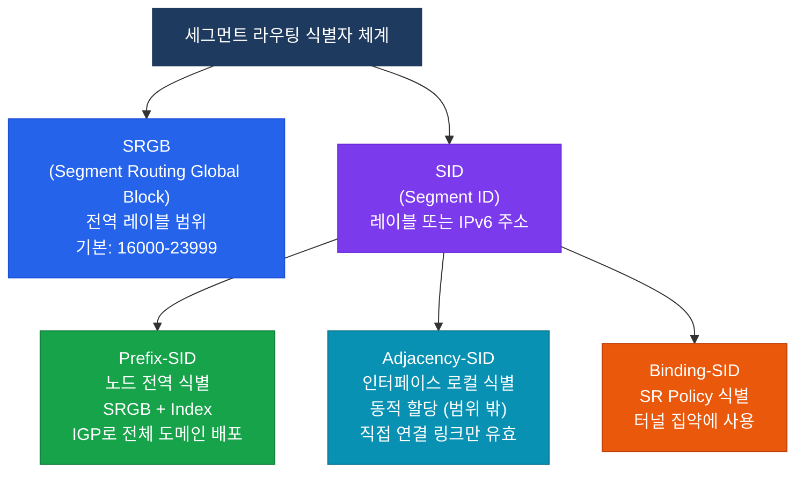
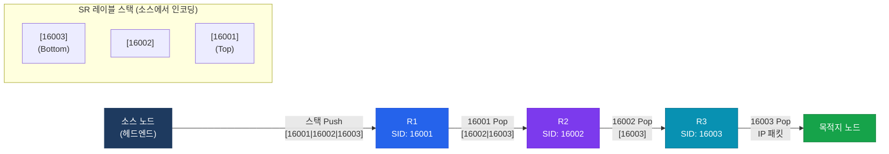

# 세그먼트 라우팅 (Segment Routing)

## 정의

소스 노드가 **세그먼트(Segment)** 라는 명령어 목록을 패킷 헤더에 인코딩하여 경로를 명시적으로 지시하는 소스 라우팅 기술로, SR-MPLS(레이블 스택)과 SRv6(IPv6 확장 헤더) 두 가지 데이터 플레인을 지원한다 (RFC 8402).

## 특징

- **(소스 라우팅으로 완전한 경로 제어)** 헤드엔드 노드가 전체 경로를 세그먼트 스택으로 인코딩하여 중간 노드의 상태 유지 없이 트래픽 엔지니어링 구현
- **(LDP/RSVP 없는 단순 아키텍처)** IGP(IS-IS/OSPF) 확장만으로 SID를 배포하므로 LDP·RSVP 프로토콜 제거 가능
- **(FRR과 TI-LFA로 50ms 복구)** Topology Independent LFA가 임의 토폴로지에서 링크·노드 장애를 50ms 이내에 복구

---

## SR vs 전통 MPLS 비교

| 구분 | 전통 MPLS | 세그먼트 라우팅 |
|------|-----------|-----------------|
| **레이블 배포** | LDP / RSVP-TE | IGP 확장 (IS-IS / OSPF) |
| **상태 유지** | 모든 중간 노드가 LSP 상태 유지 | 소스 노드만 경로 정보 유지 |
| **TE 구현** | RSVP-TE 필수 | SR-TE로 RSVP 없이 구현 |
| **확장성** | 터널 수 × 노드 수로 상태 폭발 | 소스 집중으로 확장성 우수 |
| **빠른 복구** | RSVP FRR | TI-LFA (토폴로지 독립적) |
| **컨트롤러 통합** | 복잡 | PCE/SDN과 직접 연동 용이 |

---

## SR-MPLS vs SRv6 비교

| 구분 | SR-MPLS | SRv6 |
|------|---------|------|
| **데이터 플레인** | MPLS 레이블 스택 | IPv6 확장 헤더 (SRH) |
| **SID 표현** | 20비트 MPLS 레이블 | 128비트 IPv6 주소 |
| **기존 호환성** | MPLS 인프라 재사용 | IPv6 전용 인프라 필요 |
| **헤더 오버헤드** | 4바이트 × 세그먼트 수 | 8+16n 바이트 (SRH) |
| **프로그래머빌리티** | 제한적 | 함수 인코딩으로 높은 유연성 |
| **주요 배포** | SP 코어, DC 인터커넥트 | 차세대 SP/DC 망 |

---

## SRGB / SID / Prefix-SID / Adj-SID



| 개념 | 범위 | 값 계산 | 용도 |
|------|------|---------|------|
| **SRGB** | 도메인 전체 공통 | 관리자 설정 (16000-23999) | 전역 레이블 풀 |
| **Prefix-SID** | 전역 | SRGB_Base + Index | 노드 식별, LSP 경로 지정 |
| **Adj-SID** | 로컬 (노드 내) | 동적 할당 (SRGB 밖) | 특정 링크 강제 지정 |
| **Node-SID** | 전역 | Prefix-SID의 일종 | 라우터 전체 식별 |

---

## 동작 흐름



각 노드는 자신의 Prefix-SID를 스택 최상단에서 확인하고 제거(Next-Segment) 후 다음 노드로 전달한다.

---

## 설정 및 검증

```bash
! ─── IS-IS에서 SR-MPLS 활성화 ───
R(config)# router isis 1
R(config-router)# segment-routing mpls          ! SR-MPLS 데이터 플레인 활성화
R(config-router)# segment-routing prefix-sid-map advertise-local  ! Prefix-SID 광고

! ─── SRGB 범위 설정 ───
R(config)# segment-routing
R(config-sr)# global-block 16000 23999          ! SRGB 범위 지정 (기본값)

! ─── Loopback에 Prefix-SID 할당 ───
R(config)# router isis 1
R(config-router)# address-family ipv4 unicast
R(config-router-af)# segment-routing mpls
R(config-router-af)# exit
R(config-router)# interface Loopback0
R(config-router)# passive-interface Loopback0

R(config)# interface Loopback0
R(config-if)# isis segment-routing prefix-sid index 1   ! SID = SRGB_Base + 1 = 16001

! ─── SR-TE 명시적 경로 (Policy) ───
R(config)# segment-routing
R(config-sr)# traffic-eng
R(config-sr-te)# segment-list EXPLICIT-PATH
R(config-sr-te-sl)# index 10 address ipv4 1.1.1.1       ! 경유 노드 Prefix-SID
R(config-sr-te-sl)# index 20 address ipv4 2.2.2.2
R(config-sr-te-sl)# exit
R(config-sr-te)# policy SR-POLICY
R(config-sr-te-policy)# color 100 end-point ipv4 3.3.3.3
R(config-sr-te-policy)# candidate-paths
R(config-sr-te-policy-path)# preference 100
R(config-sr-te-policy-path-pref)# explicit segment-list EXPLICIT-PATH

! ─── 검증 명령어 ───
R# show segment-routing mpls state             ! SR-MPLS 전체 상태
R# show segment-routing mpls connected-prefix-sid-map local   ! 로컬 Prefix-SID 확인
R# show segment-routing mpls forwarding        ! SR 포워딩 테이블
R# show isis segment-routing prefix-sids       ! IS-IS에서 광고 중인 Prefix-SID
R# show segment-routing traffic-eng policy     ! SR-TE Policy 상태
R# show mpls forwarding-table                  ! LFIB에서 SR 레이블 확인
```

---

## CCNP/CCIE 시험 포인트

- **SRGB 기본 범위는 16000-23999** 이다 — Prefix-SID는 SRGB_Base + Index로 계산.
- Prefix-SID는 **전역(Global)**, Adj-SID는 **로컬(Local)** 범위다 — Adj-SID는 노드 재시작 시 값이 바뀔 수 있다.
- SR은 LDP를 **대체**할 수 있지만 공존(SR + LDP)도 가능하다 — 마이그레이션 단계에서 혼용.
- **TI-LFA(Topology Independent LFA)** 는 링크·노드·SRLG 모든 장애에 대해 50ms 이내 복구를 제공한다.
- SR-TE는 **PCE(Path Computation Element)** 와 연동하여 중앙 집중식 경로 계산이 가능하다.
