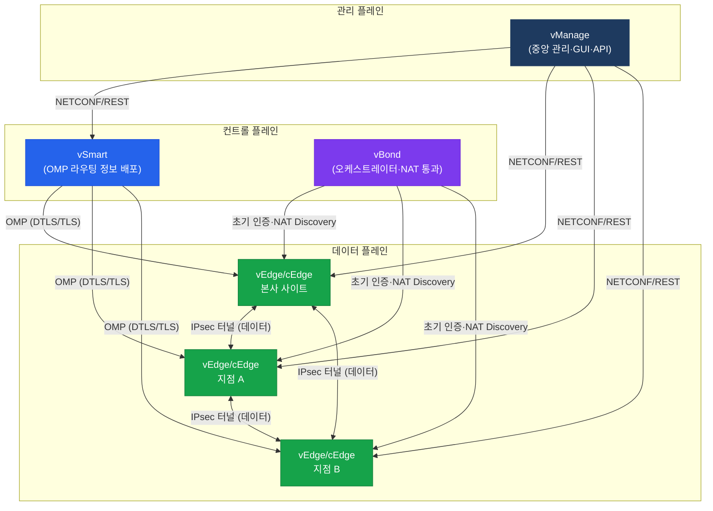

# Cisco SD-WAN (소프트웨어 정의 WAN)
**Software-Defined Wide Area Network**

## 정의

소프트웨어 컨트롤러(vManage/vSmart/vBond)가 WAN 엣지 장비(vEdge/cEdge)를 중앙에서 제어·관리하여, 다양한 전송 매체(MPLS·인터넷·LTE) 위에 오버레이 패브릭을 구성하는 **소프트웨어 정의 네트워킹** 기술.

## 특징

- **(중앙 집중 관리)** vManage 단일 대시보드로 전 사이트 구성·정책·모니터링을 통합 적용하여 운영 복잡도 대폭 절감
- **(전송 독립성)** MPLS·인터넷·LTE 등 이기종 링크를 동시에 활용하며 애플리케이션별 SLA에 따라 최적 경로를 자동 선택
- **(Zero Trust 보안)** 모든 WAN 터널을 IPsec으로 암호화하고 인증서 기반 장비 인증을 적용하여 브랜치 간 통신을 보호

## 왜 필요한가?

전통 WAN은 **MPLS 단일 경로** 의존으로 인해 비용이 높고, 지점마다 개별 장비 설정이 필요해 배포 속도가 느렸다. 클라우드·SaaS 트래픽이 폭발적으로 증가하면서 MPLS 백홀 방식은 지연과 비용 문제가 심화됐다.

SD-WAN은 인터넷·LTE 등 저렴한 링크를 MPLS와 동시에 활용하고, 중앙 컨트롤러가 정책을 일괄 배포함으로써 **비용 절감 + 민첩성 향상**을 동시에 달성한다.

---

## SD-WAN 아키텍처 전체 구조

### 구성 요소 역할 요약

| 구성 요소 | 플레인 | 역할 |
|-----------|--------|------|
| **vManage** | 관리 플레인 | GUI/REST API 기반 중앙 관리, 정책 배포, 모니터링 |
| **vSmart** | 컨트롤 플레인 | OMP를 통해 라우팅 정보·정책 배포, BGP 컨트롤러 역할 |
| **vBond** | 오케스트레이션 | WAN Edge 최초 인증, vSmart/vManage 주소 제공, NAT 통과 지원 |
| **vEdge/cEdge** | 데이터 플레인 | 물리·가상 WAN 엣지, IPsec 터널 종단, 트래픽 포워딩 |

> **vEdge**: Viptela 전용 장비 / **cEdge**: Cisco IOS-XE 기반 장비 (ISR 4000, ASR 1000, CSR 1000v 등)

---

## 전통 WAN vs SD-WAN 비교

| 구분 | 전통 WAN | SD-WAN |
|------|----------|--------|
| 경로 제어 | 분산 (장비별 개별 설정) | 중앙 집중 (vSmart) |
| 전송 매체 | 주로 MPLS 단일 | MPLS + 인터넷 + LTE 복합 |
| 배포 방식 | 수동 CLI, 사이트별 방문 | ZTP 자동 프로비저닝 |
| 가시성 | 제한적 (SNMP/NetFlow) | 실시간 애플리케이션 모니터링 |
| 보안 | 별도 IPsec 구성 필요 | 기본 All-Tunnel IPsec |
| 비용 | MPLS 전용선 고비용 | 인터넷 링크 병행 → 비용 절감 |
| 변경 속도 | 느림 (개별 장비 CLI) | 빠름 (vManage 일괄 푸시) |

---

## 섹션 문서 링크

| 문서 | 내용 |
|------|------|
| [SD-WAN 아키텍처](./sdwan-architecture) | TLOC·OMP·BFD·Control/Data Plane 분리 원리 |
| [SD-WAN 정책](./sdwan-policies) | Centralized/Localized 정책, App-Aware Routing |
| [SD-WAN 보안](./sdwan-security) | Zero Trust 인증, ZTP, Segmentation, Cloud Security |

---

## CCNP/CCIE 시험 비중

SD-WAN은 **CCNP ENCOR(350-401)** 와 **CCIE Enterprise Infrastructure** 시험 모두에서 출제된다.

| 시험 | 섹션 | 비중 |
|------|------|------|
| CCNP ENCOR | Infrastructure (SD-WAN) | 약 10–15% |
| CCIE Enterprise Written | SD-WAN 아키텍처·정책 | 포함 |
| CCIE Enterprise Lab | SD-WAN 설정·검증 | 포함 |

## CCNP/CCIE 시험 포인트

- **vBond**는 퍼블릭 IP가 반드시 필요하다 — NAT 뒤에 배치 불가 (단, NAT 통과 지원은 다른 장비)
- vSmart는 **OMP(Overlay Management Protocol)** 를 사용하며 BGP와 유사하게 동작한다
- vManage는 NETCONF/YANG 기반으로 vEdge/cEdge를 프로그래밍 방식으로 관리한다
- Control Connection은 **DTLS(기본) 또는 TLS** 를 사용하며 TCP 포트 **443** 으로 동작한다
- cEdge는 IOS-XE 기반이므로 기존 IOS-XE CLI와 SD-WAN 템플릿 모두 사용 가능하다
- SD-WAN 데이터 플레인 터널은 vEdge/cEdge 간 **직접 IPsec** 으로 형성되며 vSmart를 통과하지 않는다
