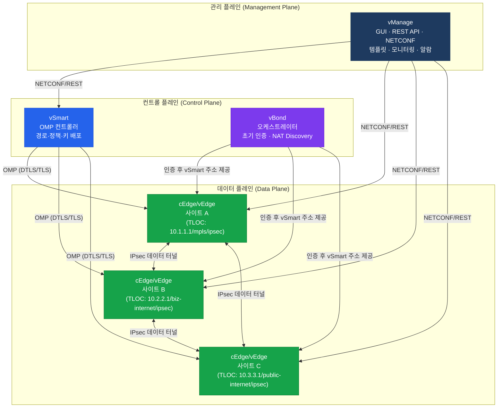
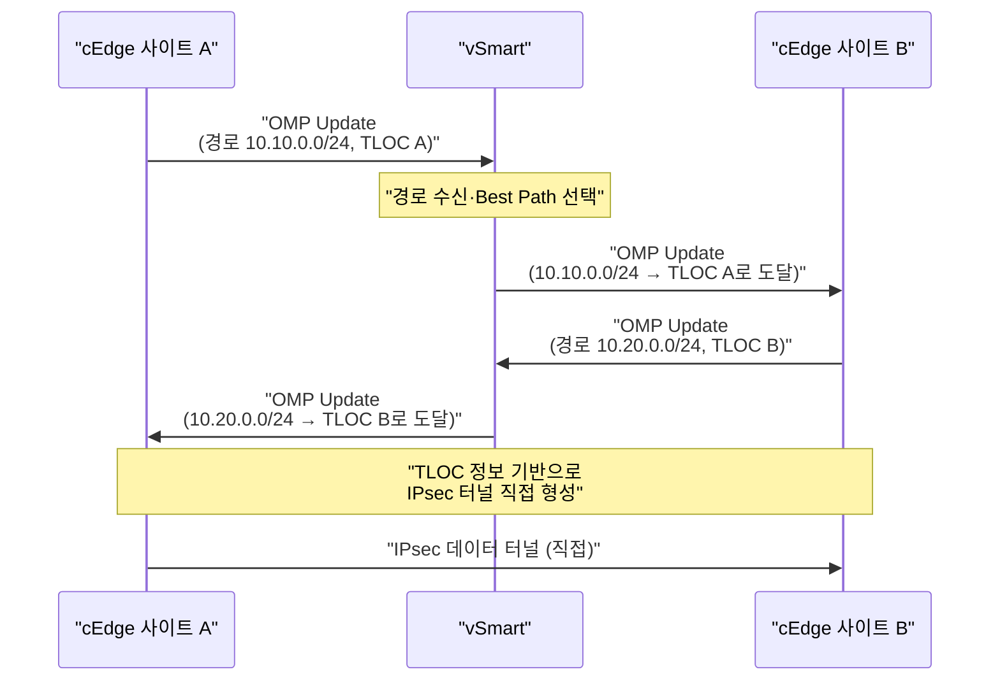
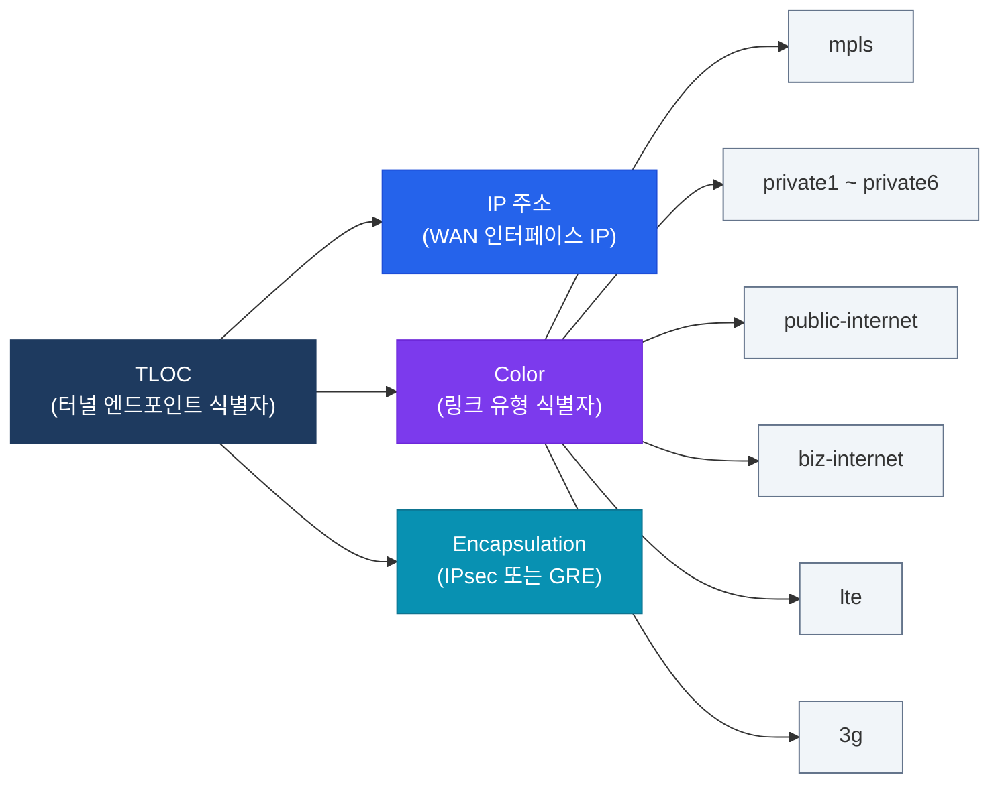

# SD-WAN 아키텍처
**Cisco SD-WAN Architecture (vManage/vSmart/vBond)**

## 정의

Cisco SD-WAN 아키텍처는 **관리·컨트롤·데이터 플레인을 물리적으로 분리**하여, vManage(관리)·vSmart(컨트롤)·vBond(오케스트레이션)·vEdge/cEdge(데이터)가 각자의 역할을 전담하는 4-컴포넌트 오버레이 패브릭 구조.

## 특징

- **(플레인 분리)** 관리·컨트롤·데이터 플레인이 물리적으로 독립하여 컨트롤러 장애가 데이터 포워딩에 영향을 주지 않음
- **(TLOC 기반 터널 식별)** IP + Color + Encapsulation 세 가지 조합으로 터널 엔드포인트를 고유하게 식별하여 다중 링크 동시 활용
- **(OMP 중앙 경로 제어)** BGP와 유사한 OMP 프로토콜로 vSmart가 모든 사이트의 경로·정책·보안 정보를 일괄 배포

## 컨트롤/데이터/관리 플레인 분리



---

## OMP 동작 원리

**OMP(Overlay Management Protocol)** 는 SD-WAN 전용 컨트롤 프로토콜로, vSmart와 WAN Edge 간에 동작한다.

### OMP가 배포하는 정보

| OMP 라우트 유형 | 내용 |
|----------------|------|
| **OMP Routes** | IPv4/IPv6 접두사, TLOC 정보, 오리진 |
| **TLOC Routes** | 터널 엔드포인트 위치 (IP + Color + Encap) |
| **Service Routes** | 서비스 체이닝 (방화벽·IDS 위치 정보) |

### OMP 경로 선택 원리

- vSmart는 수신한 경로 중 **Best 4개**를 각 WAN Edge에 전달 (기본값)
- OMP Best Path 기준: Origin > OMP Preference > TLOC Preference > System IP



---

## BFD & 터널 관리

**BFD(Bidirectional Forwarding Detection)** 는 WAN Edge 간 IPsec 터널 상태를 감지하는 데 사용된다.

| 항목 | 기본값 | 설명 |
|------|--------|------|
| BFD Hello 간격 | 1초 | 터널 상태 확인 주기 |
| BFD Multiplier | 7 | 7회 미응답 시 터널 Down |
| 터널 다운 감지 시간 | 최대 7초 | Hello × Multiplier |
| 멀티플 링크 지원 | O | 링크별 BFD 독립 동작 |

- BFD는 **각 IPsec 터널마다 독립적**으로 동작한다
- 터널 Down 감지 시 OMP를 통해 vSmart에 알리고 대체 TLOC로 즉시 전환
- App-Aware Routing은 BFD 프로브 결과(지연·손실·지터)를 기반으로 경로 품질을 평가

---

## TLOCs (Transport Location Identifiers)

TLOC은 WAN Edge의 터널 엔드포인트를 **세 가지 속성**의 조합으로 식별한다.



- **Color**가 다르면 동일 IP라도 별개의 TLOC → 복수 링크에 복수 터널 형성 가능
- `mpls` color는 기본적으로 **restrict** 속성: mpls ↔ mpls 터널만 허용
- `public-internet` color는 제한 없음: 어떤 color와도 터널 형성 가능

---

## 설정 및 검증

### WAN Edge 기본 설정 (cEdge IOS-XE)

```bash
! SD-WAN 시스템 설정
system
 system-ip        10.0.0.1          ! 고유 시스템 IP (라우터 ID 역할)
 site-id          100               ! 사이트 식별자
 organization-name "MyOrg"          ! vManage와 동일해야 함
 vbond 203.0.113.1                  ! vBond IP 주소

! WAN 인터페이스 터널 설정
interface GigabitEthernet0/0/0
 description "WAN - biz-internet"
 ip address 198.51.100.1 255.255.255.0
 tunnel-interface
  encapsulation ipsec
  color biz-internet                ! TLOC Color 지정
  allow-service all                 ! 허용 서비스

! MPLS WAN 인터페이스
interface GigabitEthernet0/0/1
 description "WAN - MPLS"
 ip address 172.16.100.1 255.255.255.0
 tunnel-interface
  encapsulation ipsec
  color mpls restrict               ! restrict: mpls끼리만 터널 형성
```

### OMP 및 터널 검증 명령어

```bash
! OMP 피어 상태 확인
show sdwan omp peers

! OMP 수신 경로 확인
show sdwan omp routes

! TLOC 정보 확인
show sdwan omp tlocs

! BFD 세션 상태 확인
show sdwan bfd sessions

! IPsec 터널 상태 확인
show sdwan ipsec inbound-connections
show sdwan ipsec outbound-connections

! 컨트롤 커넥션 상태 확인
show sdwan control connections
show sdwan control connections-history
```

---

## CCNP/CCIE 시험 포인트

- **Control Connection**은 DTLS(기본) 또는 TLS를 사용하며 포트는 **TCP/UDP 443**이다
- vSmart는 OMP Best Path를 기본 **4개** WAN Edge에 전달한다 (`omp send-path-limit`)
- TLOC의 **restrict** 속성: 같은 color 사이에서만 터널 형성, 다른 color와는 터널 미형성
- BFD는 컨트롤러(vSmart)가 아닌 **WAN Edge 간 직접** 동작한다
- **OMP graceful-restart**: 컨트롤러 연결 끊겨도 기존 경로 유지 (기본 43,200초 = 12시간)
- cEdge와 vEdge의 차이: cEdge는 **IOS-XE 기반**으로 기존 IOS-XE 기능과 SD-WAN 기능 동시 지원
