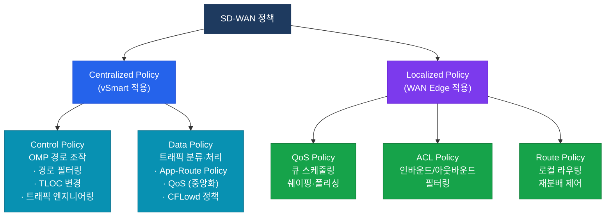
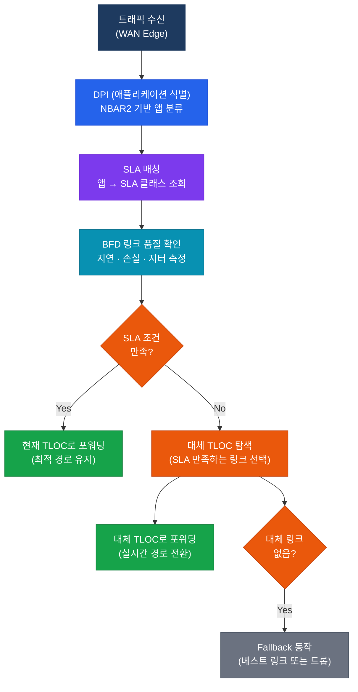

# SD-WAN 정책
**SD-WAN Policies & Traffic Engineering**

## 정의

SD-WAN 정책은 vManage에서 정의하고 vSmart(중앙화) 또는 WAN Edge(로컬화)에서 적용되는 **트래픽 제어 규칙 집합**으로, OMP 경로 조작(Control Policy)과 트래픽 분류·조작(Data Policy) 두 축으로 구성된다.

## 특징

- **(중앙 집중 정책)** vSmart에서 전체 패브릭에 일관되게 적용되며 OMP 경로 조작 및 앱 인식 라우팅을 포함
- **(로컬 정책)** 개별 WAN Edge에서 적용되는 QoS·ACL·로컬 라우팅 정책으로 사이트별 세분화 제어 가능
- **(App-Aware Routing)** 애플리케이션별 SLA(지연·손실·지터) 기준으로 실시간 링크 품질을 측정하여 최적 경로를 동적 선택

## Centralized vs Localized 정책 비교

| 구분 | Centralized Policy | Localized Policy |
|------|-------------------|-----------------|
| 적용 위치 | vSmart (전체 패브릭) | WAN Edge (개별 사이트) |
| 배포 경로 | vManage → vSmart → OMP | vManage → vEdge/cEdge 직접 |
| 정책 유형 | Control Policy, Data Policy (App-Route) | QoS Policy, ACL, Route Policy |
| 적용 범위 | 전체 네트워크 또는 사이트 그룹 | 특정 WAN Edge 로컬 |
| 주요 용도 | 경로 조작, 트래픽 엔지니어링 | QoS, 로컬 필터링 |

---

## Control Policy vs Data Policy



---

## Application-Aware Routing

**App-Aware Routing**은 BFD 프로브로 실시간 링크 품질을 측정하고 애플리케이션 SLA 기준에 따라 최적 TLOC를 동적으로 선택하는 기능이다.

### SLA 측정 항목

| SLA 항목 | CLI 파라미터 | 일반 기준 (예시) |
|----------|-------------|----------------|
| 지연 (Latency) | `latency` | 150ms 이하 |
| 패킷 손실 | `loss-percent` | 1% 이하 |
| 지터 | `jitter` | 30ms 이하 |

### App-Aware Routing 동작 흐름



---

## 설정 개념

### vManage Policy 구성 요소 (개념 순서)

```
1. Groups of Interest (대상 정의)
   - Site Lists, VPN Lists, Prefix Lists, App Lists, TLOC Lists

2. Policy 정의
   - Control Policy (Match/Action on OMP routes)
   - App-Route Policy (SLA Class + TLOC preference)
   - Data Policy (Match/Action on traffic flows)

3. Policy 적용
   - Site에 Centralized Policy 연결 (vManage → vSmart 배포)
   - WAN Edge에 Localized Policy 연결 (직접 배포)
```

### App-Route 정책 설정 예시 (vManage CLI 템플릿 기준)

```bash
! SLA 클래스 정의
policy
 sla-class VOICE-SLA
  latency    150     ! 최대 지연 150ms
  loss       1       ! 최대 손실 1%
  jitter     30      ! 최대 지터 30ms

! App-Route 정책 정의
 app-route-policy VOICE-POLICY
  vpn-list VPN-1
   sequence 10
    match
     app-list VOICE-APPS     ! NBAR 앱 리스트 (Webex, Teams 등)
    action
     sla-class VOICE-SLA     ! SLA 클래스 매칭
      preferred-color mpls   ! 1순위: MPLS 링크
      backup-color biz-internet  ! 대체: 비즈니스 인터넷

! 검증 명령어
show sdwan policy app-route-policy-filter
show sdwan app-fwd cflowd-flows
show sdwan policy data-policy-filter
show sdwan omp tlocs received
```

### Control Policy 경로 필터링 예시 (개념)

```bash
! OMP 경로 필터링 — 특정 사이트로 경로 광고 제한
policy
 control-policy LIMIT-ROUTES
  sequence 10
   match route
    site-list BRANCH-SITES
    prefix-list CORP-PREFIXES
   action accept
    set
     tloc-list MPLS-ONLY     ! MPLS TLOC으로만 경로 지시
  default-action reject

! 검증
show sdwan omp routes received
show sdwan omp routes advertised
```

---

## CCNP/CCIE 시험 포인트

- **Centralized Policy**는 vSmart에서 적용되고, **Localized Policy**는 WAN Edge에서 직접 적용된다
- App-Route Policy에서 SLA 조건 미충족 시 **Fallback 동작**은 `fallback-best-tunnel` 명령으로 제어한다
- Control Policy의 `default-action`은 **reject**가 기본값 — 명시적 permit 없으면 OMP 경로 차단됨에 주의
- BFD 샘플링: App-Aware Routing은 BFD 에코 패킷의 **SLA 히스토리 평균값**으로 링크 품질 판단
- **TLOC restrict**: Control Policy 없이도 Color 레벨에서 터널 형성 제한 가능 (mpls ↔ mpls만)
- App-Route Policy 적용 방향: **서비스 사이드(LAN)에서 WAN 방향** 트래픽에 적용된다
