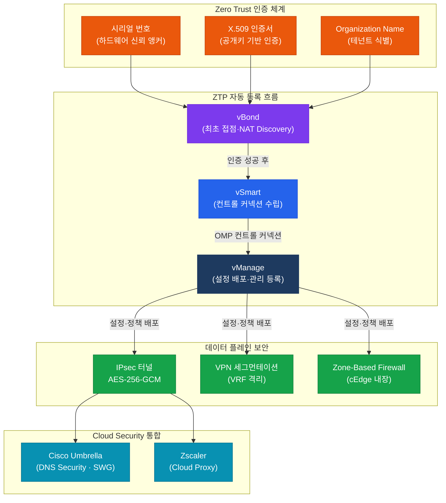
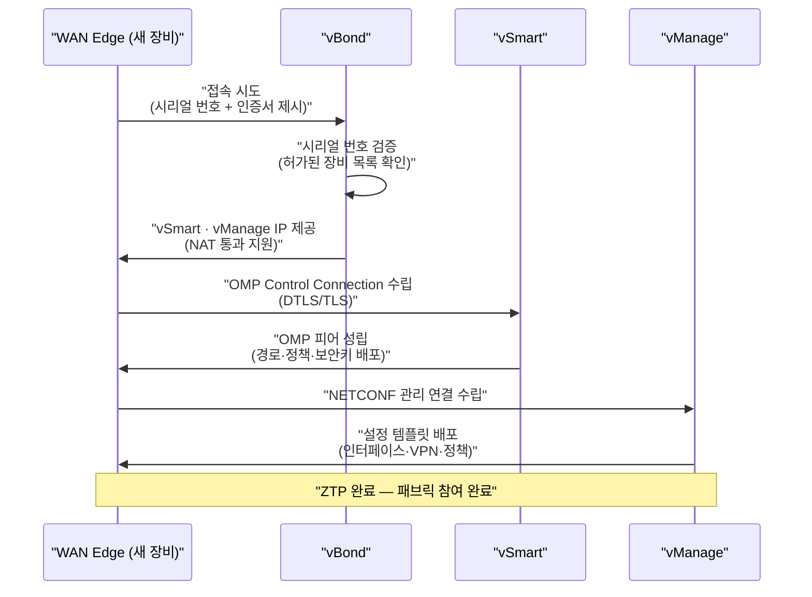
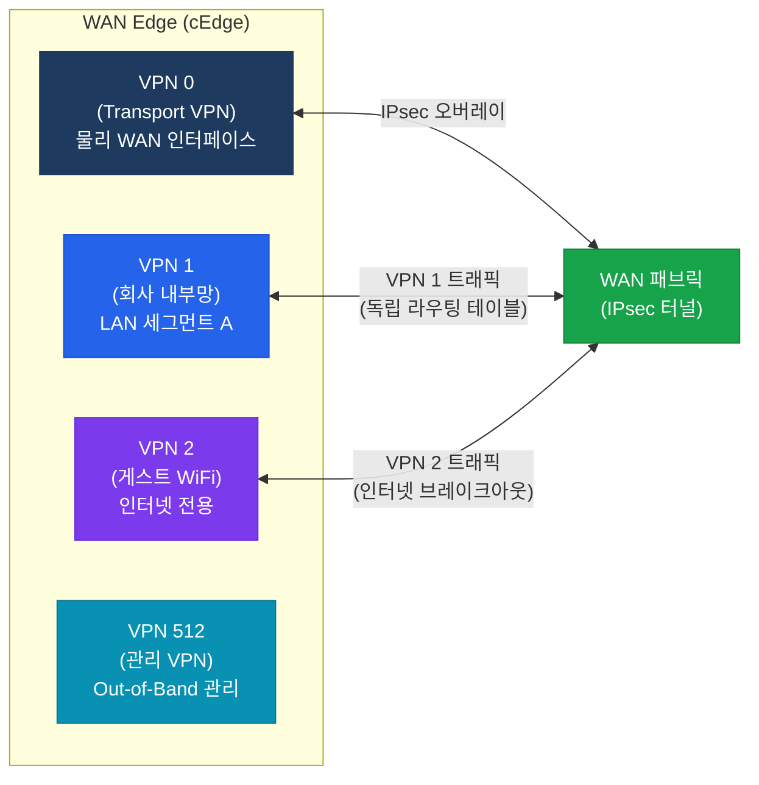

# SD-WAN 보안
**SD-WAN Security & Cloud OnRamp**

## 정의

Cisco SD-WAN 보안은 **Zero Trust 기반 장비 인증**, 전 구간 IPsec 암호화, VPN/VRF 세그먼테이션, 클라우드 보안 서비스 통합을 결합하여 WAN 패브릭 전체를 보호하는 다계층 보안 아키텍처.

## 특징

- **(Zero Trust 인증)** 모든 WAN Edge는 시리얼 번호와 X.509 인증서 기반으로 인증되며 미등록 장비는 패브릭 참여 불가
- **(전구간 IPsec 암호화)** WAN Edge 간 모든 데이터 터널을 AES-256-GCM으로 암호화하여 도청·변조를 원천 차단
- **(VPN 세그먼테이션)** SD-WAN 내 VPN(VRF 역할)으로 트래픽을 완전히 분리하여 부서·서비스별 격리된 경로 제공

## Zero Trust 기반 보안 아키텍처



---

## 인증 체계 (WAN Edge 인증 & ZTP)

### WAN Edge 등록 흐름

**ZTP(Zero Touch Provisioning)** 은 새 WAN Edge가 전원을 켰을 때 수동 설정 없이 자동으로 SD-WAN 패브릭에 합류하는 프로세스다.



### 장비 인증 방식

| 인증 요소 | 설명 |
|-----------|------|
| **시리얼 번호** | Cisco PnP/Viptela 포털에 사전 등록된 하드웨어 ID |
| **X.509 인증서** | 장비 제조 시 탑재되거나 vManage가 서명하여 발급 |
| **Organization Name** | 모든 컨트롤러·WAN Edge에 동일하게 설정 필수 |
| **OTP (One-Time Password)** | 소프트웨어 WAN Edge(CSR/vEdge Cloud) 등록 시 사용 |

---

## Cloud Security 통합

SD-WAN은 인터넷 트래픽을 클라우드 보안 서비스로 직접 전달하는 **Direct Internet Access (DIA)** 구조를 지원한다.

| 솔루션 | 역할 | 통합 방식 |
|--------|------|----------|
| **Cisco Umbrella** | DNS Security, SWG, CASB | IPsec 터널 또는 DNS 리디렉션 |
| **Zscaler** | Cloud Proxy, SSL 검사 | GRE/IPsec 터널 |
| **Cisco Secure Firewall** | 고급 위협 차단 | 서비스 체이닝 (Service Route) |

---

## Segmentation (VPN/VRF)

SD-WAN에서 **VPN**은 일반 VPN 터널이 아니라 **VRF(가상 라우팅 테이블)** 에 해당하는 개념이다.



| VPN 번호 | 역할 | 비고 |
|----------|------|------|
| **VPN 0** | Transport VPN — 물리 WAN 인터페이스, IPsec 터널 수립 | 필수 |
| **VPN 512** | Management VPN — OOB 관리, SSH 접근 | 필수 |
| **VPN 1~511** | Service VPN — 실제 서비스 트래픽 (회사 데이터, 게스트 등) | 사용자 정의 |

---

## 설정 및 검증

### IPsec 암호화 설정 (cEdge)

```bash
! 터널 인터페이스 IPsec 설정
interface GigabitEthernet0/0/0
 tunnel-interface
  encapsulation ipsec
  color biz-internet
  no allow-service bgp         ! BGP 허용 안 함
  allow-service dhcp
  allow-service dns
  allow-service icmp

! IPsec 파라미터 확인
show sdwan ipsec inbound-connections
show sdwan ipsec outbound-connections

! 인증서 및 장비 인증 확인
show sdwan certificate installed
show sdwan certificate serial
show sdwan certificate validity

! ZTP 및 컨트롤 커넥션 상태 확인
show sdwan control connections
show sdwan control local-properties

! VPN 세그먼테이션 확인
show sdwan running-config | section vpn
show ip route vrf 1          ! VPN 1 라우팅 테이블
```

### Umbrella 통합 설정 (개념)

```bash
! Umbrella DNS Security 설정 (vManage 정책에서 적용)
policy
 umbrella
  dns-redirect                 ! DNS 쿼리를 Umbrella로 리디렉션
  api-key <umbrella-api-key>   ! Umbrella 조직 API 키

! Umbrella 터널 (IPsec) — WAN Edge에서 직접 Umbrella PoP 연결
interface Tunnel100
 ip unnumbered GigabitEthernet0/0/0
 tunnel source GigabitEthernet0/0/0
 tunnel mode ipsec ipv4
 tunnel destination <umbrella-pop-ip>
```

---

## CCNP/CCIE 시험 포인트

- **vBond**는 반드시 퍼블릭 IP가 필요하다 — WAN Edge가 NAT 뒤에 있어도 vBond는 직접 도달 가능해야 함
- **DTLS vs TLS**: Control Connection 기본은 DTLS(UDP 12346), 방화벽 제약 시 TLS(TCP 443)로 전환
- 인증서 기반 인증: Organization Name이 컨트롤러와 WAN Edge **모두에서 일치**해야 하며 불일치 시 연결 거부
- **VPN 0**과 **VPN 512**는 SD-WAN 동작에 예약된 번호 — 서비스 VPN으로 사용 불가
- ZTP 동작 순서: **vBond → vSmart → vManage** 순서로 연결이 수립된다
- IPsec 기본 암호화 알고리즘: **AES-256-GCM** (인증 포함 AEAD 방식으로 별도 HMAC 불필요)
