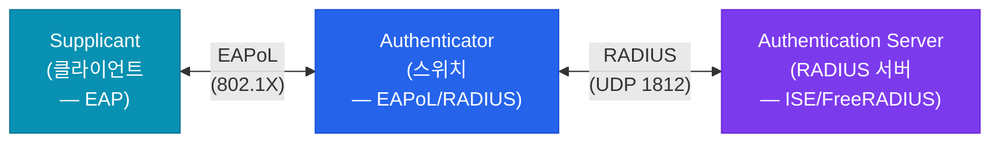
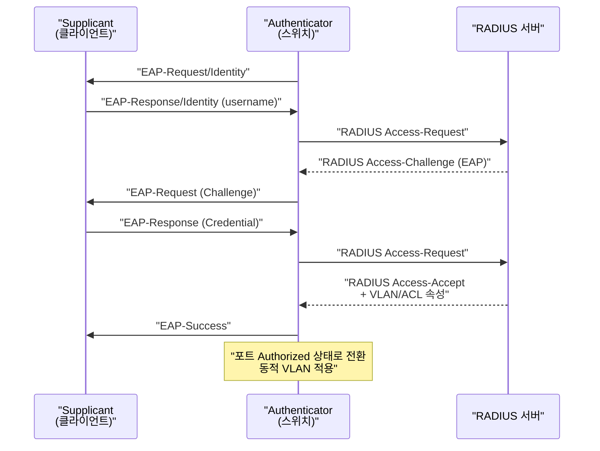
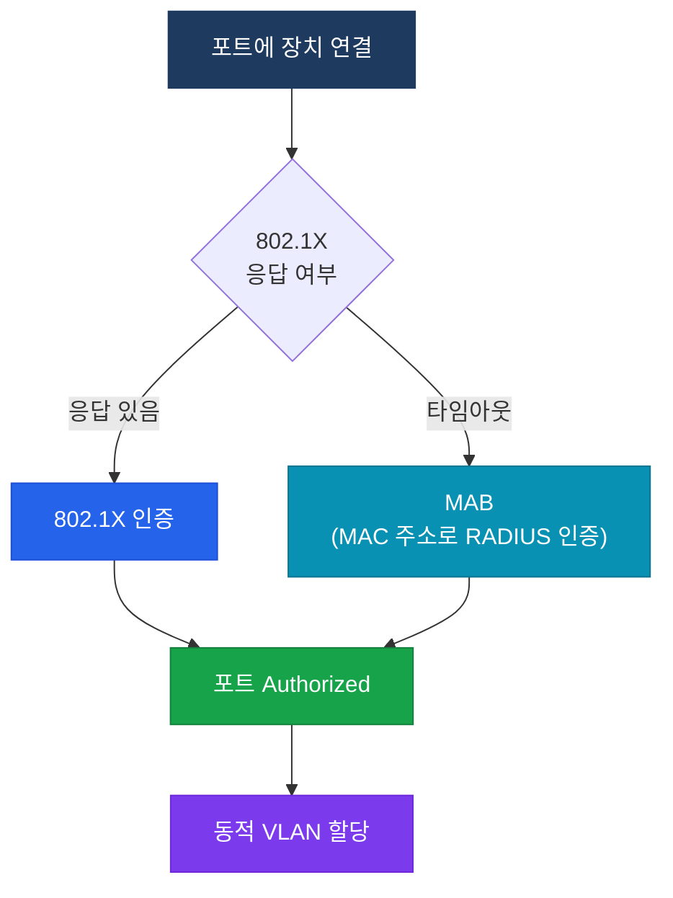

# 802.1X 포트 기반 인증
**IEEE 802.1X Port-Based Network Access Control**

## 정의

IEEE 802.1X는 스위치 포트 또는 무선 AP에 물리적으로 연결된 장치가 **EAP(Extensible Authentication Protocol)** 를 통해 인증을 완료하기 전까지 네트워크 접근을 차단하는 포트 기반 NAC 표준.

## 특징

- **(포트 단위 격리)** 인증 전 포트를 Unauthorized 상태로 유지하여 인증되지 않은 장치의 네트워크 진입을 원천 차단
- **(EAP 캡슐화)** 스위치가 EAP 메시지를 RADIUS 형식으로 변환(EAPoL → RADIUS)하여 인증 서버와 통신
- **(동적 VLAN 할당)** 인증 결과에 따라 사용자별로 서로 다른 VLAN·ACL·QoS 정책을 자동 적용

## 왜 필요한가?

포트에 케이블을 꽂기만 하면 네트워크에 접근할 수 있는 환경에서는 비인가 장치, 악성 코드 감염 노트북, USB 허브를 이용한 침입이 가능하다. 802.1X는 케이블 연결 자체만으로는 통신이 불가능하게 만든다.

## 3자 구조



| 역할 | 설명 |
|------|------|
| **Supplicant** | 인증을 요청하는 클라이언트 (Windows 802.1X, Cisco AnyConnect) |
| **Authenticator** | 스위치/AP — EAPoL을 받아 RADIUS로 중계, 포트 개폐 결정 |
| **Authentication Server** | RADIUS 서버 (Cisco ISE, FreeRADIUS) — 실제 자격증명 검증 |

---

## EAP 인증 흐름



---

## EAP 방식 비교

| EAP 방식 | 서버 인증서 | 클라이언트 인증서 | 보안 수준 | 주요 용도 |
|----------|------------|------------------|-----------|-----------|
| **EAP-TLS** | 필요 | 필요 | 최고 | PKI 환경, 스마트카드 |
| **PEAP-MSCHAPv2** | 필요 | 불필요 | 높음 | AD 자격증명, 기업 무선 |
| **EAP-FAST** | 선택 | 불필요 | 높음 | Cisco ISE 환경 |
| **LEAP** | 불필요 | 불필요 | 낮음 | 레거시 (사용 지양) |

---

## MAB (MAC Authentication Bypass)

802.1X 클라이언트를 설치할 수 없는 장치(IP폰, 프린터, IoT)는 MAC 주소를 자격증명으로 사용한다.



---

## 설정 및 검증

```bash
! ── 전역 설정 ────────────────────────────────────────────────
SW(config)# aaa new-model
SW(config)# dot1x system-auth-control
! 스위치 전체 802.1X 활성화 (필수)

SW(config)# radius server CORP-ISE
SW(config-radius-server)#  address ipv4 192.168.1.200 auth-port 1812 acct-port 1813
SW(config-radius-server)#  key Str0ngK3y!

SW(config)# aaa authentication dot1x default group radius
SW(config)# aaa authorization network default group radius
SW(config)# aaa accounting dot1x default start-stop group radius

! ── 인터페이스 설정 ──────────────────────────────────────────
SW(config)# interface GigabitEthernet0/1
SW(config-if)#  switchport mode access
SW(config-if)#  authentication port-control auto
! auto: 인증 성공 시 Authorized, 실패 시 Unauthorized
SW(config-if)#  dot1x pae authenticator
! PAE(Port Access Entity): Authenticator 역할 지정
SW(config-if)#  mab
! MAB 활성화: 802.1X 타임아웃 후 MAC 인증으로 폴백
SW(config-if)#  authentication order dot1x mab
! 인증 순서: 802.1X 먼저, 실패 시 MAB

! ── Guest VLAN (미인증 장치용) ───────────────────────────────
SW(config-if)#  authentication event fail action authorize vlan 999
SW(config-if)#  authentication event no-response action authorize vlan 999

! ── 검증 ────────────────────────────────────────────────────
SW# show authentication sessions
SW# show authentication sessions interface GigabitEthernet0/1
SW# show dot1x all
SW# show dot1x interface GigabitEthernet0/1 detail
```

---

## CCNP/CCIE 시험 포인트

- `dot1x system-auth-control` 없이 인터페이스 설정만 해도 동작하지 않는다 — 전역 활성화 필수
- `authentication port-control` 옵션: `auto`(인증 필요), `force-authorized`(항상 허용), `force-unauthorized`(항상 차단)
- EAP-TLS는 클라이언트와 서버 **양방향 인증서**가 필요 — 가장 안전하지만 PKI 인프라 필수
- PEAP는 서버 인증서만 필요 — 클라이언트는 ID·패스워드 사용 (가장 많이 쓰이는 방식)
- MAB는 MAC 주소를 username/password 양쪽에 그대로 사용 (RADIUS 서버에서 MAC 주소 DB 관리)
- Guest VLAN은 미응답 장치(no-response)에 적용, Auth-Fail VLAN은 인증 실패 장치에 적용 — 서로 다른 설정
- `show authentication sessions` 출력의 Status 필드: `Auth`(인증 성공), `Unauth`(미인증), `Authz Failed`(인가 실패)
