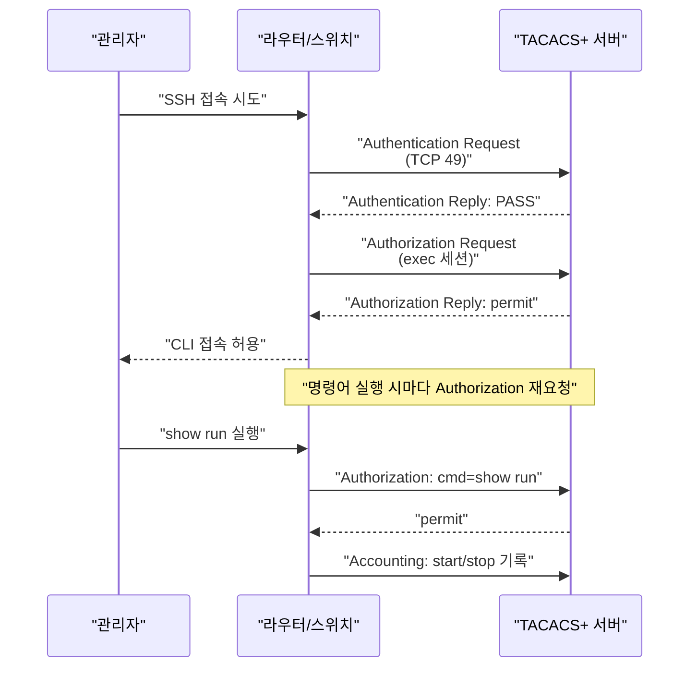

# AAA (Authentication, Authorization, Accounting)

## 정의

AAA는 네트워크 장비에 접근하는 사용자를 **인증(Authentication)** 하고, 허용된 작업 범위를 **인가(Authorization)** 하며, 모든 활동을 **과금·기록(Accounting)** 하는 보안 프레임워크.

## 특징

- **(중앙 집중 관리)** TACACS+ 또는 RADIUS 서버를 통해 수백 대 장비의 접근 정책을 단일 지점에서 관리
- **(로컬 폴백 지원)** 외부 서버가 다운되어도 로컬 사용자 계정으로 자동 전환하여 관리 연속성 보장
- **(세밀한 인가 제어)** TACACS+의 명령어별 인가로 운영자 등급에 따라 실행 가능한 IOS 명령어를 제한

## 왜 필요한가?

장비마다 로컬 계정을 관리하면 운영자가 퇴사할 때 수백 대 장비의 패스워드를 모두 변경해야 한다. AAA는 중앙 서버 한 곳에서 계정을 비활성화하는 즉시 모든 장비 접근이 차단된다.

## AAA 3요소


---

## TACACS+ vs RADIUS 비교

| 구분 | TACACS+ | RADIUS |
|------|---------|--------|
| 전송 프로토콜 | **TCP 49** | **UDP 1812**(인증), **1813**(과금) |
| 패킷 암호화 | 전체 패킷 암호화 | 패스워드 필드만 암호화 |
| AAA 분리 | Authentication·Authorization·Accounting 완전 분리 | 인증과 인가를 함께 처리 |
| 명령어 인가 | 명령어별 세밀한 인가 지원 | 미지원 (NAS 수준) |
| 표준 여부 | Cisco 독자 프로토콜 | RFC 2865/2866 표준 |
| 주요 용도 | 네트워크 장비 관리 접근 | 802.1X, VPN, 무선 인증 |

---

## 동작 흐름



---

## 설정 및 검증

```bash
! ── TACACS+ 서버 정의 ──────────────────────────────────────
R(config)# tacacs server CORP-TACACS
R(config-server-tacacs)#  address ipv4 192.168.1.100
R(config-server-tacacs)#  key Str0ngK3y!
R(config-server-tacacs)#  timeout 5

! ── RADIUS 서버 정의 ────────────────────────────────────────
R(config)# radius server CORP-RADIUS
R(config-server-radius)#  address ipv4 192.168.1.101 auth-port 1812 acct-port 1813
R(config-server-radius)#  key Str0ngK3y!

! ── AAA 모델 활성화 (반드시 가장 먼저) ──────────────────────
R(config)# aaa new-model

! ── 인증: 콘솔·VTY 로그인 ────────────────────────────────────
R(config)# aaa authentication login default group tacacs+ local
! default: 모든 라인에 적용 / local: 서버 다운 시 로컬 계정 폴백

! ── 인가: exec 세션 (privilege level 부여) ───────────────────
R(config)# aaa authorization exec default group tacacs+ local

! ── 인가: 명령어별 (레벨 15 전체) ────────────────────────────
R(config)# aaa authorization commands 15 default group tacacs+ local

! ── 과금: exec 및 명령어 기록 ────────────────────────────────
R(config)# aaa accounting exec default start-stop group tacacs+
R(config)# aaa accounting commands 15 default start-stop group tacacs+

! ── VTY에 로그인 적용 ────────────────────────────────────────
R(config)# line vty 0 15
R(config-line)#  login authentication default
R(config-line)#  transport input ssh

! ── 검증 ────────────────────────────────────────────────────
R# show aaa servers
R# show tacacs
R# show radius statistics
R# debug aaa authentication
R# test aaa group tacacs+ admin Passw0rd! new-code
! test: 서버 연결 및 자격증명 검증 (운영 전 필수 확인)
```

---

## CCNP/CCIE 시험 포인트

- `aaa new-model` 명령어를 입력하는 순간 기존 `login local` 설정은 무시된다 — 서버 설정 없이 입력하면 잠금(lockout) 위험
- 로컬 폴백 순서: `group tacacs+ local` — 서버 **무응답** 시 local로 전환, 서버 **거부** 시 local로 넘어가지 않음
- TACACS+는 **TCP 49**, RADIUS는 **UDP 1812/1813** — 포트 번호는 자주 출제
- TACACS+는 패킷 전체 암호화, RADIUS는 패스워드 필드만 암호화 — 보안 비교 문제
- `aaa authorization exec default group tacacs+ if-authenticated` — if-authenticated는 서버 다운 시에도 이미 인증된 세션은 허용
- 명령어 인가를 활성화하면 console에도 적용 — console에는 별도 method list로 예외 처리 권장
- `test aaa group [NAME]` 명령어로 서버 연결을 사전 검증 — 실무·시험 모두 필수 확인 단계
