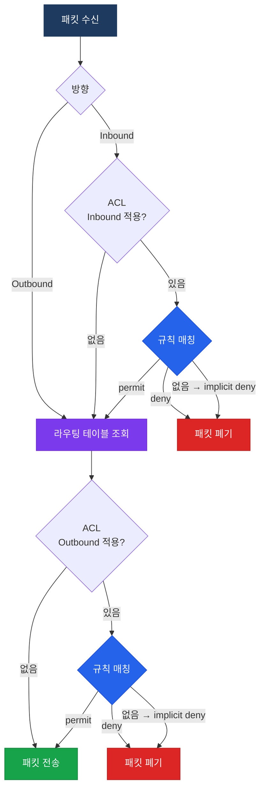
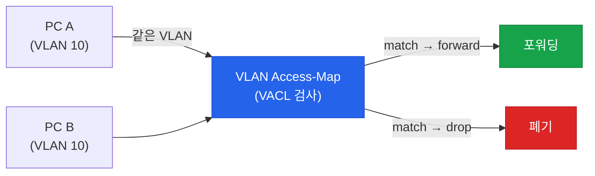

# ACL (Access Control List)

## 정의

ACL은 라우터·스위치 인터페이스를 통과하는 패킷을 **소스 IP·목적지 IP·포트·프로토콜** 기준으로 허용(permit) 또는 차단(deny)하는 순서화된 규칙 목록.

## 특징

- **(순차 매칭)** 위에서 아래로 첫 번째로 일치하는 규칙만 적용하고 즉시 종료하여 이후 규칙은 평가하지 않음
- **(Implicit Deny)** 모든 ACL 끝에 묵시적 deny any 규칙이 존재하여 명시적으로 허용되지 않은 트래픽은 전부 차단
- **(방향 적용)** 인터페이스에 inbound 또는 outbound 중 하나의 방향으로만 적용되며, 방향에 따라 검사 대상 트래픽이 달라짐

## Standard vs Extended vs Named ACL

| 구분 | 번호 범위 | 필터 기준 | 적용 위치 권장 |
|------|-----------|-----------|----------------|
| **Standard** | 1–99, 1300–1999 | 소스 IP 주소만 | 목적지에 최대한 가깝게 |
| **Extended** | 100–199, 2000–2699 | 소스·목적지 IP + 포트 + 프로토콜 | 소스에 최대한 가깝게 |
| **Named** | 이름 지정 | Standard 또는 Extended와 동일 | 규칙 삽입·삭제 가능 |

> Named ACL은 번호형 ACL과 달리 특정 sequence number의 규칙만 삭제하거나 중간에 삽입할 수 있다.

---

## ACL 처리 흐름



---

## VACL (VLAN ACL)

VACL은 라우터를 거치지 않는 **동일 VLAN 내 트래픽**에도 ACL을 적용한다. 인터페이스 ACL과 달리 스위치 내부의 VLAN 트래픽 전체를 제어한다.



---

## 설정 및 검증

```bash
! ── Standard ACL (번호형) ────────────────────────────────────
R(config)# access-list 10 permit 192.168.1.0 0.0.0.255
R(config)# access-list 10 deny any
! Wildcard mask: 0.0.0.255 = 192.168.1.0/24 전체
! 0.0.0.0 = 특정 호스트 1개 (host 키워드와 동일)
! 255.255.255.255 = any (모든 주소)

! ── Extended ACL (번호형) ────────────────────────────────────
R(config)# access-list 110 permit tcp 10.0.0.0 0.0.0.255 host 172.16.1.100 eq 80
R(config)# access-list 110 permit tcp 10.0.0.0 0.0.0.255 host 172.16.1.100 eq 443
R(config)# access-list 110 deny ip any any log
! log: 일치 패킷을 syslog로 기록

! ── Named ACL (권장 방식) ────────────────────────────────────
R(config)# ip access-list extended WEB-FILTER
R(config-ext-nacl)#  10 permit tcp 10.1.0.0 0.0.255.255 any eq 80
R(config-ext-nacl)#  20 permit tcp 10.1.0.0 0.0.255.255 any eq 443
R(config-ext-nacl)#  30 deny ip any any log
! sequence number로 중간 삽입 및 개별 삭제 가능

! ── 인터페이스 적용 ──────────────────────────────────────────
R(config)# interface GigabitEthernet0/0
R(config-if)#  ip access-group WEB-FILTER in
! in: 이 인터페이스로 들어오는 트래픽에 적용
! out: 이 인터페이스로 나가는 트래픽에 적용

! ── VTY 적용 (관리 접근 제한) ───────────────────────────────
R(config)# ip access-list standard MGMT-ACCESS
R(config-std-nacl)#  permit 192.168.100.0 0.0.0.255
R(config)# line vty 0 15
R(config-line)#  access-class MGMT-ACCESS in
! access-class: VTY 라인에 적용 (ip access-group이 아님)

! ── VACL 설정 ────────────────────────────────────────────────
SW(config)# ip access-list extended VLAN10-FILTER
SW(config-ext-nacl)#  deny ip 10.10.10.0 0.0.0.255 10.10.10.0 0.0.0.255
SW(config-ext-nacl)#  permit ip any any

SW(config)# vlan access-map VMAP10 10
SW(config-access-map)#  match ip address VLAN10-FILTER
SW(config-access-map)#  action drop
SW(config)# vlan access-map VMAP10 20
SW(config-access-map)#  action forward

SW(config)# vlan filter VMAP10 vlan-list 10
! VLAN 10의 모든 트래픽에 VMAP10 적용

! ── 검증 ────────────────────────────────────────────────────
R# show ip access-lists
R# show ip access-lists WEB-FILTER
R# show ip interface GigabitEthernet0/0
! "Inbound access list is" / "Outbound access list is" 확인
SW# show vlan access-map
SW# show vlan filter
```

---

## CCNP/CCIE 시험 포인트

- 모든 ACL 끝에는 **implicit deny any** 가 있다 — 명시적 permit이 없으면 전부 차단
- Standard ACL은 소스 IP만 보므로 **목적지 가까이** 적용해야 원하지 않는 트래픽 차단 최소화
- Extended ACL은 소스와 목적지 모두 확인하므로 **소스 가까이** 적용하여 불필요한 트래픽을 조기 차단
- VTY 라인에는 `access-class`, 인터페이스에는 `ip access-group` — 혼동 주의
- Wildcard mask는 서브넷 마스크의 반전값: `/24`(255.255.255.0) → wildcard `0.0.0.255`
- Named ACL에서 규칙 삭제 시 `no 10`처럼 sequence number로 삭제 — 번호형은 전체 삭제 후 재입력
- VACL은 라우팅 없이 **같은 VLAN 내 스위칭 트래픽**에도 적용 — 인터페이스 ACL은 라우티드 트래픽만 적용
