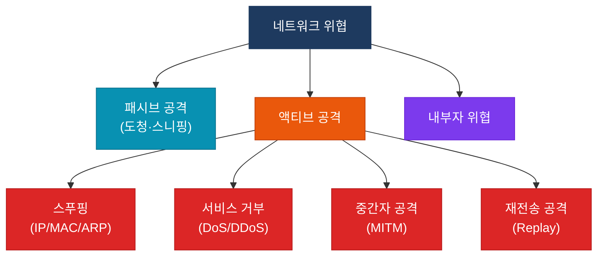

# 네트워크 보안 개요
**Network Security Overview**

## 정의

네트워크 보안은 인가되지 않은 **접근·변조·도청·파괴**로부터 네트워크 인프라와 데이터를 보호하기 위한 기술·정책·절차의 집합.

## 특징

- **(다계층 보호)** OSI 각 계층에서 독립적인 보안 통제를 적용하여 단일 실패 지점을 제거
- **(CIA 트라이어드)** 기밀성(Confidentiality)·무결성(Integrity)·가용성(Availability) 세 가지 원칙을 동시에 보장
- **(심층 방어)** 여러 보안 레이어를 겹쳐 배치하여 하나의 통제가 우회되더라도 나머지가 차단

## 왜 필요한가?

네트워크는 연결될수록 공격 표면이 넓어진다. 단일 방화벽 한 대만으로는 내부 횡적 이동(Lateral Movement), 사회공학, 제로데이 취약점을 막을 수 없다. 보안을 여러 계층으로 분산 배치해야 한다.

## 보안 위협 유형

## 심층 방어 (Defense-in-Depth)

각 레이어는 독립적으로 동작하며, 앞 단계가 우회되더라도 다음 단계가 차단한다.

---

## 섹션 문서

| 문서 | 주요 내용 |
|------|-----------|
| [AAA](./aaa) | TACACS+/RADIUS, 인증·인가·과금 |
| [802.1X](./8021x) | 포트 기반 NAC, EAP 인증 흐름 |
| [ACL](./acl) | Standard/Extended/Named, VACL |
| [Zone-Based Firewall](./zone-based-fw) | Zone/Zone-pair, inspect 정책 |
| [위협 방어](./threat-defense) | CoPP, DHCP Snooping, DAI, IP Source Guard |

---

## CCNP/CCIE 시험 비중

| 시험 | 보안 도메인 비중 |
|------|----------------|
| CCNP ENCOR (350-401) | 약 15% |
| CCIE Enterprise Lab | 인프라 보안 전 범위 |

- AAA와 802.1X는 CCNP ENCOR 단골 출제 영역이다
- ACL 방향(inbound/outbound)과 implicit deny는 매 시험마다 등장한다
- Zone-Based Firewall은 CBAC와의 차이점 위주로 출제된다
