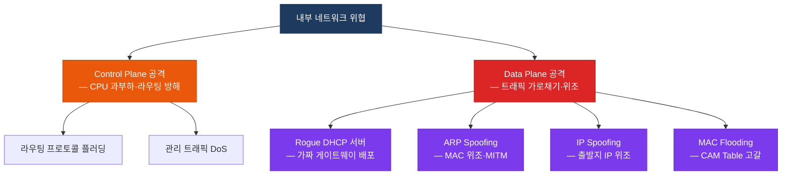
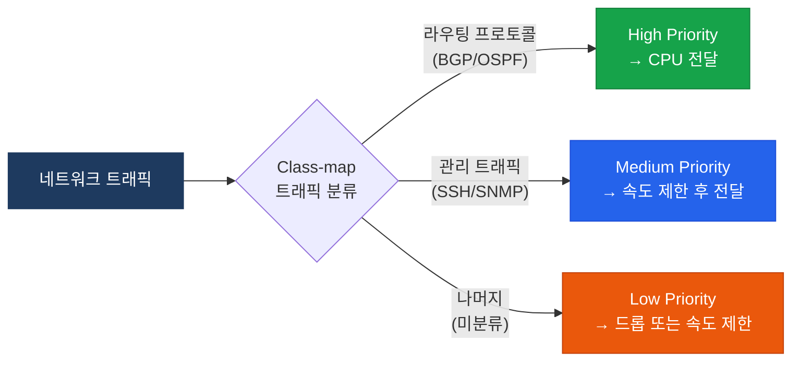
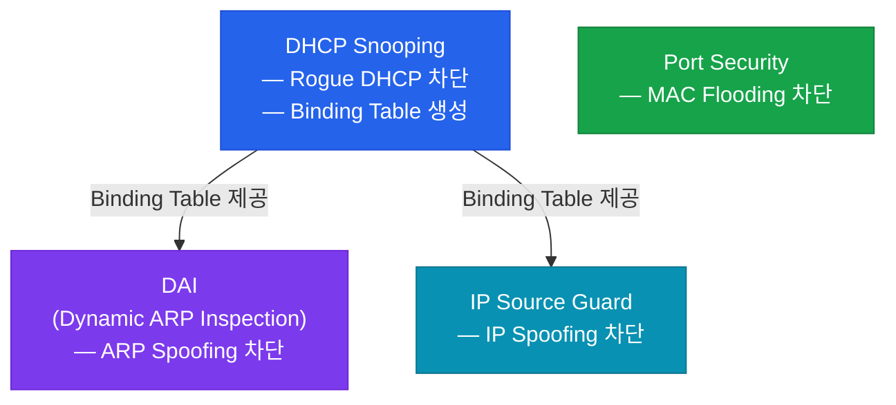

# 위협 방어 (Threat Defense)

## 정의

위협 방어는 네트워크 인프라를 대상으로 하는 **스푸핑·플러딩·DoS** 공격을 스위치와 라우터의 Control Plane 및 Data Plane에서 직접 탐지하고 차단하는 내장 보안 메커니즘의 집합.

## 특징

- **(Control Plane 보호)** CoPP로 CPU로 향하는 트래픽을 속도 제한하여 라우팅 프로토콜·관리 트래픽 처리를 보장
- **(L2 스푸핑 차단)** DHCP Snooping·DAI·IP Source Guard가 연계 동작하여 MAC·IP·ARP 스푸핑을 계층적으로 방어
- **(Binding Table 기반 검증)** DHCP Snooping이 생성한 IP-MAC-포트 바인딩 테이블을 DAI와 IP Source Guard가 공유하여 재사용

## 왜 필요한가?

내부망에서 공격자가 가짜 DHCP 서버를 띄우거나 ARP 응답을 위조하면 통신이 가로채어진다. 이 공격들은 외부 방화벽으로는 차단이 불가능하다 — 스위치 자체가 방어해야 한다.

---

## 위협 유형 분류



---

## Control Plane Policing (CoPP)

CoPP는 라우터 CPU(Control Plane)로 향하는 트래픽을 분류하고 속도를 제한하여 라우팅 프로토콜과 관리 접근이 방해받지 않도록 한다.



---

## Data Plane 보안 연계 구조



| 기능 | 차단 공격 | 의존 관계 |
|------|-----------|-----------|
| **DHCP Snooping** | Rogue DHCP 서버 | 독립 동작 |
| **DAI** | ARP Spoofing/Poisoning | DHCP Snooping 필요 |
| **IP Source Guard** | IP Spoofing | DHCP Snooping 필요 |
| **Port Security** | MAC Flooding | 독립 동작 |

---

## 설정 및 검증

```bash
! ── DHCP Snooping ────────────────────────────────────────────
SW(config)# ip dhcp snooping
SW(config)# ip dhcp snooping vlan 10,20
! VLAN 10, 20에 DHCP Snooping 활성화

SW(config)# interface GigabitEthernet0/1
SW(config-if)#  ip dhcp snooping trust
! 업링크(실제 DHCP 서버 방향) 포트만 trusted
! 나머지 포트는 기본 untrusted — DHCP Offer/Ack 차단

SW(config)# ip dhcp snooping limit rate 15
! untrusted 포트에서 초당 DHCP 패킷 15개 제한

! ── DAI (Dynamic ARP Inspection) ────────────────────────────
SW(config)# ip arp inspection vlan 10,20
! DHCP Snooping이 먼저 활성화되어 있어야 함

SW(config)# interface GigabitEthernet0/1
SW(config-if)#  ip arp inspection trust
! DHCP Snooping trusted 포트와 동일하게 설정

SW(config)# ip arp inspection limit rate 100
! ARP 패킷 속도 제한 (초당 100개)

! ── IP Source Guard ──────────────────────────────────────────
SW(config)# interface GigabitEthernet0/10
SW(config-if)#  ip verify source
! DHCP Snooping Binding Table의 IP-포트 일치 여부 검증
SW(config-if)#  ip verify source port-security
! IP + MAC 모두 검증

! ── Port Security ────────────────────────────────────────────
SW(config)# interface GigabitEthernet0/10
SW(config-if)#  switchport mode access
SW(config-if)#  switchport port-security
SW(config-if)#  switchport port-security maximum 2
! 포트당 최대 2개 MAC 주소 허용
SW(config-if)#  switchport port-security mac-address sticky
! 동적 학습 MAC을 자동으로 running-config에 저장
SW(config-if)#  switchport port-security violation restrict
! restrict: 위반 패킷 폐기 + 카운터 증가 (포트 shutdown 안 함)
! shutdown: 포트를 err-disabled 상태로 전환 (기본값)
! protect: 위반 패킷만 폐기 (카운터 없음)

! ── CoPP 설정 ────────────────────────────────────────────────
R(config)# ip access-list extended ACL-ROUTING
R(config-ext-nacl)#  permit ospf any any
R(config-ext-nacl)#  permit tcp any any eq bgp

R(config)# class-map match-any CM-ROUTING
R(config-cmap)#  match access-group name ACL-ROUTING

R(config)# policy-map PM-COPP
R(config-pmap)#  class CM-ROUTING
R(config-pmap-c)#   police rate 64000 bps conform-action transmit exceed-action drop
R(config-pmap)#  class class-default
R(config-pmap-c)#   police rate 8000 bps conform-action transmit exceed-action drop

R(config)# control-plane
R(config-cp)#  service-policy input PM-COPP

! ── 검증 ────────────────────────────────────────────────────
SW# show ip dhcp snooping
SW# show ip dhcp snooping binding
! Binding Table: IP / MAC / 포트 / VLAN / 만료 시간
SW# show ip arp inspection vlan 10
SW# show ip arp inspection statistics vlan 10
SW# ip verify source
SW# show port-security interface GigabitEthernet0/10
R# show policy-map control-plane
```

---

## CCNP/CCIE 시험 포인트

- DHCP Snooping에서 **trusted 포트**는 실제 DHCP 서버 방향(업링크)만 지정 — 나머지는 기본 untrusted
- DAI는 DHCP Snooping Binding Table을 사용하므로 **DHCP Snooping이 먼저 활성화**되어야 함
- DHCP Snooping을 사용하지 않는 환경에서 DAI를 쓰려면 `arp access-list`로 정적 바인딩 수동 정의
- IP Source Guard는 DHCP Snooping Binding Table에 없는 IP 패킷을 차단 — 정적 IP 장치는 별도 static binding 필요
- Port Security violation 기본값은 **shutdown** (err-disabled) — `errdisable recovery` 설정 권장
- CoPP는 NBAR(Network-Based Application Recognition) 또는 ACL로 트래픽을 분류하며, **Control Plane에만** 적용
- `show ip dhcp snooping binding` 출력이 없으면 DAI와 IP Source Guard 모두 정상 동작하지 않음
