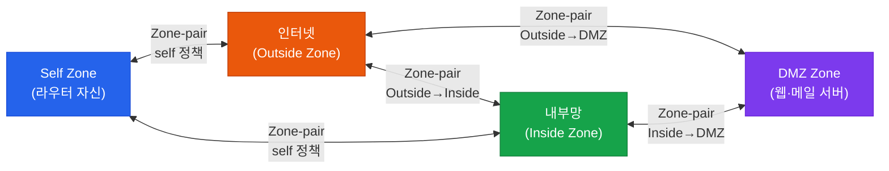
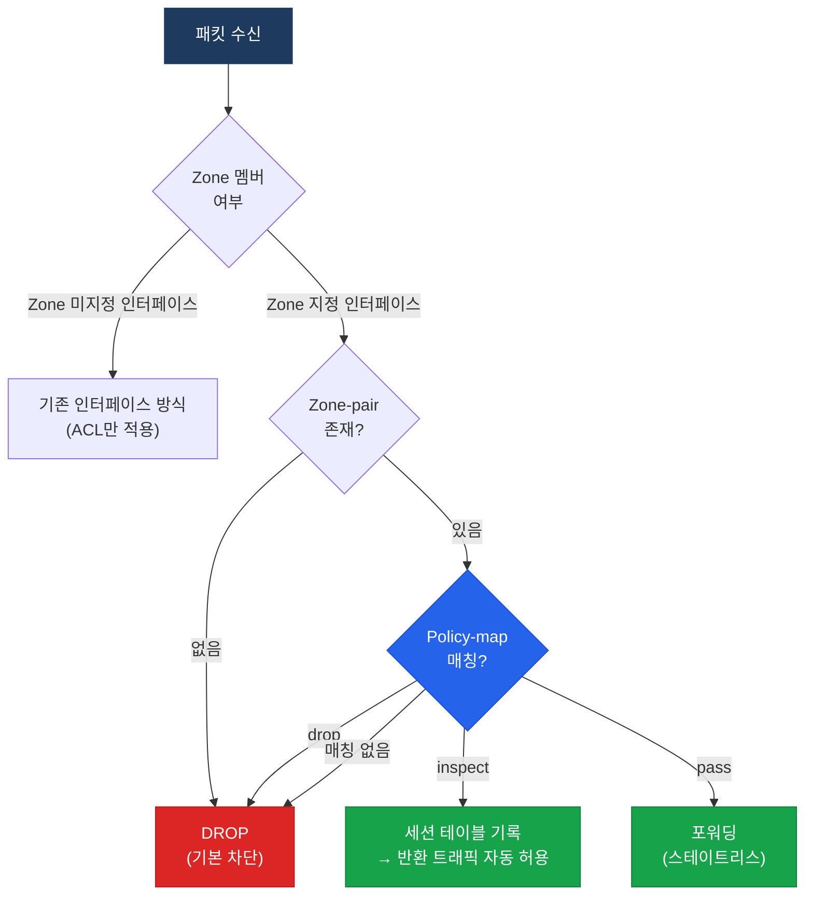

# Zone-Based Firewall (ZBF/ZBFW)

## 정의

Zone-Based Firewall(ZBF)은 인터페이스를 보안 **Zone**으로 그룹화하고, Zone 간 트래픽 허용 여부를 **Zone-pair**와 **정책(Policy-map)** 으로 제어하는 Cisco IOS 스테이트풀 방화벽.

## 특징

- **(인터페이스 Zone 그룹화)** 여러 인터페이스를 하나의 Zone으로 묶어 보안 경계를 인터페이스 단위가 아닌 논리 영역 단위로 정의
- **(스테이트풀 검사)** inspect 액션이 적용된 트래픽은 연결 상태 테이블에 기록되어 반환 트래픽을 자동 허용
- **(같은 Zone 자동 허용)** 동일 Zone에 속한 인터페이스 간 트래픽은 정책 없이 자동으로 허용되어 별도 설정 불필요

## 왜 필요한가? (CBAC 대비)

CBAC(Context-Based Access Control)는 인터페이스마다 ACL + inspect를 설정해야 했다. 인터페이스가 늘어날수록 설정이 폭발적으로 증가하고 일관성을 유지하기 어려웠다. ZBF는 정책을 Zone 단위로 집중 관리하여 복잡도를 줄이고 감사(Audit)를 용이하게 한다.

| 구분 | CBAC | ZBF |
|------|------|-----|
| 정책 단위 | 인터페이스 | Zone |
| 설정 복잡도 | 인터페이스 수 × 방향 | Zone-pair 수 |
| self zone | 별도 처리 없음 | self zone으로 명시적 제어 |
| 기본 동작 | 명시적 설정 없으면 허용 | Zone 간 기본 차단 |

---

## Zone 구조



---

## 정책 매트릭스

| Source Zone | Destination Zone | 기본 동작 | 권장 정책 |
|-------------|------------------|-----------|-----------|
| Inside | Outside | 차단 | inspect (HTTP/HTTPS/DNS) |
| Outside | Inside | 차단 | drop (기본 차단) |
| Outside | DMZ | 차단 | inspect (HTTP/HTTPS) |
| Inside | DMZ | 차단 | inspect |
| Inside | Self | 차단 | pass (SSH/SNMP 관리) |
| Outside | Self | 차단 | pass (제한적 허용) |
| Same Zone | Same Zone | **자동 허용** | 설정 불필요 |

---

## 동작 흐름



---

## 설정 및 검증

```bash
! ── Zone 생성 ────────────────────────────────────────────────
R(config)# zone security INSIDE
R(config)# zone security OUTSIDE
R(config)# zone security DMZ

! ── 인터페이스를 Zone에 할당 ─────────────────────────────────
R(config)# interface GigabitEthernet0/0
R(config-if)#  zone-member security INSIDE
R(config)# interface GigabitEthernet0/1
R(config-if)#  zone-member security OUTSIDE
R(config)# interface GigabitEthernet0/2
R(config-if)#  zone-member security DMZ

! ── Class-map: 허용할 트래픽 정의 ───────────────────────────
R(config)# class-map type inspect match-any CM-INSIDE-OUT
R(config-cmap)#  match protocol http
R(config-cmap)#  match protocol https
R(config-cmap)#  match protocol dns

R(config)# class-map type inspect match-any CM-OUT-DMZ
R(config-cmap)#  match protocol http
R(config-cmap)#  match protocol https

! ── Policy-map: 액션 지정 ────────────────────────────────────
R(config)# policy-map type inspect PM-INSIDE-OUT
R(config-pmap)#  class type inspect CM-INSIDE-OUT
R(config-pmap-c)#   inspect
! inspect: 세션 추적 + 반환 트래픽 자동 허용
R(config-pmap)#  class class-default
R(config-pmap-c)#   drop log
! 나머지 트래픽은 모두 차단 후 로깅

R(config)# policy-map type inspect PM-OUT-DMZ
R(config-pmap)#  class type inspect CM-OUT-DMZ
R(config-pmap-c)#   inspect
R(config-pmap)#  class class-default
R(config-pmap-c)#   drop

! ── Zone-pair에 Policy-map 적용 ──────────────────────────────
R(config)# zone-pair security ZP-IN-OUT source INSIDE destination OUTSIDE
R(config-sec-zone-pair)#  service-policy type inspect PM-INSIDE-OUT

R(config)# zone-pair security ZP-OUT-DMZ source OUTSIDE destination DMZ
R(config-sec-zone-pair)#  service-policy type inspect PM-OUT-DMZ

! ── Self Zone: 라우터 자신에 대한 관리 트래픽 허용 ───────────
R(config)# class-map type inspect match-any CM-MGMT
R(config-cmap)#  match protocol ssh
R(config-cmap)#  match protocol snmp

R(config)# policy-map type inspect PM-IN-SELF
R(config-pmap)#  class type inspect CM-MGMT
R(config-pmap-c)#   pass
R(config-pmap)#  class class-default
R(config-pmap-c)#   drop

R(config)# zone-pair security ZP-IN-SELF source INSIDE destination self
R(config-sec-zone-pair)#  service-policy type inspect PM-IN-SELF

! ── 검증 ────────────────────────────────────────────────────
R# show zone security
R# show zone-pair security
R# show policy-map type inspect zone-pair
R# show policy-map type inspect zone-pair sessions
! sessions: 현재 활성 연결 세션 확인
```

---

## CCNP/CCIE 시험 포인트

- 같은 Zone에 속한 인터페이스 간 트래픽은 **정책 없이 자동 허용** — Zone-pair 설정 불필요
- Zone이 지정된 인터페이스와 지정되지 않은 인터페이스 간 트래픽은 **기본 차단**
- **self zone**: 라우터 자신으로 향하거나 라우터에서 시작되는 트래픽을 제어 — SSH/SNMP 관리 트래픽도 명시적 허용 필요
- `inspect` vs `pass` 차이: inspect는 스테이트풀(반환 트래픽 자동 허용), pass는 스테이트리스(단방향 허용만)
- `drop` 액션은 세션 테이블에 기록하지 않고 즉시 폐기
- Class-map의 `match-any`(OR 조건)와 `match-all`(AND 조건) 혼동 주의
