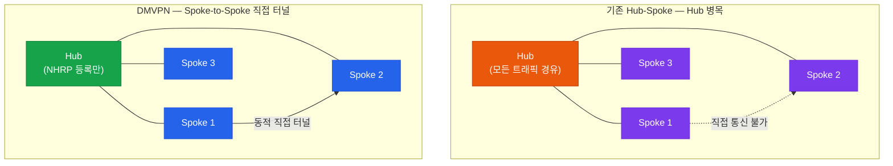
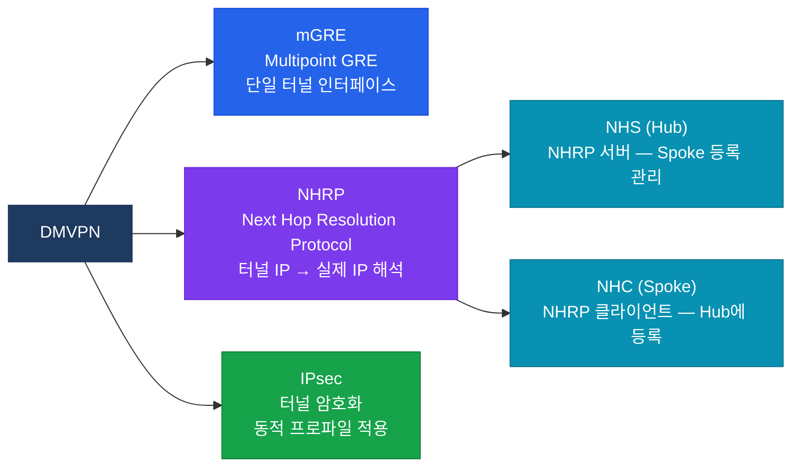
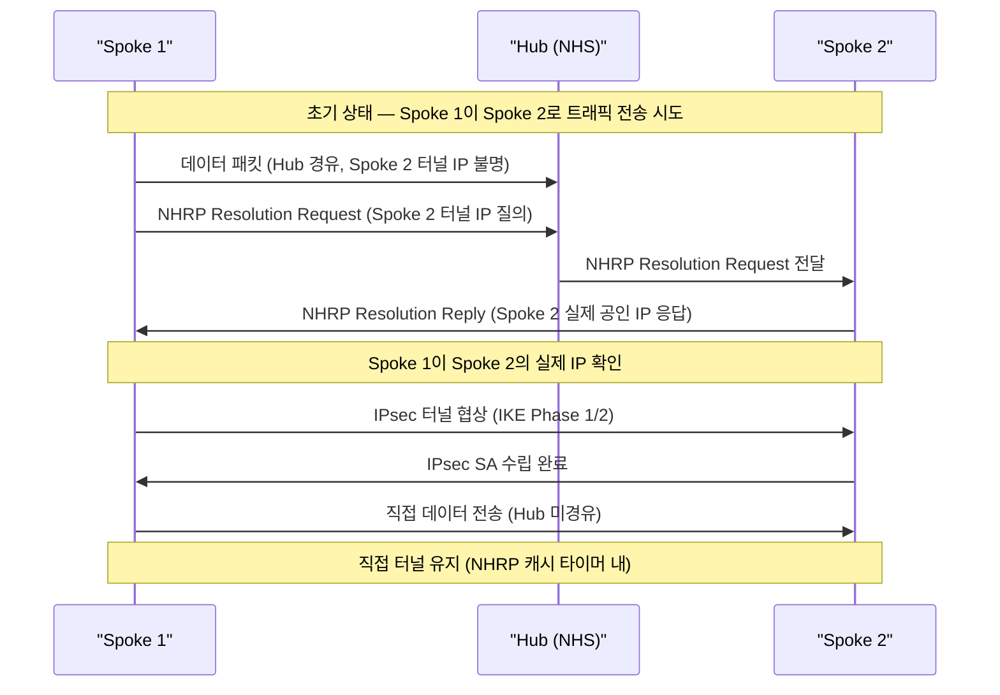

# DMVPN (Dynamic Multipoint VPN)

## 정의

**mGRE(Multipoint GRE)** 터널과 **NHRP(Next Hop Resolution Protocol)** 를 결합하여 Hub-Spoke 기반의 정적 터널 설정 없이 Spoke 간 동적 직접 터널을 자동 생성하는 Cisco 독자 VPN 기술 (RFC 2332 기반).

## 특징

- **(동적 Spoke-to-Spoke 터널)** 처음에는 Hub를 경유하다가 NHRP를 통해 상대 Spoke의 실제 IP를 파악한 뒤 직접 터널을 자동 생성하여 Hub 부하 감소
- **(mGRE 기반 단일 터널 인터페이스)** Hub 한 대가 하나의 mGRE 인터페이스로 수백 개 Spoke와 통신하여 기존 Point-to-Point GRE 대비 설정 복잡도 대폭 감소
- **(IPsec 통합으로 보안 제공)** mGRE 터널 위에 IPsec 프로파일을 적용하여 동적으로 생성된 터널에도 암호화 자동 적용

## 왜 필요한가? — Hub-Spoke의 한계

기존 Hub-Spoke IPsec VPN은 Spoke가 늘어날수록 Hub에서 **N개의 정적 터널**을 각각 설정해야 하고, Spoke 간 통신도 반드시 Hub를 경유해서 **Hub가 병목**이 된다. DMVPN은 동적 터널 생성으로 이 두 문제를 모두 해결한다.



---

## DMVPN 3단계 Phase 비교

| 구분 | Phase 1 | Phase 2 | Phase 3 |
|------|---------|---------|---------|
| Spoke-to-Spoke | 불가 (Hub 경유) | 가능 (직접 터널) | 가능 (최적화) |
| 라우팅 요건 | 없음 | next-hop 보존 필요 | NHRP Redirect + Shortcut |
| Hub 부하 | 높음 | 초기 패킷만 경유 | 초기 패킷만 경유 |
| 요약 경로 | 허용 | 허용 불가 | 허용 |
| 주요 용도 | 소규모 단순 Hub-Spoke | 중소규모 직접 통신 | 대규모 최적화 배포 |

---

## 구성 요소



---

## Spoke-to-Spoke 터널 생성 흐름



---

## 설정 및 검증

### Hub 설정

```bash
! === Hub 터널 인터페이스 (mGRE) ===
Hub(config)# interface Tunnel0
Hub(config-if)# ip address 172.16.0.1 255.255.255.0
Hub(config-if)# tunnel source GigabitEthernet0/0    ! 실제 공인 인터페이스
Hub(config-if)# tunnel mode gre multipoint           ! mGRE 모드 핵심 설정
Hub(config-if)# tunnel key 100                       ! 터널 식별 키 (선택)

! NHRP 설정
Hub(config-if)# ip nhrp network-id 1                 ! NHRP 도메인 ID
Hub(config-if)# ip nhrp map multicast dynamic        ! Spoke 멀티캐스트 동적 맵핑
Hub(config-if)# ip nhrp authentication NHRPKEY       ! NHRP 인증

! IPsec 프로파일 적용
Hub(config-if)# tunnel protection ipsec profile DMVPN-PROF shared

! NHRP 홀드 타이머
Hub(config-if)# ip nhrp holdtime 300

! === IPsec 프로파일 정의 ===
Hub(config)# crypto ipsec profile DMVPN-PROF
Hub(ipsec-profile)# set transform-set TS-DMVPN
Hub(ipsec-profile)# set pfs group14
```

### Spoke 설정

```bash
! === Spoke 터널 인터페이스 ===
Spoke1(config)# interface Tunnel0
Spoke1(config-if)# ip address 172.16.0.2 255.255.255.0
Spoke1(config-if)# tunnel source GigabitEthernet0/0
Spoke1(config-if)# tunnel mode gre multipoint
Spoke1(config-if)# tunnel key 100

! NHRP 설정
Spoke1(config-if)# ip nhrp network-id 1
Spoke1(config-if)# ip nhrp authentication NHRPKEY
Spoke1(config-if)# ip nhrp nhs 172.16.0.1            ! Hub 터널 IP (NHS 등록)
Spoke1(config-if)# ip nhrp map 172.16.0.1 203.0.113.1 ! Hub 터널IP→공인IP 정적 맵핑
Spoke1(config-if)# ip nhrp map multicast 203.0.113.1  ! Hub 향 멀티캐스트

Spoke1(config-if)# tunnel protection ipsec profile DMVPN-PROF shared

! === EIGRP/OSPF 라우팅 (Phase 2의 경우 no split-horizon) ===
Spoke1(config)# router eigrp 1
Spoke1(config-router)# network 172.16.0.0 0.0.0.255
Spoke1(config-router)# network 10.1.0.0 0.0.255.255

! === 검증 명령어 ===
Hub# show dmvpn                        ! DMVPN 터널 상태 요약
Hub# show ip nhrp                      ! NHRP 캐시 테이블
Hub# show ip nhrp detail               ! NHRP 상세 정보
Hub# show crypto ipsec sa              ! IPsec SA 상태
Hub# show tunnel endpoints             ! 터널 엔드포인트 확인
```

---

## CCNP/CCIE 시험 포인트

- **Phase 2에서 EIGRP 사용 시** `no ip split-horizon eigrp [AS]`를 Hub 터널 인터페이스에 적용해야 Spoke 경로가 다른 Spoke로 재광고됨
- **OSPF Phase 2** 는 network type을 `broadcast` 또는 `point-to-multipoint`로 설정해야 하며, next-hop 보존을 위해 `broadcast` 타입 + DR/BDR 선출이 선호됨
- NHRP `holdtime`은 기본 7200초 — Hub의 holdtime이 Spoke의 registration interval보다 커야 등록이 유지됨
- **Phase 3**의 핵심은 `ip nhrp redirect`(Hub에서 설정)와 `ip nhrp shortcut`(Spoke에서 설정) — 두 명령 모두 없으면 직접 터널 최적화 미동작
- `show dmvpn` 출력에서 Spoke 항목의 상태가 `NHRP`이면 동적 매핑, `STATIC`이면 수동 설정
- Hub에서 `tunnel protection ipsec profile ... shared` — `shared` 키워드 없으면 mGRE에서 IPsec 동작하지 않음
- Spoke의 공인 IP가 동적(DHCP)인 경우에도 NHRP 등록으로 정상 동작 가능 — DMVPN의 핵심 장점
