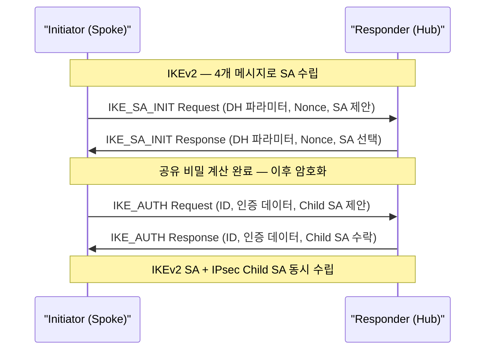

# FlexVPN

## 정의

Cisco IOS/IOS-XE에서 **IKEv2(RFC 7296)** 를 기반으로 Site-to-Site, Remote Access, DMVPN 등 다양한 VPN 시나리오를 단일 프레임워크로 통합 구성하는 차세대 VPN 솔루션으로, **Virtual Template** 기반 동적 터널 인터페이스를 사용.

## 특징

- **(IKEv2 단순화된 협상)** IKE_SA_INIT + IKE_AUTH 단 4개 메시지로 SA 수립 완료 (IKEv1 Main Mode 9개 메시지 대비 절반 이하)
- **(Virtual Template 기반 동적 인터페이스)** Spoke가 연결될 때마다 Virtual Template에서 Virtual-Access 인터페이스를 동적으로 생성하여 Hub 설정 최소화
- **(Smart Defaults로 설정 간소화)** IKEv2 기본 제안(AES-CBC-128, SHA1, DH-5)이 자동 적용되어 명시적 선언 없이도 기본 보안 수준 유지

## FlexVPN vs DMVPN vs GET VPN 비교

| 구분 | FlexVPN | DMVPN | GET VPN |
|------|---------|-------|---------|
| 기반 프로토콜 | IKEv2 | IKEv1/v2 + mGRE + NHRP | GDOI |
| 터널 방식 | Virtual Template (동적) | mGRE (동적) | 터널 없음 (그룹 키) |
| Spoke-to-Spoke | 지원 | Phase 2/3 지원 | 해당 없음 |
| 네트워크 유형 | 인터넷 / MPLS | 인터넷 | MPLS WAN 전용 |
| IP 헤더 보존 | 아니오 | 아니오 | 예 |
| 설정 복잡도 | 중간 | 중간 | 낮음 (GM 기준) |
| Cisco 기술 세대 | 최신 (IOS-XE) | 현역 | 현역 |

---

## IKEv2 기반 동작



IKEv1에서 Phase 1(Main Mode 6개) + Phase 2(Quick Mode 3개) = **9개 메시지** 였던 협상이 IKEv2에서는 **4개 메시지**로 단순화된다.

---

## Smart Defaults

FlexVPN은 명시적 설정이 없을 때 자동으로 적용되는 기본 제안 세트를 제공한다.

| 항목 | Smart Default 값 |
|------|-----------------|
| 암호화 | AES-CBC-128 |
| 무결성 | SHA1-96 |
| DH 그룹 | Group 5 (1536-bit) |
| PRF | SHA1 |
| IKEv2 SA 수명 | 86400초 |

실무에서는 Smart Defaults를 override하여 AES-256, SHA-256, Group 14 이상을 권장한다.

---

## 설정 및 검증

### Hub-Spoke 구성 (IOS-XE)

```bash
! === IKEv2 Keyring (PSK 사전 공유 키) ===
Hub(config)# crypto ikev2 keyring FLEX-KEYRING
Hub(config-ikev2-keyring)# peer SPOKES
Hub(config-ikev2-keyring-peer)# address 0.0.0.0 0.0.0.0    ! 모든 Spoke 허용
Hub(config-ikev2-keyring-peer)# pre-shared-key FLEXKEY123
Hub(config-ikev2-keyring-peer)# exit

! === IKEv2 Proposal (암호화/무결성 파라미터) ===
Hub(config)# crypto ikev2 proposal FLEX-PROP
Hub(config-ikev2-proposal)# encryption aes-cbc-256
Hub(config-ikev2-proposal)# integrity sha256
Hub(config-ikev2-proposal)# group 14
Hub(config-ikev2-proposal)# exit

! === IKEv2 Policy ===
Hub(config)# crypto ikev2 policy FLEX-POLICY
Hub(config-ikev2-policy)# proposal FLEX-PROP
Hub(config-ikev2-policy)# exit

! === IKEv2 Profile ===
Hub(config)# crypto ikev2 profile FLEX-PROFILE
Hub(config-ikev2-profile)# match identity remote address 0.0.0.0    ! 모든 Spoke
Hub(config-ikev2-profile)# authentication remote pre-share
Hub(config-ikev2-profile)# authentication local pre-share
Hub(config-ikev2-profile)# keyring local FLEX-KEYRING
Hub(config-ikev2-profile)# virtual-template 1                       ! VT 바인딩
Hub(config-ikev2-profile)# exit

! === IPsec Transform-Set ===
Hub(config)# crypto ipsec transform-set TS-FLEX esp-aes 256 esp-sha256-hmac
Hub(cfg-crypto-trans)# mode tunnel

! === IPsec Profile ===
Hub(config)# crypto ipsec profile FLEX-IPSEC-PROF
Hub(ipsec-profile)# set transform-set TS-FLEX
Hub(ipsec-profile)# set ikev2-profile FLEX-PROFILE
Hub(ipsec-profile)# exit

! === Virtual Template 인터페이스 ===
Hub(config)# interface Virtual-Template 1 type tunnel
Hub(config-if)# ip unnumbered Loopback0             ! Loopback IP 차용
Hub(config-if)# ip nhrp network-id 1
Hub(config-if)# ip nhrp map multicast dynamic
Hub(config-if)# tunnel mode ipsec ipv4
Hub(config-if)# tunnel protection ipsec profile FLEX-IPSEC-PROF

! === Hub Loopback (터널 IP 기준) ===
Hub(config)# interface Loopback0
Hub(config-if)# ip address 172.16.0.1 255.255.255.0
```

### Spoke 설정

```bash
! Spoke는 Hub의 IKEv2 Profile을 미러링하여 설정
Spoke1(config)# crypto ikev2 keyring FLEX-KEYRING
Spoke1(config-ikev2-keyring)# peer HUB
Spoke1(config-ikev2-keyring-peer)# address 203.0.113.1          ! Hub 공인 IP
Spoke1(config-ikev2-keyring-peer)# pre-shared-key FLEXKEY123
Spoke1(config-ikev2-keyring-peer)# exit

Spoke1(config)# crypto ikev2 profile FLEX-PROFILE
Spoke1(config-ikev2-profile)# match identity remote address 203.0.113.1
Spoke1(config-ikev2-profile)# authentication remote pre-share
Spoke1(config-ikev2-profile)# authentication local pre-share
Spoke1(config-ikev2-profile)# keyring local FLEX-KEYRING
Spoke1(config-ikev2-profile)# exit

Spoke1(config)# interface Tunnel0
Spoke1(config-if)# ip address 172.16.0.2 255.255.255.0
Spoke1(config-if)# tunnel source GigabitEthernet0/0
Spoke1(config-if)# tunnel destination 203.0.113.1               ! Hub 공인 IP
Spoke1(config-if)# tunnel mode ipsec ipv4
Spoke1(config-if)# tunnel protection ipsec profile FLEX-IPSEC-PROF

! === 검증 명령어 ===
Hub# show crypto ikev2 sa                    ! IKEv2 SA 상태
Hub# show crypto ikev2 sa detail             ! IKEv2 SA 상세 (알고리즘 확인)
Hub# show crypto session                     ! 전체 암호화 세션 요약
Hub# show crypto ipsec sa                    ! IPsec SA 패킷 카운터
Hub# show virtual-access [n]                 ! 동적 생성된 VA 인터페이스 확인
Hub# show crypto ikev2 stats                 ! IKEv2 통계 (재협상 횟수 등)
```

---

## CCNP/CCIE 시험 포인트

- IKEv2는 **4개 메시지** (IKE_SA_INIT 2개 + IKE_AUTH 2개) — IKEv1 Main Mode 6개 + Quick Mode 3개와 대비하여 암기
- Virtual Template에서 `ip unnumbered`를 사용하면 IP 풀 없이도 동작 가능 — DMVPN과 달리 모든 Spoke 터널 IP를 Loopback 하나로 처리 가능
- `virtual-template [n]` 명령은 IKEv2 Profile 안에서 선언 — DMVPN과 달리 Hub 인터페이스가 동적으로 Virtual-Access로 생성됨
- Smart Defaults는 편의 기능이지만 보안 감사 시 취약할 수 있어 **명시적 proposal 설정 권장**
- FlexVPN은 **EAP 인증**을 지원하여 원격 사용자 인증에 RADIUS/AD 연동 가능 — `authentication remote eap`
- `show crypto session` 상태가 `UP-ACTIVE` 이어야 정상 — `UP-IDLE`은 SA는 있으나 트래픽 없음
