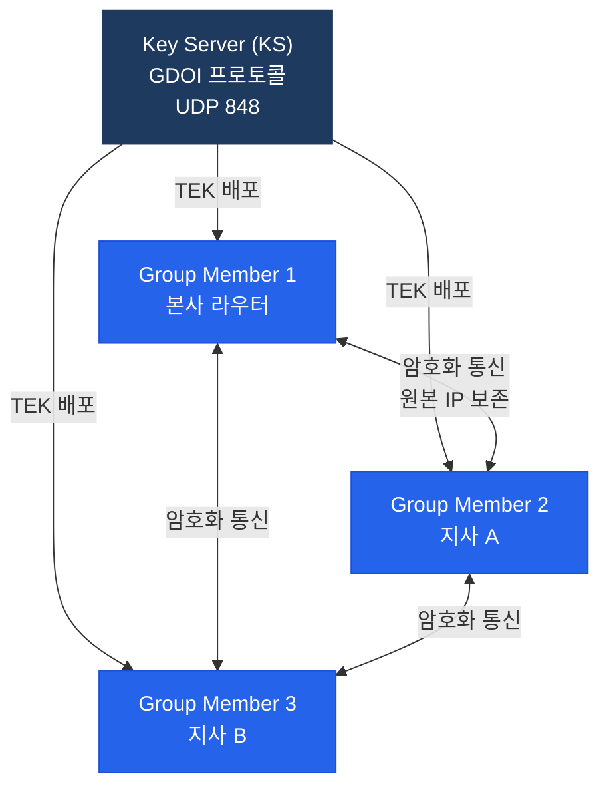

# GET VPN (Group Encrypted Transport VPN)

## 정의

MPLS WAN이나 Private WAN 환경에서 **터널을 생성하지 않고** 그룹 기반 공유 키로 트래픽을 암호화하는 Cisco 독자 VPN 기술로, 원본 IP 헤더를 보존하여 MPLS QoS·라우팅을 유지하면서 암호화를 적용한다.

## 특징

- **(터널리스 암호화)** GRE·IPsec 터널 없이 패킷의 원본 IP를 유지한 채 ESP로 페이로드를 암호화하므로 MPLS 레이블 스위칭과 QoS 정책이 정상 동작
- **(그룹 키 공유)** Key Server(KS)가 TEK(Traffic Encryption Key)를 모든 Group Member(GM)에 배포하여 Any-to-Any 암호화 통신을 터널 없이 구현
- **(중앙 집중 키 관리)** KS가 주기적으로 키를 갱신(Rekey)하고 GM은 자동으로 수신하므로 대규모 WAN에서 운영 오버헤드 최소화

## 왜 필요한가?

기존 IPsec Site-to-Site VPN은 거점 수 증가 시 터널 수가 n(n-1)/2로 폭발적으로 증가한다. DMVPN은 이를 해결하지만 캡슐화로 원본 IP가 변경되어 MPLS QoS가 깨진다. GET VPN은 **MPLS WAN 기존 인프라를 그대로 유지**하면서 암호화를 추가한다.

---

## GET VPN 구성 요소



| 구성 요소 | 역할 |
|----------|------|
| Key Server (KS) | TEK/KEK 생성 및 배포, 그룹 정책 관리 |
| Group Member (GM) | KS에 등록 후 TEK 수신, 암호화 적용 |
| TEK (Traffic Encryption Key) | 실제 데이터 암호화 키 |
| KEK (Key Encryption Key) | TEK 재키잉(Rekey) 메시지 암호화 |
| GDOI | GET VPN 제어 프로토콜 (UDP 848) |

---

## GET VPN vs DMVPN 비교

| 구분 | GET VPN | DMVPN |
|------|---------|-------|
| 터널 | 없음 (Tunnel-less) | GRE 터널 |
| 원본 IP 보존 | O | X (캡슐화) |
| MPLS QoS 유지 | O | X |
| 적용 환경 | MPLS Private WAN | 인터넷/MPLS |
| 키 관리 | KS 중앙 집중 | IKE P2P |
| Any-to-Any | O (즉시) | Phase 3 필요 |

---

## 설정 및 검증

```bash
! === Key Server 설정 ===
KS(config)# crypto isakmp policy 10
KS(config-isakmp)#  encryption aes 256
KS(config-isakmp)#  hash sha256
KS(config-isakmp)#  authentication pre-share
KS(config-isakmp)#  group 14

KS(config)# crypto isakmp key GETVPN-KEY address 0.0.0.0

! GDOI 그룹 정의
KS(config)# crypto gdoi group GETVPN-GROUP
KS(config-gdoi-group)#  identity number 12345
KS(config-gdoi-group)#  server local
KS(config-gdoi-server)#   rekey algorithm aes 256
KS(config-gdoi-server)#   rekey lifetime seconds 86400
KS(config-gdoi-server)#   sa ipsec 1
KS(config-gdoi-sa-ipsec)#    profile GETVPN-PROFILE
KS(config-gdoi-sa-ipsec)#    match address ipv4 GETVPN-ACL
KS(config-gdoi-sa-ipsec)#    replay counter window-size 64

! 암호화 ACL (암호화할 트래픽)
KS(config)# ip access-list extended GETVPN-ACL
KS(config-ext-nacl)#  permit ip 10.0.0.0 0.255.255.255 10.0.0.0 0.255.255.255

! === Group Member 설정 ===
GM(config)# crypto gdoi group GETVPN-GROUP
GM(config-gdoi-group)#  identity number 12345
GM(config-gdoi-group)#  server address ipv4 192.168.1.1  ! KS IP

GM(config)# crypto map GETVPN-MAP gdoi
GM(config-crypto-map)#  set group GETVPN-GROUP

GM(config)# interface GigabitEthernet0/0
GM(config-if)#  crypto map GETVPN-MAP

! 검증
KS# show crypto gdoi
KS# show crypto gdoi ks
GM# show crypto gdoi gm
GM# show crypto gdoi group GETVPN-GROUP
```

---

## CCNP/CCIE 시험 포인트

- GET VPN은 **인터넷 구간에 부적합** — 원본 IP 보존으로 사설 IP가 외부 노출
- GDOI 프로토콜은 **UDP 848** 포트 사용
- KS 이중화: **COOP(Cooperative Key Server)** — Primary/Secondary KS
- TEK 만료 전 **Rekey** 자동 수행 (Unicast Rekey / Multicast Rekey)
- GM 등록 실패 시 트래픽 암호화 불가 → `show crypto gdoi gm` 으로 상태 확인
- GET VPN은 **Transport Mode** ESP 사용 (원본 IP 헤더 보존)
