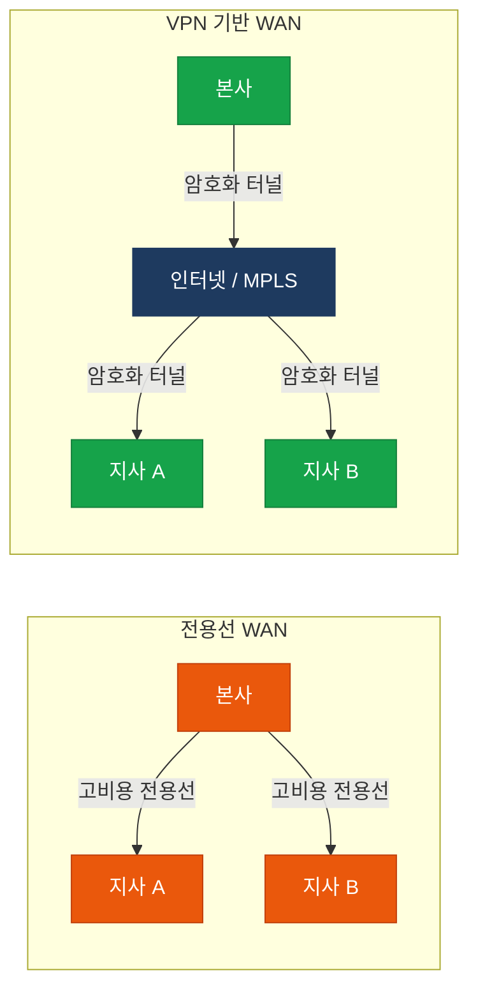
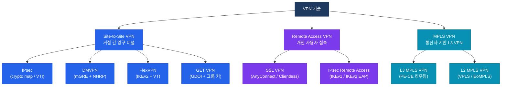

# VPN 기술 개요

## 정의

공중 네트워크(인터넷 또는 MPLS WAN)를 전용 사설망처럼 활용하기 위해 **암호화·터널링·인증** 기술을 조합하여 논리적으로 격리된 통신 경로를 구성하는 네트워크 보안 기술의 총칭.

## 특징

- **(암호화 기반 보안)** 공중망을 통과하는 트래픽을 암호화하여 도청·변조로부터 데이터 기밀성과 무결성을 보장
- **(논리적 터널링)** 실제 물리 인프라와 무관하게 엔드포인트 간 가상 전용 경로를 생성하여 사설 WAN과 동등한 연결성 제공
- **(다양한 구현 방식)** Site-to-Site, Remote Access, MPLS VPN 등 배포 형태와 프로토콜(IPsec, SSL, MPLS) 선택이 유연

## 왜 필요한가?

전용선(Leased Line) 기반 WAN은 높은 비용과 긴 회선 구축 시간이 문제였다. VPN은 기존 인터넷 또는 MPLS 인프라 위에서 암호화 터널을 구성하여 **낮은 비용으로 전용망 수준의 보안과 격리**를 실현한다.

---

## VPN 기술 분류

---

## 섹션 문서 링크

| 문서 | 주요 기술 | CCNP/CCIE 비중 |
|------|-----------|----------------|
| [IPsec](./ipsec) | IKEv1/v2, ESP, AH, crypto map, VTI | ★★★★★ |
| [DMVPN](./dmvpn) | mGRE, NHRP, Phase 1/2/3 | ★★★★☆ |
| [FlexVPN](./flexvpn) | IKEv2, Virtual Template, Smart Defaults | ★★★★☆ |
| [SSL VPN](./ssl-vpn) | AnyConnect, TLS/DTLS, Split Tunneling | ★★★☆☆ |
| [GET VPN](./getvpn) | GDOI, KS/GM, TEK/KEK | ★★★☆☆ |

---

## CCNP/CCIE 시험 비중

| 영역 | 시험 비중 | 핵심 포인트 |
|------|-----------|-------------|
| IPsec (IKEv1/v2) | 매우 높음 | IKE Phase 1/2 협상 파라미터, transform-set |
| DMVPN | 높음 | Phase별 Spoke-to-Spoke 동작, NHRP 역할 |
| FlexVPN | 높음 | IKEv2 메시지 수, Virtual Template 동작 |
| SSL VPN / AnyConnect | 보통 | ASA 정책 구조, Split Tunneling |
| GET VPN | 보통 | GDOI, KS/GM 관계, MPLS WAN 전용 |
