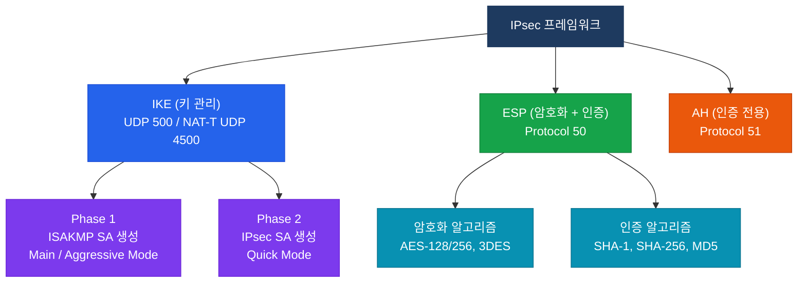
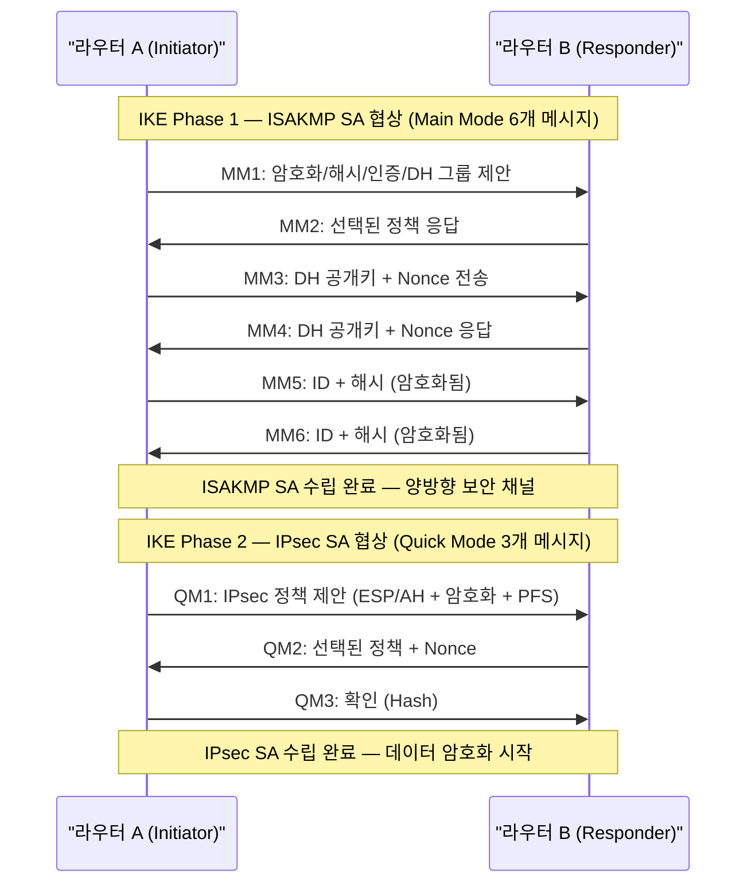

# IPsec (IP Security)

## 정의

IETF RFC 4301에 정의된 IP 계층(L3) 보안 프레임워크로, **IKE(Internet Key Exchange)** 프로토콜을 통해 키를 협상하고 **ESP(Encapsulating Security Payload)** 또는 **AH(Authentication Header)** 로 트래픽을 암호화·인증하는 Site-to-Site VPN의 핵심 표준.

## 특징

- **(IKE 2단계 협상)** Phase 1에서 ISAKMP SA를 생성한 뒤 Phase 2에서 IPsec SA를 협상하는 두 단계 키 교환으로 보안 채널을 수립
- **(ESP/AH 이중 프로토콜)** ESP(프로토콜 50)는 암호화+인증을, AH(프로토콜 51)는 인증만 제공하며 AH는 NAT 환경에서 사용 불가
- **(Tunnel/Transport 이중 모드)** Tunnel 모드는 원본 IP 헤더 전체를 캡슐화하고 Transport 모드는 페이로드만 보호하여 엔드투엔드 암호화에 적합

## 왜 필요한가?

인터넷 구간을 통과하는 기업 트래픽은 스니핑·중간자 공격(MITM) 위협에 노출된다. IPsec은 **암호화(기밀성), 해시(무결성), 인증(출처 검증), 재전송 방지** 4가지 보안 서비스를 IP 계층에서 제공하여 별도의 애플리케이션 수정 없이 전체 트래픽을 보호한다.

---

## IPsec 프레임워크



---

## IKE Phase 1/2 협상 흐름



---

## AH vs ESP 비교

| 구분 | AH (Protocol 51) | ESP (Protocol 50) |
|------|-----------------|-------------------|
| 암호화 | 없음 | AES, 3DES |
| 인증 | IP 헤더 포함 전체 | 페이로드만 (IP 헤더 제외) |
| NAT 통과 | 불가 (헤더 변경 시 인증 실패) | 가능 (NAT-T 사용) |
| 기밀성 | 없음 | 있음 |
| 실무 사용 | 거의 미사용 | 표준 사용 |

---

## Transport vs Tunnel 모드 비교

| 구분 | Transport 모드 | Tunnel 모드 |
|------|---------------|-------------|
| 적용 범위 | 페이로드만 보호 | 원본 IP 헤더 + 페이로드 전체 캡슐화 |
| 새 IP 헤더 | 없음 (원본 헤더 유지) | 있음 (새 외부 헤더 추가) |
| 주요 용도 | 호스트 간 직접 통신 | Site-to-Site VPN (게이트웨이 간) |
| 오버헤드 | 낮음 | 높음 |

---

## 설정 및 검증

### crypto map 방식 (IKEv1)

```bash
! === Phase 1: ISAKMP 정책 설정 ===
R1(config)# crypto isakmp policy 10
R1(config-isakmp)# encryption aes 256       ! 암호화 알고리즘
R1(config-isakmp)# hash sha256              ! 무결성 해시
R1(config-isakmp)# authentication pre-share ! 사전 공유 키 인증
R1(config-isakmp)# group 14                 ! DH 그룹 14 (2048-bit)
R1(config-isakmp)# lifetime 86400           ! SA 수명 (초)
R1(config-isakmp)# exit

! 피어 인증 키 설정
R1(config)# crypto isakmp key CISCO123 address 203.0.113.2

! === Phase 2: Transform-Set 설정 ===
R1(config)# crypto ipsec transform-set TS1 esp-aes 256 esp-sha256-hmac
R1(cfg-crypto-trans)# mode tunnel           ! 터널 모드 (기본값)
R1(cfg-crypto-trans)# exit

! === 암호화 대상 트래픽 ACL ===
R1(config)# ip access-list extended VPN-TRAFFIC
R1(config-ext-nacl)# permit ip 10.1.0.0 0.0.255.255 10.2.0.0 0.0.255.255
R1(config-ext-nacl)# exit

! === Crypto Map 설정 ===
R1(config)# crypto map CMAP 10 ipsec-isakmp
R1(config-crypto-map)# match address VPN-TRAFFIC  ! 암호화 대상 트래픽
R1(config-crypto-map)# set peer 203.0.113.2        ! 피어 IP
R1(config-crypto-map)# set transform-set TS1       ! Phase 2 정책
R1(config-crypto-map)# set pfs group14             ! Perfect Forward Secrecy
R1(config-crypto-map)# exit

! === 인터페이스에 Crypto Map 적용 ===
R1(config)# interface GigabitEthernet0/0
R1(config-if)# crypto map CMAP

! === 검증 명령어 ===
R1# show crypto isakmp sa          ! Phase 1 SA 상태 확인
R1# show crypto ipsec sa           ! Phase 2 SA 상태 및 패킷 카운터
R1# show crypto isakmp policy      ! ISAKMP 정책 확인
R1# show crypto map                ! Crypto Map 설정 확인
R1# debug crypto isakmp            ! IKE 협상 디버그 (주의: 운영 중 사용 자제)
```

### VTI (Virtual Tunnel Interface) 방식

```bash
! VTI 방식 — 동적 라우팅과 통합 용이
R1(config)# interface Tunnel0
R1(config-if)# ip address 172.16.0.1 255.255.255.252
R1(config-if)# tunnel source GigabitEthernet0/0
R1(config-if)# tunnel destination 203.0.113.2
R1(config-if)# tunnel mode ipsec ipv4         ! IPsec VTI 터널
R1(config-if)# tunnel protection ipsec profile IPSEC-PROF

R1(config)# crypto ipsec profile IPSEC-PROF
R1(ipsec-profile)# set transform-set TS1
R1(ipsec-profile)# set pfs group14
```

---

## CCNP/CCIE 시험 포인트

- IKE Phase 1 Main Mode는 **6개 메시지**, Aggressive Mode는 **3개 메시지** — 속도와 보안의 트레이드오프
- AH는 IP 헤더를 포함하여 인증하므로 **NAT 환경에서 절대 동작하지 않음** — NAT가 있으면 반드시 ESP 사용
- **NAT-T(NAT Traversal)**: ESP를 UDP 4500으로 캡슐화하여 NAT 통과 — IKEv1은 자동 감지, IKEv2는 기본 내장
- **PFS(Perfect Forward Secrecy)**: Phase 2마다 새 DH 키 교환 — 이전 세션 키 노출 시에도 현재 세션 보호
- **Dead Peer Detection(DPD)**: 피어 장애를 감지하여 SA를 자동 삭제 — `isakmp keepalive` 명령
- crypto map 방식의 `match address` ACL은 **미러링 필수** — 양 끝단 ACL이 반드시 대칭이어야 함
- `show crypto ipsec sa`에서 `#pkts encrypt`와 `#pkts decrypt`가 증가하는지 확인하여 터널 동작 검증
