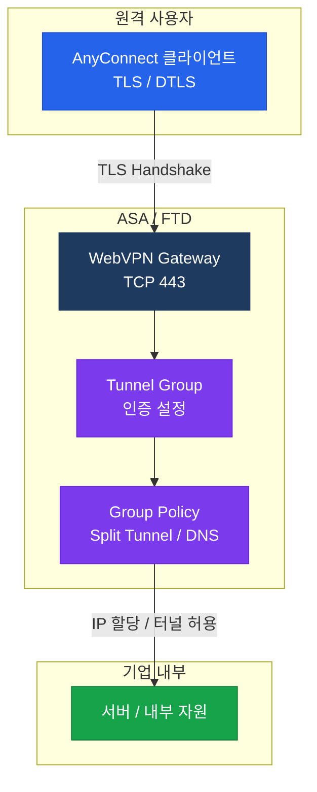

# SSL VPN (AnyConnect)

## 정의

TLS/DTLS 프로토콜을 기반으로 원격 사용자가 기업 네트워크에 안전하게 접속하는 Remote Access VPN 기술로, Cisco AnyConnect 클라이언트를 통해 웹 브라우저 또는 전용 클라이언트 방식으로 동작한다.

## 특징

- **(클라이언트리스 / 풀 터널 이중 모드)** 웹 브라우저만으로 접속하는 Clientless 모드와 AnyConnect 클라이언트 설치 후 OS 레벨 터널을 생성하는 Full-Tunnel 모드를 모두 지원
- **(DTLS 저지연 최적화)** TLS가 TCP 기반이라 재전송 지연이 발생하는 문제를, UDP 기반의 DTLS(Datagram TLS)로 보완하여 VoIP·화상회의 같은 실시간 트래픽 지연 최소화
- **(NAT·방화벽 통과 용이)** HTTP/HTTPS 포트(TCP 443)를 사용하여 기업 방화벽이나 ISP NAT 환경에서도 별도 포트 개방 없이 접속 가능

## 왜 필요한가?

IPsec VPN은 ESP 프로토콜이 방화벽에 차단되거나 NAT 환경에서 문제가 생기는 경우가 많다. SSL VPN은 TCP 443을 사용하므로 **HTTPS 트래픽이 허용된 모든 환경**에서 원격 접속이 가능하며, 별도 클라이언트 없이도 웹 기반 접속을 지원한다.

---

## AnyConnect 구조



---

## Clientless vs AnyConnect 비교

| 구분 | Clientless SSL VPN | AnyConnect (Full Tunnel) |
|------|-------------------|--------------------------|
| 클라이언트 | 웹 브라우저 | AnyConnect 앱 설치 |
| 프로토콜 | HTTPS (TCP 443) | TLS + DTLS |
| 접속 범위 | 웹 앱·파일 공유 한정 | 모든 IP 트래픽 |
| IP 할당 | 불필요 | IP Pool에서 할당 |
| 사용 사례 | 일시적 외부 접속 | 재택·장기 원격 근무 |

---

## Split Tunneling

| 모드 | 동작 | 특징 |
|------|------|------|
| Full Tunnel | 모든 트래픽을 VPN으로 | 보안 강하나 인터넷 속도 저하 |
| Split Tunnel (include) | 지정 서브넷만 VPN으로 | 인터넷 직접 연결, 성능 우수 |
| Split Tunnel (exclude) | 지정 서브넷만 로컬로 | 역방향 Split |

---

## 설정 및 검증

```bash
! WebVPN 활성화 (ASA)
ASA(config)# webvpn
ASA(config-webvpn)#  enable outside
ASA(config-webvpn)#  anyconnect image disk0:/anyconnect-win.pkg 1
ASA(config-webvpn)#  anyconnect enable

! IP Pool 정의
ASA(config)# ip local pool VPN-POOL 10.10.10.1-10.10.10.254 mask 255.255.255.0

! Group Policy (Split Tunnel 설정)
ASA(config)# group-policy GP-ANYCONNECT internal
ASA(config-group-policy)#  vpn-tunnel-protocol ssl-client
ASA(config-group-policy)#  split-tunnel-policy tunnelspecified
ASA(config-group-policy)#  split-tunnel-network-list value SPLIT-ACL

! Tunnel Group
ASA(config)# tunnel-group ANYCONNECT-TG type remote-access
ASA(config-tunnel-general)#  address-pool VPN-POOL
ASA(config-tunnel-general)#  default-group-policy GP-ANYCONNECT

! 검증
ASA# show vpn-sessiondb anyconnect
ASA# show vpn-sessiondb summary
ASA# show webvpn statistics
```

---

## CCNP/CCIE 시험 포인트

- AnyConnect는 **TLS(제어)** + **DTLS(데이터)** 이중 프로토콜 사용 — DTLS 비활성화 시 모두 TLS로 동작
- `webvpn enable [interface]` — 인터페이스 지정 필수
- Split Tunnel은 **Group Policy**에서 설정, Tunnel Group이 아님
- Clientless 모드는 **IP 주소 할당 없음** — 브라우저 프록시 방식
- `tunnel-group` 이름이 클라이언트가 접속하는 **URL 경로**와 연결됨
- DTLS는 UDP 443 사용 — UDP 443을 차단한 방화벽에서는 TLS 폴백
