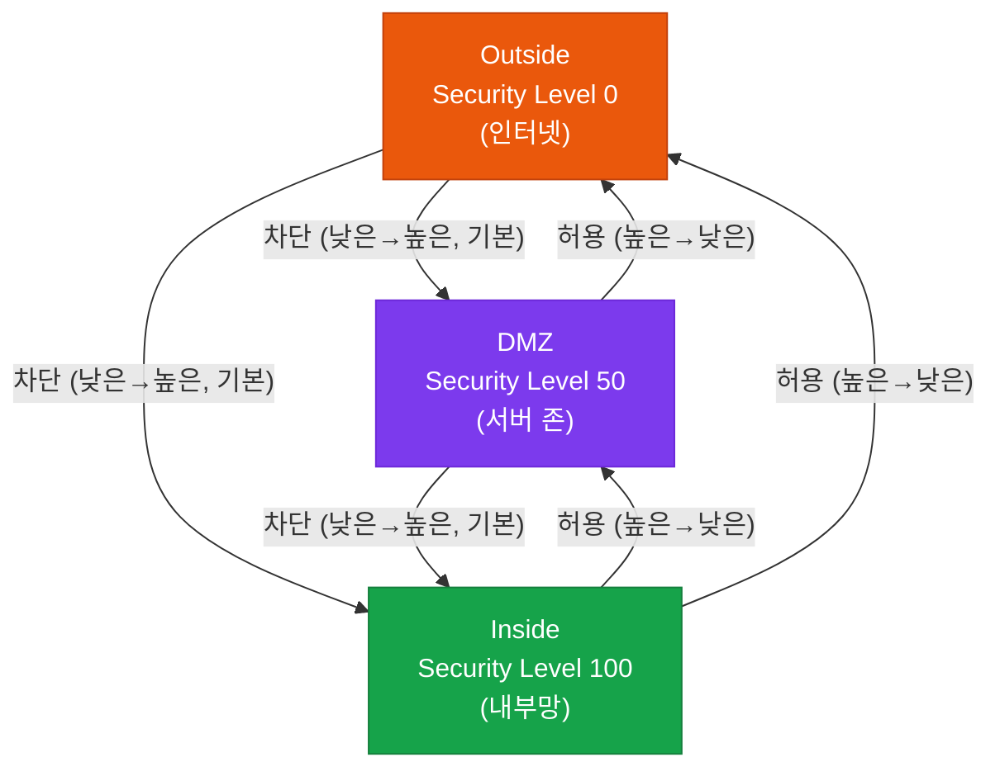
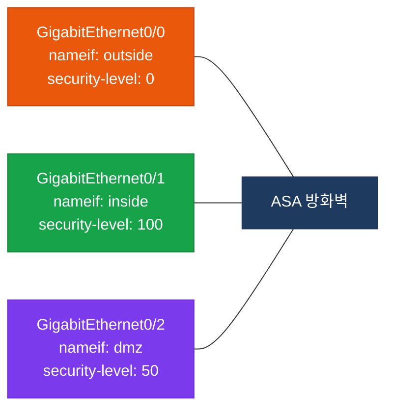
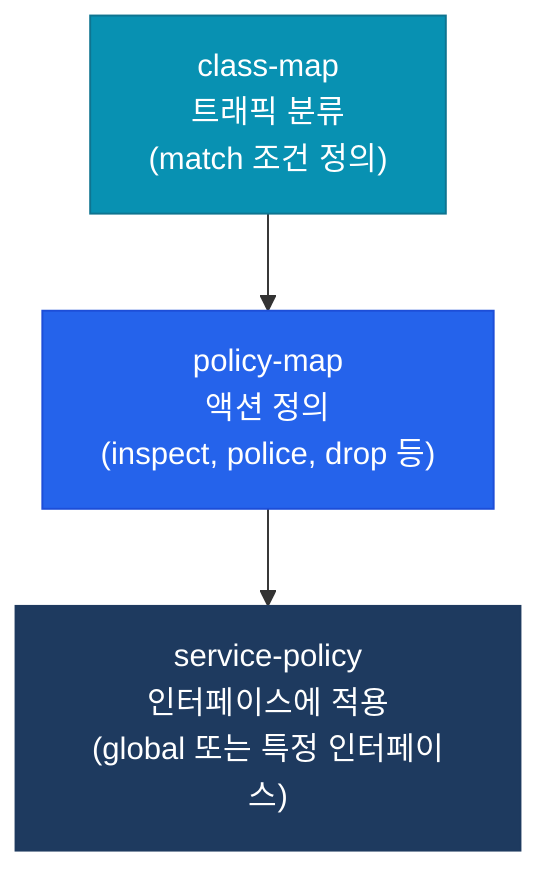

# Cisco ASA 기본

## 정의

Cisco ASA(Adaptive Security Appliance)는 **Stateful Inspection** 기반의 방화벽으로, Security Level과 MPF(Modular Policy Framework)를 사용하여 인터페이스 간 트래픽을 제어하는 전용 보안 장비.

## 특징

- **(Security Level 기반 트래픽 제어)** 인터페이스에 0~100 사이의 보안 레벨을 부여하여 높은 레벨에서 낮은 레벨로의 트래픽은 기본 허용, 반대 방향은 차단
- **(MPF 3단계 정책 구조)** class-map → policy-map → service-policy의 계층 구조로 QoS, 검사, 연결 제한 등 세밀한 트래픽 정책 적용
- **(Stateful Connection Table)** 허용된 아웃바운드 세션의 상태를 `conn` 테이블에 유지하여 응답 트래픽을 별도 ACL 없이 자동 허용

## 왜 필요한가?

단순 ACL 라우터는 단방향 규칙만 가지고 있어, 내부에서 시작된 연결의 응답 트래픽도 별도 허용 규칙이 필요하다. ASA는 상태 추적으로 이 문제를 해결하고, Security Level을 통해 직관적인 존 기반 접근 제어를 제공한다.

---

## ASA 보안 레벨 개념



> 같은 Security Level 간 트래픽은 **기본적으로 차단**된다. `same-security-traffic permit inter-interface` 명령으로 허용 가능.

---

## 인터페이스 / Security Level 설정



---

## MPF (Modular Policy Framework)

MPF는 클래스 기반 트래픽 분류 후 정책을 적용하는 3계층 구조다.



| 구성 요소 | 역할 | 예시 |
|-----------|------|------|
| **class-map** | 트래픽 분류 조건 정의 | `match port tcp eq 80` |
| **policy-map** | 분류된 트래픽에 적용할 액션 | `inspect http`, `police 1000000` |
| **service-policy** | policy-map을 인터페이스에 바인딩 | `service-policy global_policy global` |

---

## 설정 및 검증

```bash
! 인터페이스 설정
ASA(config)# interface GigabitEthernet0/0
ASA(config-if)# nameif outside               ! 논리 이름 부여
ASA(config-if)# security-level 0             ! Outside = 레벨 0
ASA(config-if)# ip address 203.0.113.1 255.255.255.0
ASA(config-if)# no shutdown

ASA(config)# interface GigabitEthernet0/1
ASA(config-if)# nameif inside
ASA(config-if)# security-level 100           ! Inside = 레벨 100
ASA(config-if)# ip address 192.168.1.1 255.255.255.0
ASA(config-if)# no shutdown

! ACL 설정 (Outside → Inside 허용)
ASA(config)# access-list OUTSIDE_IN extended permit tcp any host 192.168.1.10 eq 80
ASA(config)# access-group OUTSIDE_IN in interface outside

! NAT 설정 (Inside → Outside PAT)
ASA(config)# object network INSIDE_NET
ASA(config-network-object)# subnet 192.168.1.0 255.255.255.0
ASA(config-network-object)# nat (inside,outside) dynamic interface

! MPF 설정 — HTTP 트래픽 검사
ASA(config)# class-map HTTP_TRAFFIC
ASA(config-cmap)# match port tcp eq 80
ASA(config)# policy-map GLOBAL_POLICY
ASA(config-pmap)# class HTTP_TRAFFIC
ASA(config-pmap-c)# inspect http
ASA(config)# service-policy GLOBAL_POLICY global

! 검증 명령어
ASA# show interface ip brief                  ! 인터페이스 상태 확인
ASA# show access-list                         ! ACL 히트 카운트 확인
ASA# show conn                                ! 활성 연결 테이블 확인
ASA# show xlate                               ! NAT 변환 테이블 확인
ASA# show service-policy                      ! MPF 정책 적용 상태 확인
ASA# show running-config nat                  ! NAT 설정 전체 확인
```

---

## CCNP/CCIE 시험 포인트

- **Security Level 0**은 항상 Outside 인터페이스에 부여하며, 가장 신뢰 수준이 낮음
- 높은 레벨 → 낮은 레벨 트래픽은 ACL 없이 **기본 허용**, 반대 방향은 ACL 필요
- **같은 Security Level** 간 트래픽은 기본 차단 (`same-security-traffic` 명령으로 변경 가능)
- ACL 방향: `access-group [NAME] in interface outside` — `in`은 해당 인터페이스로 **들어오는** 방향
- MPF `service-policy global` 적용 시 모든 인터페이스에 전역 적용됨
- `show conn` 출력에서 `f` 플래그는 Fastpath(하드웨어 가속), `U`는 UDP를 의미
- NAT exemption(identity NAT) 구성 시 `nat (inside,outside) static` + `no-proxy-arp route-lookup` 필요
