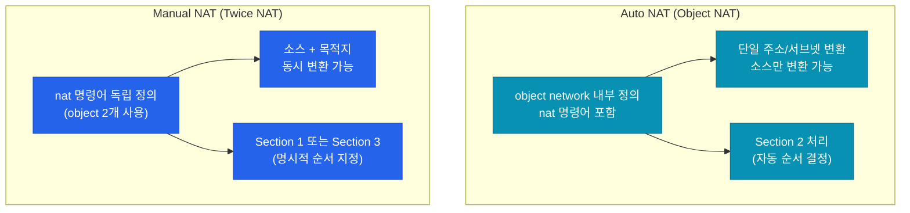
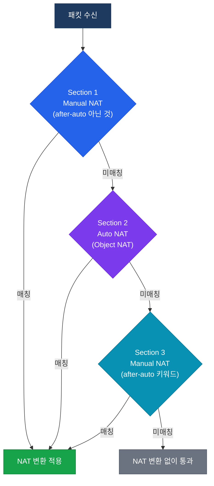

# ASA NAT (Network Address Translation)

## 정의

ASA NAT는 내부 IP 주소를 외부 라우팅 가능한 주소로 변환하거나, 목적지 주소를 동시에 변환하는 기능으로, **Auto NAT(Object NAT)** 와 **Manual NAT(Twice NAT)** 두 가지 구현 방식을 제공.

## 특징

- **(이중 변환 지원)** Manual NAT(Twice NAT)는 출발지와 목적지 주소를 동시에 변환하여 복잡한 오버랩 주소 환경 해결
- **(섹션 기반 처리 순서)** NAT 규칙을 Section 1(Manual) → Section 2(Auto) → Section 3(Manual after-auto) 순서로 처리하여 예측 가능한 매칭 보장
- **(인터페이스 쌍 지정)** `nat (real-ifc, mapped-ifc)` 형식으로 변환이 적용되는 방향을 명시하여 양방향 NAT 동작을 직관적으로 제어

## 왜 필요한가?

내부 사설 IP는 인터넷에서 라우팅되지 않으므로 공인 IP로 변환해야 한다. ASA는 단순 PAT를 넘어 서버 공개(Static NAT), 주소 오버랩 해결(Twice NAT), 특정 트래픽 NAT 면제(Identity NAT) 등 다양한 시나리오를 지원한다.

---

## NAT 유형 비교

| 유형 | 변환 방식 | 주요 용도 | 예시 |
|------|-----------|-----------|------|
| **Static NAT** | 1:1 고정 매핑 | 서버 공개 (공인 IP ↔ 사설 IP) | 웹서버를 인터넷에 노출 |
| **Dynamic NAT** | 풀(Pool) 기반 다수:다수 | 공인 IP 풀 보유 시 | 여러 공인 IP를 순서대로 할당 |
| **PAT (Overload)** | 포트 다중화로 다수:1 | 가장 일반적인 인터넷 공유 | 내부망 전체가 하나의 공인 IP 공유 |
| **Policy NAT** | 조건(ACL)에 따라 선택적 변환 | 특정 목적지로 갈 때만 NAT | 파트너 네트워크 연결 시 |
| **Identity NAT** | 변환 없이 통과 (NAT 면제) | VPN 트래픽 NAT 제외 | 사이트 간 VPN crypto map 적용 전 |

---

## Auto NAT vs Manual NAT



---

## NAT 처리 순서

ASA는 NAT 규칙을 3개의 섹션으로 나누어 순서대로 매칭한다.



> Section 1(Manual NAT)이 Section 2(Auto NAT)보다 **항상 먼저** 처리된다. 더 구체적인 규칙을 Section 1에 배치하여 우선 적용한다.

---

## 설정 및 검증

```bash
! --- Auto NAT (Object NAT) ---

! PAT: Inside 전체를 Outside 인터페이스 IP로 변환
ASA(config)# object network INSIDE_NET
ASA(config-network-object)# subnet 192.168.1.0 255.255.255.0
ASA(config-network-object)# nat (inside,outside) dynamic interface

! Static NAT: 웹서버 공개 (1:1 고정 매핑)
ASA(config)# object network WEB_SERVER
ASA(config-network-object)# host 192.168.1.10
ASA(config-network-object)# nat (inside,outside) static 203.0.113.10

! Dynamic NAT: 공인 IP 풀 사용
ASA(config)# object network PUBLIC_POOL
ASA(config-network-object)# range 203.0.113.20 203.0.113.30
ASA(config)# object network INSIDE_NET2
ASA(config-network-object)# subnet 192.168.2.0 255.255.255.0
ASA(config-network-object)# nat (inside,outside) dynamic PUBLIC_POOL

! --- Manual NAT (Twice NAT) ---

! Policy NAT: 특정 목적지로 갈 때만 다른 IP로 변환
ASA(config)# object network SRC_HOST
ASA(config-network-object)# host 192.168.1.100
ASA(config)# object network DST_PARTNER
ASA(config-network-object)# host 10.10.10.1
ASA(config)# object network TRANSLATED_SRC
ASA(config-network-object)# host 172.16.0.100
ASA(config)# nat (inside,outside) source static SRC_HOST TRANSLATED_SRC destination static DST_PARTNER DST_PARTNER

! Identity NAT (NAT 면제): VPN 트래픽 NAT 제외
ASA(config)# object network VPN_SRC
ASA(config-network-object)# subnet 192.168.1.0 255.255.255.0
ASA(config)# object network VPN_DST
ASA(config-network-object)# subnet 10.0.0.0 255.255.255.0
ASA(config)# nat (inside,outside) source static VPN_SRC VPN_SRC destination static VPN_DST VPN_DST no-proxy-arp route-lookup

! 검증 명령어
ASA# show xlate                               ! 현재 NAT 변환 테이블 확인
ASA# show xlate detail                        ! 상세 변환 정보 (인터페이스, 플래그 포함)
ASA# show nat detail                          ! NAT 정책별 히트 카운트 및 순서 확인
ASA# show nat                                 ! NAT 규칙 요약
ASA# clear xlate                              ! NAT 변환 테이블 초기화 (주의)
ASA# packet-tracer input inside tcp 192.168.1.5 12345 8.8.8.8 80  ! NAT 동작 시뮬레이션
```

---

## CCNP/CCIE 시험 포인트

- **Manual NAT(Twice NAT)** 는 Section 1에 위치하여 Auto NAT보다 **항상 먼저** 처리됨
- `after-auto` 키워드를 사용하면 해당 Manual NAT 규칙이 Section 3에 배치됨
- **Identity NAT** 는 주소 변환 없이 통과시키는 규칙으로, VPN 트래픽 NAT 면제에 필수
- `no-proxy-arp`와 `route-lookup`은 Identity NAT에서 라우팅 루프 방지를 위해 함께 사용
- Static NAT은 양방향 매핑이므로 Outside에서 Inside 방향도 자동으로 변환됨 (ACL 별도 필요)
- `show nat detail` 의 `translate_hits` 카운트로 어느 NAT 규칙이 실제 트래픽을 처리하는지 확인
- PAT에서 `dynamic interface` 는 Outside 인터페이스의 IP를 자동 참조하므로 DHCP 환경에 유리
