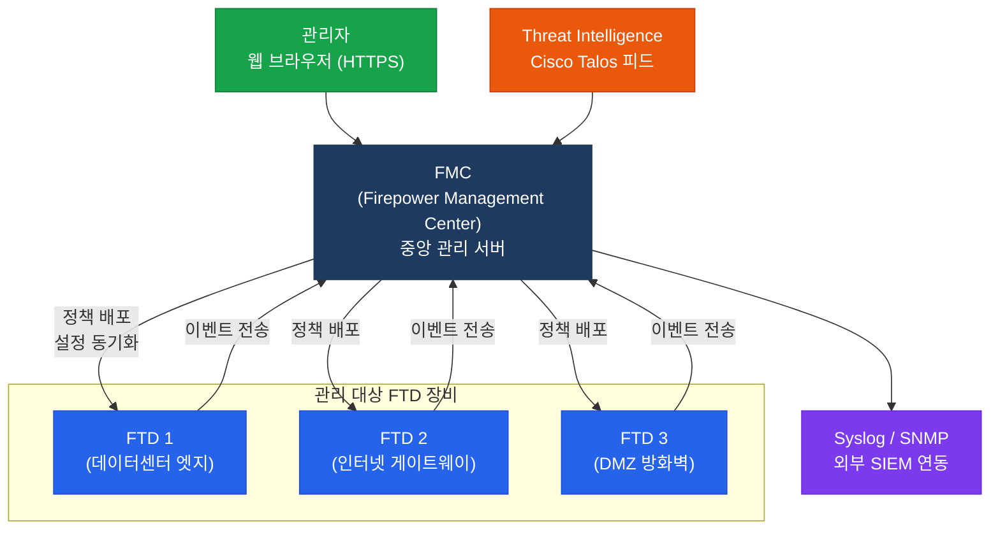
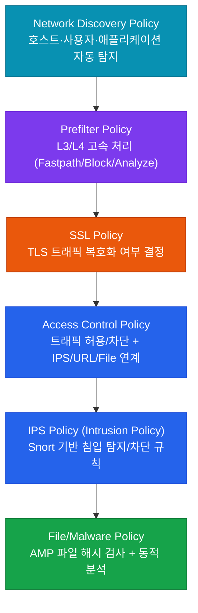
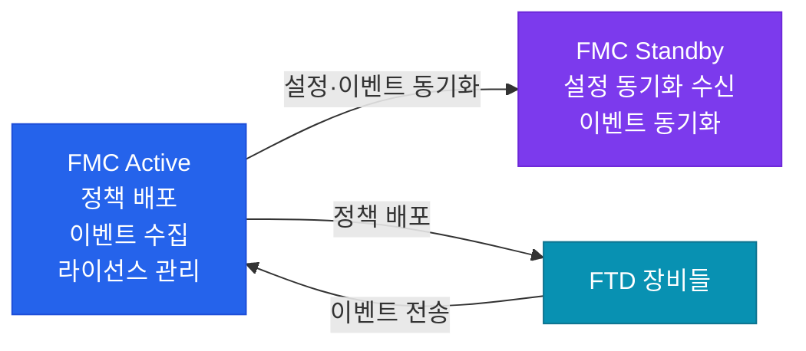

# FMC (Firepower Management Center)

## 정의

FMC(Firepower Management Center)는 다수의 Cisco FTD 장비를 **단일 웹 콘솔**에서 중앙 관리하는 보안 관리 플랫폼으로, 정책 배포·이벤트 분석·보고서 생성·라이선스 관리를 통합 제공.

## 특징

- **(중앙 집중 정책 관리)** 수십~수백 대의 FTD 장비에 ACP, IPS, URL, Malware 정책을 단일 콘솔에서 작성하고 일괄 배포
- **(계층적 정책 구조)** Network Discovery → ACP → IPS → Malware → SSL의 계층 구조로 정책 상호 참조 및 세밀한 보안 제어
- **(풍부한 가시성)** 실시간 이벤트, 침입 탐지 로그, 네트워크 토폴로지 맵, 사용자별/애플리케이션별 트래픽 분석 대시보드 제공

## 왜 필요한가?

FTD를 장비마다 FDM으로 개별 관리하면 정책 일관성 유지가 어렵고 운영 비용이 증가한다. FMC는 정책 변경을 한 번 작성하면 모든 FTD에 동시 배포할 수 있으며, 네트워크 전체의 보안 이벤트를 단일 뷰에서 분석할 수 있다.

---

## FMC 아키텍처

---

## 정책 계층 구조

FMC에서 FTD에 적용되는 정책은 아래 계층 순서로 처리된다.

---

## Smart Licensing

FMC는 Cisco Smart Account와 연동하여 FTD 장비의 기능 라이선스를 중앙 관리한다.

| 라이선스 | 제공 기능 |
|----------|-----------|
| **Base** | 기본 방화벽(ACP), NAT, VPN, Prefilter |
| **Threat** | IPS (Snort 침입 탐지/차단 정책) |
| **URL** | URL 카테고리/평판 기반 필터링 |
| **Malware** | AMP 파일 검사, 동적 분석(Sandbox) |

> FMC는 Smart Account에 등록된 FTD 장비들의 라이선스 상태를 한 화면에서 확인하고 할당/회수할 수 있다.

---

## FMC 고가용성 (HA)

FMC는 Active/Standby HA를 지원하여 관리 플랫폼의 단일 장애점(SPOF)을 제거한다.

| 항목 | 내용 |
|------|------|
| **HA 모드** | Active/Standby (Active/Active 불가) |
| **동기화 대상** | 정책 설정, 이벤트 데이터, 라이선스 정보 |
| **Failover 조건** | Active FMC 장애 시 수동 또는 자동 전환 |
| **FTD 연결** | Standby로 전환 후 FTD들이 새 Active FMC에 재등록 |

---

## 주요 관리 기능

| 기능 | 설명 |
|------|------|
| **이벤트 분석** | 침입 이벤트, 연결 이벤트, 파일/악성코드 이벤트를 실시간 조회 및 필터링 |
| **대시보드** | 상위 위협, 트래픽 통계, 호스트 맵, 사용자별 활동을 시각화 |
| **보고서** | 사전 정의된 보고서 템플릿 또는 커스텀 보고서를 PDF/HTML로 생성 |
| **네트워크 인텔리전스** | Cisco Talos 위협 피드를 자동으로 수신하여 URL/IP 블랙리스트 갱신 |
| **헬스 모니터** | FTD 장비의 CPU/메모리/디스크/정책 배포 상태를 FMC에서 모니터링 |

---

## CCNP/CCIE 시험 포인트

- FMC HA는 **Active/Standby만 지원**하며, Active/Active 구성은 불가능
- FMC에서 정책을 수정해도 **Deploy(배포)** 버튼을 클릭해야 FTD에 실제 적용됨
- **Base 라이선스**는 FTD 등록 시 필수이며, Threat/URL/Malware는 선택적 추가 라이선스
- FDM으로 관리 중인 FTD는 FMC에 등록 불가 — 관리 모드는 공장 초기화 또는 CLI 재설정으로만 변경
- FMC 자체의 관리 인터페이스는 데이터 트래픽을 처리하지 않으며, 전용 관리 포트(eth0)를 사용
