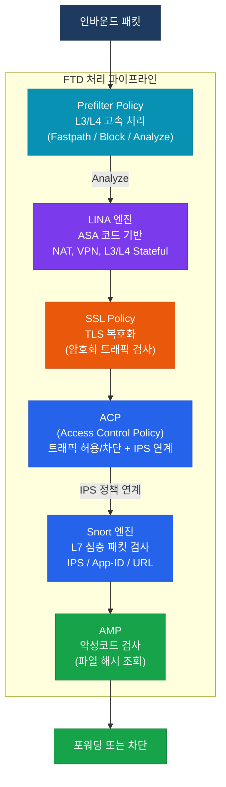
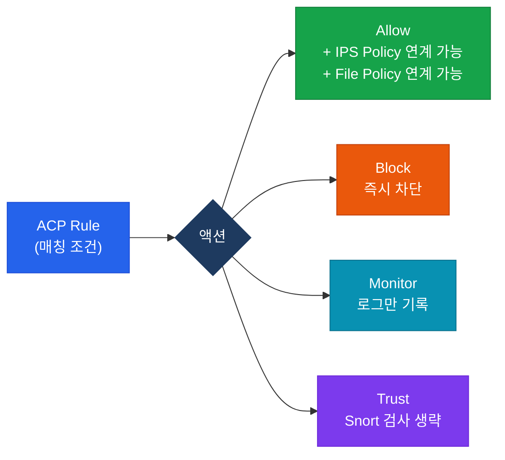

# Cisco FTD (Firepower Threat Defense)

## 정의

Cisco FTD(Firepower Threat Defense)는 ASA의 **LINA 엔진**(L3/L4 처리)과 **Snort 엔진**(심층 패킷 검사)을 단일 플랫폼에 통합한 차세대 방화벽(NGFW)으로, ACP(Access Control Policy) 기반으로 트래픽을 제어하는 보안 장비.

## 특징

- **(이중 엔진 아키텍처)** LINA(ASA 코드)가 L3/L4를 고속 처리하고, Snort가 L7 애플리케이션 심층 검사를 담당하여 성능과 보안성을 동시에 확보
- **(정책 기반 통합 보안)** ACP 하나에 방화벽 규칙, IPS 정책, URL 필터, 악성코드 검사를 연계하여 단일 정책 프레임워크로 통합 관리
- **(중앙 집중 관리)** FMC(Firepower Management Center)를 통해 다수의 FTD 장비를 단일 콘솔에서 정책 배포, 이벤트 분석, 보고서 생성 가능

## 왜 필요한가?

전통적인 ASA는 L3/L4 수준의 포트·IP 기반 제어만 가능하다. 현대 위협은 HTTPS 암호화 터널, 정상 포트를 사용하는 악성코드, 웹 애플리케이션 취약점 공격 등 L7 수준에서 발생한다. FTD는 이러한 위협을 탐지하고 차단하기 위해 Snort 기반 IPS와 SSL 복호화 검사를 통합 제공한다.

---

## FTD 아키텍처

---

## FTD vs ASA 비교

| 구분 | Cisco ASA | Cisco FTD |
|------|-----------|-----------|
| **기반 엔진** | LINA 단일 엔진 | LINA + Snort 이중 엔진 |
| **IPS** | 별도 모듈(SSP) 필요 | Snort 내장 |
| **URL 필터링** | 미지원 (기본) | URL Intelligence 지원 |
| **악성코드 차단** | 미지원 | AMP(Advanced Malware Protection) 연동 |
| **SSL 검사** | 제한적 | SSL Policy로 TLS 복호화 검사 |
| **App-ID** | 미지원 | Snort 기반 애플리케이션 식별 |
| **관리 인터페이스** | ASDM / CLI | FMC (중앙) 또는 FDM (로컬 GUI) |
| **NAT/VPN** | 풍부한 CLI | LINA 기반 동일 기능 (FMC GUI) |
| **운영 복잡도** | 낮음 | 높음 (정책 계층 多) |

---

## 주요 기능

### ACP (Access Control Policy)

트래픽 허용/차단의 핵심 정책. 각 규칙(Rule)에 IPS Policy, URL Category, File Policy를 연계할 수 있다.

### Prefilter Policy

Snort 검사 이전에 L3/L4 조건으로 고속 처리를 결정한다.

| 액션 | 동작 |
|------|------|
| **Fastpath** | Snort 검사 없이 즉시 포워딩 (고성능 트래픽용) |
| **Block** | Snort 검사 없이 즉시 차단 |
| **Analyze** | 이후 ACP / Snort 검사로 진행 |

### 관리 방식: FMC vs FDM

| 구분 | FMC (Firepower Management Center) | FDM (Firepower Device Manager) |
|------|-----------------------------------|--------------------------------|
| **용도** | 다수 FTD 중앙 관리 | 단일 장비 로컬 관리 |
| **인터페이스** | 웹 GUI (별도 서버) | 웹 GUI (장비 내장) |
| **고가용성** | FMC HA 지원 | 미지원 |
| **이벤트 분석** | 풍부한 대시보드/보고서 | 기본 수준 |
| **Smart Licensing** | FMC를 통해 관리 | FDM에서 직접 등록 |

---

## CCNP/CCIE 시험 포인트

- **LINA**는 ASA 코드 기반으로 NAT, VPN, 기본 ACL을 처리하며, Snort는 별도 프로세스로 동작
- Prefilter Policy의 **Fastpath** 액션은 Snort 엔진을 완전히 우회하므로 IPS 검사가 불가능
- ACP Rule의 **Trust** 액션도 Snort 검사를 생략하지만, Fastpath와 달리 연결 이벤트는 기록됨
- FTD에서 CLI 설정 변경은 **FMC를 통해 배포**해야 하며, 직접 CLI 수정은 재배포 시 덮어써짐
- **SSL Policy**에서 복호화하지 않으면 암호화된 위협을 Snort가 탐지할 수 없음
- FDM으로 관리되는 FTD는 FMC에 등록 불가 (관리 모드는 초기 설정 시 결정됨)
