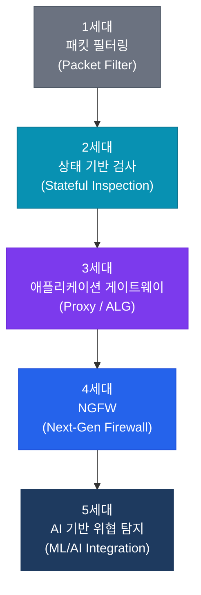
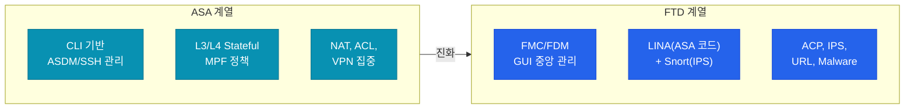

# 방화벽 개요 (Firewall Overview)

## 정의

신뢰할 수 없는 외부 네트워크와 신뢰할 수 있는 내부 네트워크 사이에 위치하여, **사전 정의된 보안 정책**에 따라 트래픽을 허용하거나 차단하는 네트워크 보안 장비.

## 특징

- **(정책 기반 트래픽 제어)** 출발지·목적지 IP, 포트, 프로토콜 등의 조건을 기반으로 트래픽 허용/차단 결정
- **(상태 추적 검사)** 연결 상태 테이블을 유지하여 정상 세션의 응답 트래픽을 자동으로 허용
- **(보안 존 분리)** Inside/Outside/DMZ 구역을 논리적으로 분리하여 최소 권한 접근 원칙 적용

## 방화벽 세대 비교

방화벽은 탐지 능력과 처리 범위의 발전에 따라 5세대로 구분된다.

| 세대 | 기술 | 검사 범위 | 한계 |
|------|------|-----------|------|
| **1세대** | 패킷 필터링 | IP/Port (L3~L4) | 상태 추적 불가 |
| **2세대** | Stateful Inspection | 세션 상태 추적 | 애플리케이션 콘텐츠 검사 불가 |
| **3세대** | 애플리케이션 게이트웨이 | L7 프록시 처리 | 성능 저하, 제한적 프로토콜 지원 |
| **4세대** | NGFW | IPS, URL 필터, App-ID, SSL 검사 | 관리 복잡성 증가 |
| **5세대** | AI/ML 통합 | 행위 기반 위협 탐지 | 고비용, 오탐 가능성 |

---

## ASA vs FTD 비교

Cisco 방화벽 제품은 전통적인 **ASA**와 차세대 **FTD(Firepower Threat Defense)** 두 계열로 나뉜다.

| 구분 | Cisco ASA | Cisco FTD |
|------|-----------|-----------|
| **세대** | 전통 방화벽 (2세대~3세대) | NGFW (4세대) |
| **관리 도구** | ASDM, CLI | FMC (중앙), FDM (로컬) |
| **IPS 기능** | 별도 SSP 모듈 필요 | Snort 내장 |
| **URL 필터링** | 미지원 (기본) | 지원 (라이선스) |
| **악성코드 차단** | 미지원 | AMP 연동 지원 |
| **NAT/VPN** | 강력 | 지원 (LINA 기반) |
| **운영 복잡도** | 낮음 (CLI 친숙) | 높음 (정책 계층 多) |

---

## 섹션 문서 링크

| 문서 | 내용 |
|------|------|
| [ASA 기본](./asa-basics) | Security Level, MPF, ACL, NAT 기초 개념 및 설정 |
| [ASA NAT](./asa-nat) | Auto NAT / Manual NAT 유형 및 처리 순서 |
| [FTD 기본](./ftd-basics) | FTD 아키텍처, LINA + Snort, ACP, FMC/FDM |
| [FMC](./fmc) | FMC 중앙 관리, 정책 계층, HA, Smart Licensing |

---

## CCNP/CCIE 시험 비중

방화벽 섹션은 **CCNP ENCOR**(350-401)과 **CCIE Enterprise Infrastructure** 랩 시험 모두에서 출제된다.

- **CCNP ENCOR**: 보안 도메인 20% 중 ASA/FTD 기본 개념, Security Level, NAT, ACL
- **CCIE Enterprise Lab**: FTD 정책 설정, NAT 트러블슈팅, FMC 연동 구성
- 자주 출제되는 포인트: Security Level 0/100 의미, NAT 처리 순서(Section 1/2/3), MPF 구조, FTD ACP 동작
