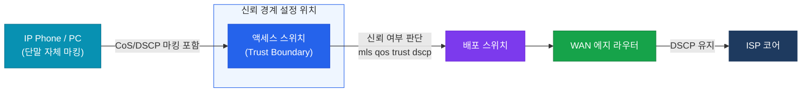

# 분류 & 마킹 (Classification & Marking)

## 정의

네트워크 트래픽을 유형별로 **식별(분류)** 하고, 식별된 클래스에 맞는 **DSCP·CoS 값을 패킷 헤더에 기록(마킹)** 하여 이후 QoS 처리 단계에서 활용할 수 있도록 준비하는 과정.

## 특징

- **(다계층 분류 기준)** ACL(IP/포트), DSCP, CoS, NBAR(응용 프로그램 인식) 등 L2~L7 정보를 조합하여 트래픽을 정밀하게 식별
- **(Trust Boundary 중요성)** 단말기가 설정한 마킹 값을 신뢰할 경계를 정의하여, 악의적인 마킹 조작으로부터 네트워크 QoS 정책을 보호
- **(에지에서 마킹 원칙)** 마킹은 네트워크 진입 지점(액세스 스위치 또는 WAN 에지 라우터)에서 한 번만 수행하여 코어 장비의 처리 부하 최소화

## 분류 기준 비교

| 분류 방법 | 계층 | 비트 수 | 특징 |
|-----------|------|---------|------|
| **CoS** (Class of Service) | L2 | 3비트 (0~7) | 802.1Q 태그 내 PCP 필드, VLAN 트렁크 구간에서만 유효 |
| **IP Precedence** | L3 | 3비트 (0~7) | IPv4 ToS 상위 3비트, 레거시 — DiffServ로 대체됨 |
| **DSCP** | L3 | 6비트 (0~63) | IPv4 ToS 상위 6비트, DiffServ 현재 표준 |
| **ACL** | L3/L4 | — | 출발지/목적지 IP·포트 기반, 정밀 제어 가능 |
| **NBAR** | L4~L7 | — | HTTP/YouTube/Skype 등 응용 프로그램 시그니처 인식 |

---

## 마킹 위치 — Trust Boundary



| 시나리오 | Trust Boundary 위치 | 이유 |
|---------|---------------------|------|
| IP Phone 연결 포트 | 스위치 포트 (trust cos 또는 trust dscp) | IP Phone의 마킹은 신뢰 가능 |
| 일반 PC 연결 포트 | 스위치가 재마킹 (untrust) | 사용자가 임의로 DSCP 조작 가능 |
| WAN 업링크 | 라우터 입력 인터페이스 | ISP 마킹 신뢰 여부에 따라 결정 |

---

## IP Precedence와 DSCP 매핑

IP Precedence(3비트)는 DSCP(6비트)의 상위 3비트와 대응된다.

| IP Precedence | 이름 | 대응 DSCP 값 |
|---------------|------|-------------|
| 7 | Network Control | CS7 (56) |
| 6 | Internetwork Control | CS6 (48) |
| 5 | Critical | CS5 (40) / EF(46) |
| 4 | Flash Override | CS4 (32) / AF4x |
| 3 | Flash | CS3 (24) / AF3x |
| 2 | Immediate | CS2 (16) / AF2x |
| 1 | Priority | CS1 (8) / AF1x |
| 0 | Routine | CS0 / BE (0) |

---

## 설정 및 검증

```bash
! ── 스위치 포트 Trust 설정 ────────────────────────────────────────────
SW(config)# interface GigabitEthernet0/1
SW(config-if)#  mls qos trust dscp        ! DSCP 값 신뢰 (IP Phone 포트)

SW(config)# interface GigabitEthernet0/2
SW(config-if)#  mls qos trust cos         ! CoS 값 신뢰 (VLAN 트렁크 업링크)

! ── MQC로 DSCP 마킹 설정 ─────────────────────────────────────────────
R(config)# class-map match-all VOIP-SIGNAL
R(config-cmap)#  match dscp cs3           ! SIP 시그널링 트래픽 분류

R(config)# class-map match-any WEB-TRAFFIC
R(config-cmap)#  match protocol http      ! NBAR로 HTTP 트래픽 분류
R(config-cmap)#  match protocol https     ! NBAR로 HTTPS 분류

R(config)# policy-map MARKING-POLICY
R(config-pmap)#  class VOIP-SIGNAL
R(config-pmap-c)#   set dscp cs3          ! CS3(24)으로 마킹

R(config-pmap)#  class WEB-TRAFFIC
R(config-pmap-c)#   set dscp af21         ! AF21(18)으로 마킹

R(config-pmap)#  class class-default
R(config-pmap-c)#   set dscp default      ! 나머지는 BE(0)으로 마킹

R(config)# interface GigabitEthernet0/0
R(config-if)#  service-policy input MARKING-POLICY   ! 인바운드 마킹 적용

! ── CoS 마킹 설정 (L2 스위치) ──────────────────────────────────────
SW(config)# policy-map COS-MARKING
SW(config-pmap)#  class VOIP-CLASS
SW(config-pmap-c)#   set cos 5            ! CoS 5 — 음성 트래픽

! ── 검증 명령어 ─────────────────────────────────────────────────────
R# show policy-map interface GigabitEthernet0/0 input   ! 인바운드 정책 통계
R# show class-map                                        ! class-map 목록
SW# show mls qos interface GigabitEthernet0/1           ! Trust 설정 확인
R# show ip nbar protocol-discovery                       ! NBAR 인식 프로토콜 통계
```

---

## CCNP/CCIE 시험 포인트

- **CoS는 802.1Q 태그 내에만 존재** — 태그가 제거되면 CoS 값도 사라짐
- IP Precedence 3비트는 DSCP 6비트의 **상위 3비트와 동일** — CS(Class Selector) DSCP가 대응
- DSCP는 **64개 값(0~63)**, CoS는 **8개 값(0~7)** — 세밀도 차이 암기
- Trust Boundary를 설정하지 않으면 스위치는 기본적으로 **untrust(CoS=0으로 재설정)** 처리
- NBAR는 L7 응용 프로그램 인식을 위해 `ip nbar protocol-discovery`를 인터페이스에 활성화해야 함
- 마킹은 반드시 **네트워크 에지에서 수행** — 코어에서 재분류하면 CPU 부하 증가
